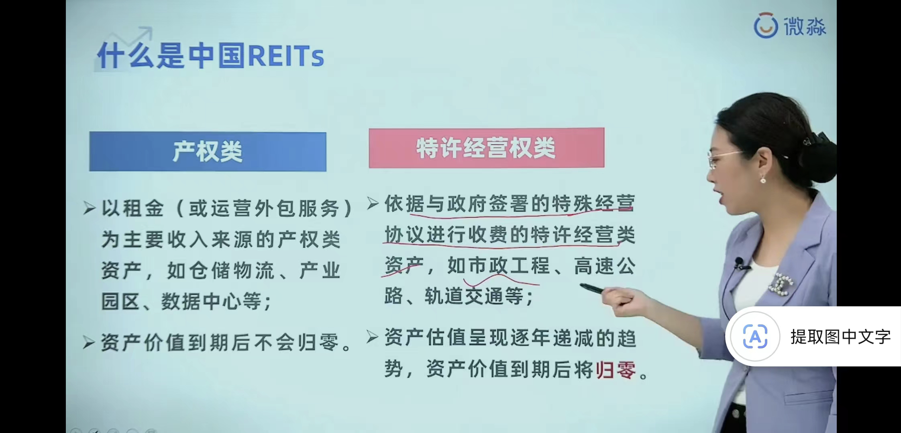
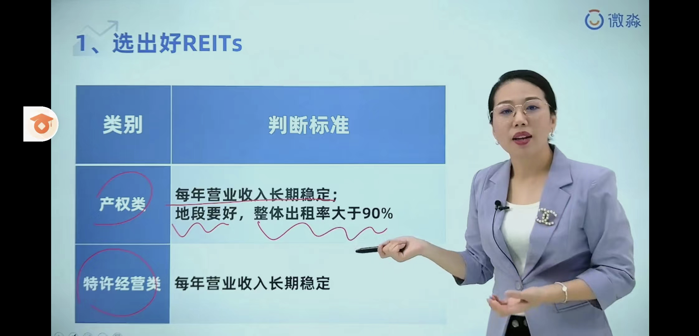
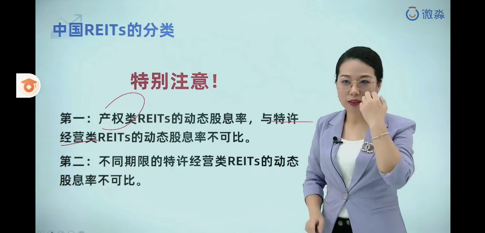
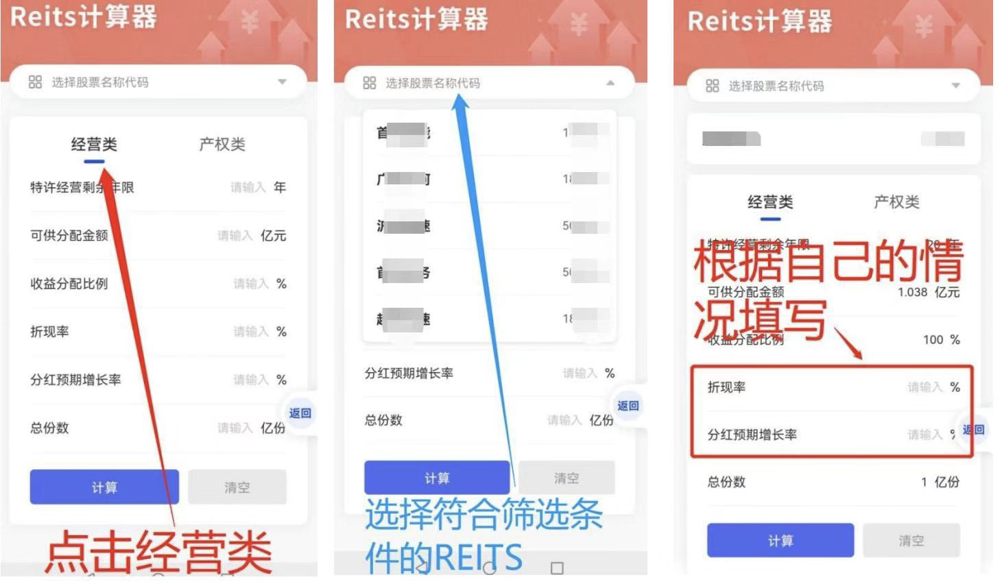
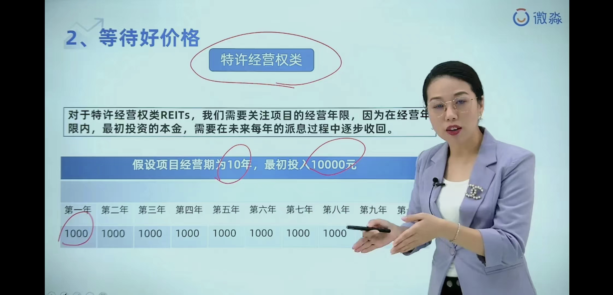
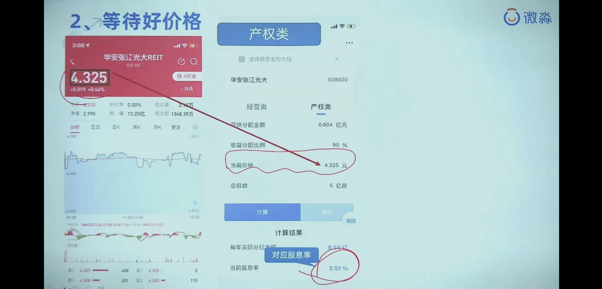
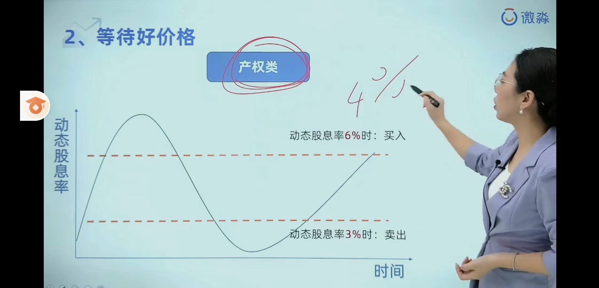
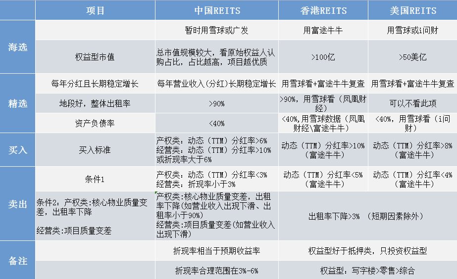
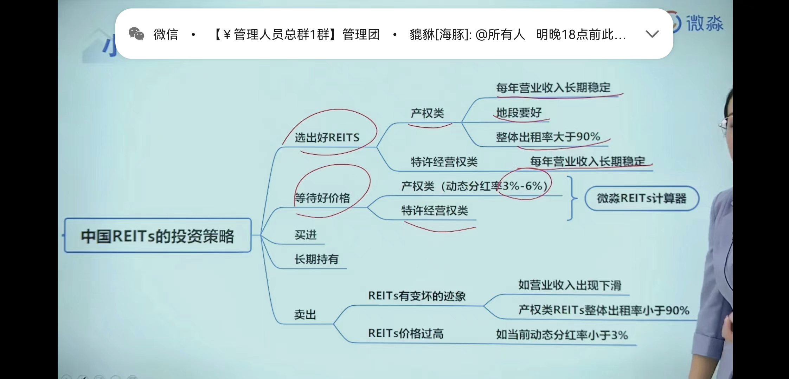
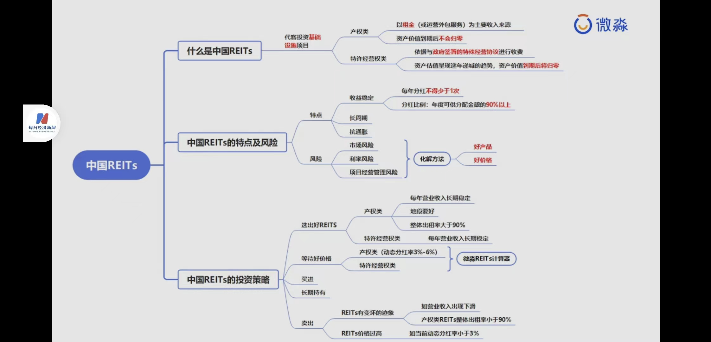

- # 一、概念
	- ## 1、什么是中国Reits?
	  collapsed:: true
		- 
- # 二、选出好Reits
  collapsed:: true
	- 
- # 三、计算好价格
  collapsed:: true
	- 
	- # 3-1、经营类REITs好价格计算：看折现率
	  collapsed:: true
		- ==借助微淼计算器==经营类REITs解析：
		- ①折现率：相当于我们预期想获得多少的年化收益回报。比如我想获得4%的年化收益率，折现率就填4%想获得6%的收益率，折现率就填6%
		- ②分红预期增长率：即该REIT未来分红可能会保持增长态势如果对该REIT持乐观态度，比如今年分红1块，明年分红1.1，增加的0.1就是分红预期增长，那么可以填写5%以下数值，如果保守起见，则可以填0
		- {:height 445, :width 746}
		- 每次派息基金的净值会降低：
			- 
	- # 3-2、产权类REITS好价格看动态股息率(股息/每股价格)
	  collapsed:: true
		- 
		- 
- # 图表总结分析
  collapsed:: true
	- 
- # ==投资策略==：
  collapsed:: true
	- 
	- 
-