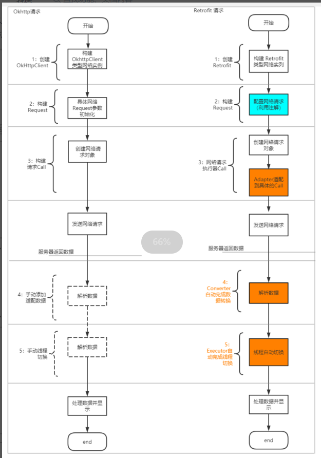
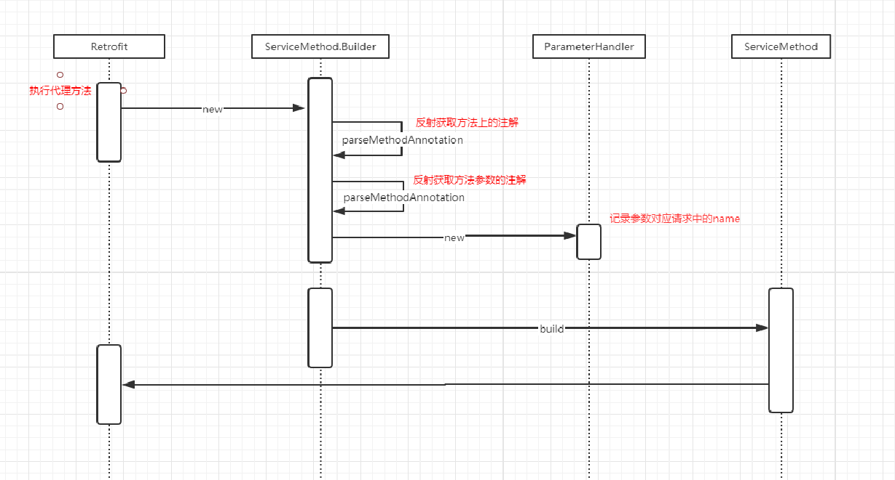

- # 一、介绍
  collapsed:: true
	- Retrofit 是一个 RESTful 的 HTTP 网络请求框架的封装，网络请求的工作本质上是 OkHttp 完成，而 Retrofit 仅负责网络请求接口的封装。
	- 
	- App应用程序通过 Retrofit 请求网络，实际上是使用 Retrofit 接口层封装请求参数、Header、Url 等信息，之后由 OkHttp 完成后续的请求操作。
	- 在服务端返回数据之后，OkHttp 将原始的结果交给 Retrofit，Retrofit根据用户的需求对结果进行解析
- # 二、基本使用对比
	- ## [[Okhttp请求简单使用]]
	- ## [[Retrofit简单使用]]
- # 三、okhttp和Retrofit流程对比
  collapsed:: true
	- 
	- **在上图中，我们看到的对比最大的区别是什么？**
	- 0）okhttp创建的是OkhttpClient，然而retrofifit创建的是 Retrofifit实例
	- 1）构建蓝色的Requet的方案，retrofifit是通过注解来进行的适配
	- 2）配置Call的过程中，retrofifit是利用Adapter适配的Okhttp 的Call
	- 3）相对okhttp，retrofifit会对responseBody进行 自动的Gson解析
	- 4）相对okhttp，retrofifit会自动的完成线程的切换。
	- 那么retrofifit是如何完成这几点的封装的呢？请看下面的文章
- # 四、[[Retrofit 优点]]
- # 五、[[Retrofit封装性具体体现在哪里？]]
- # 六、源码
	- ## 代码
		- ```java
		  //step1
		  Retrofit retrofit = new Retrofit.Builder()
		                      .baseUrl("https://www.wanandroid.com/")
		                      .addConverterFactory(GsonConverterFactory.create(new Gson()))
		                      .build();
		  //step2
		  ISharedListService sharedListService = retrofit.create(ISharedListService.class);
		  //step3
		  Call<SharedListBean> sharedListCall = sharedListService.getSharedList(2,1);
		  //step4
		  sharedListCall.enqueue(new Callback<SharedListBean>() {
		      @Override
		      public void onResponse(Call<SharedListBean> call, Response<SharedListBean> response{
		          if (response.isSuccessful()) {
		              System.out.println(response.body().toString());
		          }
		      }
		      @Override
		      public void onFailure(Call<SharedListBean> call, Throwable t) {
		          t.printStackTrace();
		      }
		  });
		  ```
	- ## 1、[[Retrofit的代理实例创建过程]]包括step1,2,3
		- step1：Retrofit的配置，见build函数
			- Adapter 和 converter的添加和获取
		- step2：create中
			- ServiceMethod的创建
			- Adapter 和 converter的获取
			- Retrofit Adapter中Call<T>函数适配过程
	- ## 2、Call<SharedListBean> sharedListCall = sharedListService.getSharedList(2,1);
		- 会调用到invoke 返回一个ExecutorCallBackCall
	- ## 3、step4：[[call.enqueue网络请求过程分析]]
		- ResponseBody 转换为bean的过程
- # 七、[[Retrofit设计模式的应用]]
	-
- # 七、请求数据准备
  collapsed:: true
	- 
- ##
- # [[Retrofit面试题]]
-
- ## 其他文章
	- [[retrofit源码分析]]
-