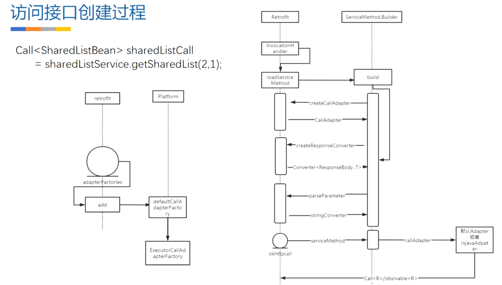

- 
- # 第一步build构建Retrofit实例
  collapsed:: true
	- 
	- ## build
		- ```java
		  //step1
		  Retrofit retrofit = new Retrofit.Builder()
		        .baseUrl("https://www.wanandroid.com/")
		        .addConverterFactory(GsonConverterFactory.create(new Gson()))
		        .build();
		  ```
	- ## 源码
		- ```java
		  public Retrofit build() {
		      if (baseUrl == null) {
		          throw new IllegalStateException("Base URL required.");
		      }
		      // 代码1
		      //默认只支持okhttp请求，不支持 httpurlconnection 和 httpclient
		      okhttp3.Call.Factory callFactory = this.callFactory;
		      if (callFactory == null) {
		          callFactory = new OkHttpClient();
		      }
		      // 代码2
		      // 添加一个线程管理 Executor,okhttp 切换线程需要手动操作，但是retrofit
		      // 不需要，就是因为这个Executor 的存在，其实他是handler
		      Executor callbackExecutor = this.callbackExecutor;
		      if (callbackExecutor == null) {
		          callbackExecutor = platform.defaultCallbackExecutor();
		      }
		      //代码3
		      // Make a defensive copy of the adapters and add the default Call adapter.
		      List<CallAdapter.Factory> adapterFactories = new ArrayList<>(this.adapterFactories);
		      adapterFactories.add(platform.defaultCallAdapterFactory(callbackExecutor));
		      // Make a defensive copy of the converters.
		      // 代码4
		      List<Converter.Factory> converterFactories = new ArrayList<>(this.converterFactories);
		      return new Retrofit(callFactory, baseUrl, unmodifiableList(converterFactories),
		              unmodifiableList(callAdapterFactories), callbackExecutor, validateEagerly);
		  }
		  ```
	- ## 在代码1处：callFactory 就是创建了一个OkhttpClient赋值
	  collapsed:: true
		- 初始化 构建call 的工厂，但是这个地方直接就是使用了 okhttp的call，没有使用到工厂设计模式去添加构建httpclient 或者 httpurlconnection的方法来创建 call，说明retrofifit 已经铁下心只支持okhttp创建call请求了。
		- 那么call 是什么的抽象呢？看下面的代码，okhttp请求的代码
			- ```java
			  OkHttpClient client = new OkHttpClient.Builder().
			  						readTimeout(5, TimeUnit.SECONDS).build();
			  Request request = new Request.Builder().
			  						url("http://www.baidu.com").get().build();
			  okhttp3.Call call = client.newCall(request);
			  call.enqueue(new okhttp3.Callback() ）...
			  ```
		- OkHttpClient是 http 请求的载体包含socket等可以复用的对象，协议配置等等一切。
		- Request 创建的是一个具体的有url，header，等请求信息的一个网络请求，表示这个具体的请求。
		- Call 通往请求的，去执行请求的整个过程的一个抽象。也是进行网络请求的最终接口。
		- 所以，此次调用，[[#red]]==**目的就是创建了一个OkHttpClient**==，换句话说，这里的调用就是生产****Okhttp****网络请求需要的请****求****Call****的，以备后面进行真正的网络请求**。
	- ## 在代码2处：用handler封装的Executor做线程切换用
	  collapsed:: true
		- 网络请求需要在子线程中执行，那么就需要线程管理，所以就有了代码2的存在，深入源码后发现，这个地方就是[[#red]]==**运用handler进行线程切换，当网络请求回来了进行线程切换**==，可以看下面的源码
		- ```java
		  static final class Android extends Platform {
		      Android() {
		      	super(Build.VERSION.SDK_INT >= 24);
		      }
		      @Override public Executor defaultCallbackExecutor() {
		      	return new MainThreadExecutor();
		      }
		      static class MainThreadExecutor implements Executor {
		          private final Handler handler = new Handler(Looper.getMainLooper());
		          @Override public void execute(Runnable r) {
		          	handler.post(r);
		          }
		      }
		  }
		  ```
		- **所以，此次调用，目的是构建一个用****handler****封装的****Executor****，以备后面进行网络请求成功后的线程切换用**
	- ## 在代码3处：设置默认CallAdapterFactory
	  collapsed:: true
		- > 这里设置的默认的CallAdapter是 defaultCallAdapterFactory，这个类会被ServiceMethod调用，比如 代理类执行代码的时候会调用到动态代理的invoke 方法处，通过这个defaultCallAdapterFactory的Adapt 方法将 OkhttpCall 封装成 ExecutorCallBackCall进行返回
		- [[#red]]==**作用：默认的Adapter把okhttpcall 适配成Retrofit call（叫ExecutorCallBackCall）**==
			- 在此添加的CallAdapterFactory属于系统默认的，当然，我们可以添加RxJavaCallAdapterFactory。默认的CallAdapterFactory是 ExecutorCallAdapterFactory 类的对象，在Platform.java Class里面可以梳理出来
			- ```java
			  defaultCallAdapterFactory(Executor callbackExecutor) {
			  	return new ExecutorCallAdapterFactory(callbackExecutor);
			  }
			  ```
			- 所以构建的Retrofifit都是用于进行后面请求的需要的内容的一个准备工作。也就是封装Okhttp需要的准备工作。
		- [[#red]]==**如果设置是rxJava的CallAdapter，就是对OkhttpCall 封装成 observable**==
	- ## 在代码4处：converterFactories
	  collapsed:: true
		- 1、Retrofit 设置请求参数通过注解，需要转换成 okhttp请求参数方式
		- 2、对okhttp返回值的处理，转换成javabean等
	- ## 总结构建流程
	  collapsed:: true
		- 
- # 第二步retrofit.create动态代理创建代理实例
	- ### [[create 源码及过程 2.9.0]]：CallAdapter对OkhttpCall包装返回ExecutorCallBackCall,带执行返回的call
-
-