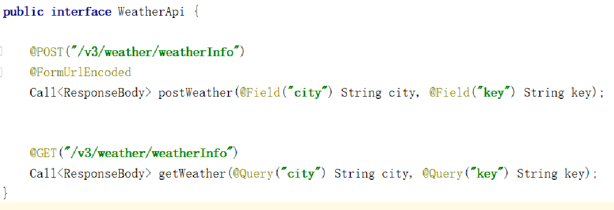
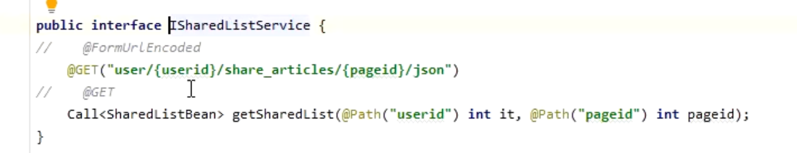
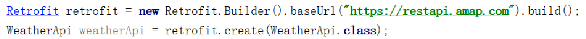

- ## 1、定义网络请求接口
	- 
	- 
- ## 2、执行请求
	- ```java
	  //step1
	  Retrofit retrofit = new Retrofit.Builder()
	                      .baseUrl("https://www.wanandroid.com/")
	                      .addConverterFactory(GsonConverterFactory.create(new Gson()))
	                      .build();
	  //step2
	  ISharedListService sharedListService = retrofit.create(ISharedListService.class);
	  //step3
	  Call<SharedListBean> sharedListCall = sharedListService.getSharedList(2,1);
	  //step4
	  sharedListCall.enqueue(new Callback<SharedListBean>() {
	      @Override
	      public void onResponse(Call<SharedListBean> call, Response<SharedListBean> response{
	          if (response.isSuccessful()) {
	              System.out.println(response.body().toString());
	          }
	      }
	      @Override
	      public void onFailure(Call<SharedListBean> call, Throwable t) {
	          t.printStackTrace();
	      }
	  });
	  ```
	- 
- ## 总结
	- **Step1: 创建retrofit对象**， 构建一个网络请求的载体对象，和okhttp构建OkhttpClient对象有一样的意义，只不过retrofifit在build的时候有非常多的初始化内容，这些内容可以为后面网络请求提供准备，如准备 线程转换Executor，Gson convert，RxJavaCallAdapter。
	- **Step2****：****Retrofifit****的精髓，为统一配置网络请求完成动态代理的设置。**
	- **Step3****：构建具体网络请求对象****Request****（****service****）**，在这个阶段要完成的任务：
	  collapsed:: true
		- 1）将接口中的**注解**翻译成对应的参数；
		- 2）确定网络请求接口的返回值response类型以及对应的转换器；
		- 3）讲Okhttp的Request封装成为Retrofifit的OKhttpCall。
		- 总结来说，就是根据请求service 的Interface来封装Okhttp请求Request。
	- **Step4****：**后面就进行网络请求了，然后处理网络请求的数据了