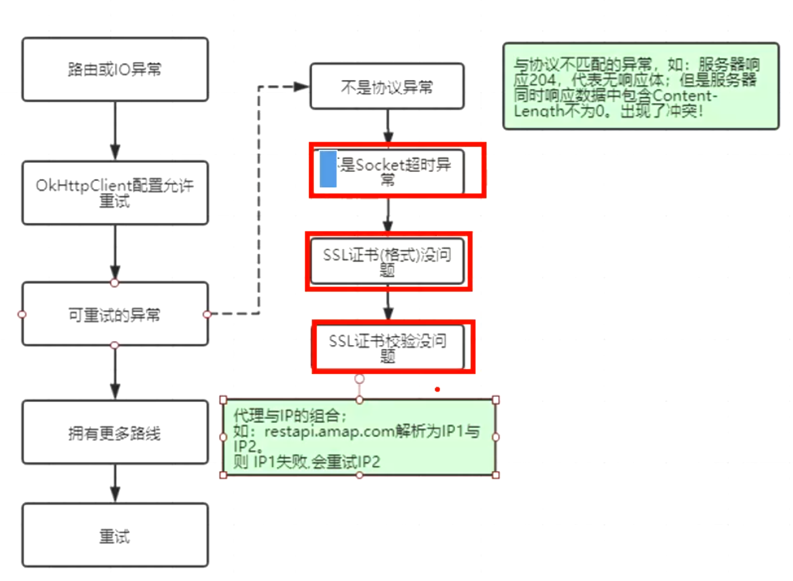
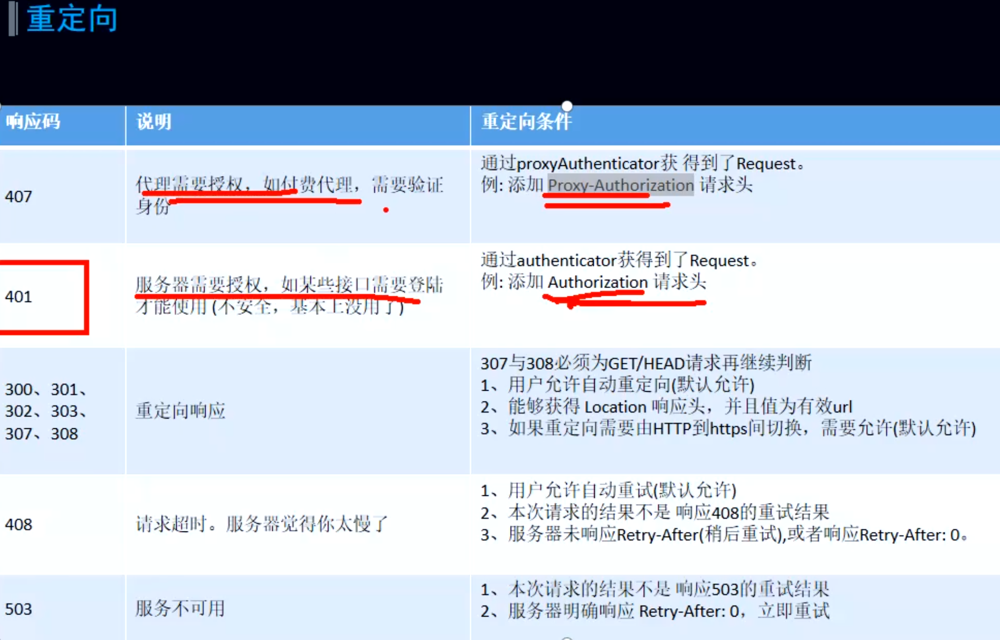

- collapsed:: true
  > 第一个拦截器: RetryAndFollowUpInterceptor ，主要就是完成两件事情：重试与重定向。
	- ```java
	    @Throws(IOException::class)
	    override fun intercept(chain: Interceptor.Chain): Response {
	      val realChain = chain as RealInterceptorChain
	      var request = chain.request
	      val call = realChain.call
	      var followUpCount = 0
	      var priorResponse: Response? = null
	      var newExchangeFinder = true
	      var recoveredFailures = listOf<IOException>()
	      while (true) {
	        call.enterNetworkInterceptorExchange(request, newExchangeFinder)
	  
	        var response: Response
	        var closeActiveExchange = true
	        try {
	          if (call.isCanceled()) {
	            throw IOException("Canceled")
	          }
	  
	          try {
	            response = realChain.proceed(request)
	            newExchangeFinder = true
	          } catch (e: RouteException) {
	            // The attempt to connect via a route failed. The request will not have been sent.
	            if (!recover(e.lastConnectException, call, request, requestSendStarted = false)) {
	              throw e.firstConnectException.withSuppressed(recoveredFailures)
	            } else {
	              recoveredFailures += e.firstConnectException
	            }
	            newExchangeFinder = false
	            continue
	          } catch (e: IOException) {
	            // An attempt to communicate with a server failed. The request may have been sent.
	            if (!recover(e, call, request, requestSendStarted = e !is ConnectionShutdownException)) {
	              throw e.withSuppressed(recoveredFailures)
	            } else {
	              recoveredFailures += e
	            }
	            newExchangeFinder = false
	            continue
	          }
	  
	          // Attach the prior response if it exists. Such responses never have a body.
	          if (priorResponse != null) {
	            response = response.newBuilder()
	                .priorResponse(priorResponse.newBuilder()
	                    .body(null)
	                    .build())
	                .build()
	          }
	  
	          val exchange = call.interceptorScopedExchange
	          val followUp = followUpRequest(response, exchange)
	  
	          if (followUp == null) {
	            if (exchange != null && exchange.isDuplex) {
	              call.timeoutEarlyExit()
	            }
	            closeActiveExchange = false
	            return response
	          }
	  
	          val followUpBody = followUp.body
	          if (followUpBody != null && followUpBody.isOneShot()) {
	            closeActiveExchange = false
	            return response
	          }
	  
	          response.body?.closeQuietly()
	  
	          if (++followUpCount > MAX_FOLLOW_UPS) {
	            throw ProtocolException("Too many follow-up requests: $followUpCount")
	          }
	  
	          request = followUp
	          priorResponse = response
	        } finally {
	          call.exitNetworkInterceptorExchange(closeActiveExchange)
	        }
	      }
	    }
	  ```
- # 一、重试（失败）[[重试重定向拦截器面试题]]
  collapsed:: true
	- ## 流程图
	  collapsed:: true
		- 
		- OkhttpClient 有标记：retryOnConnectionFailure失败是否重试标志，默认true
	- ## 可重试的异常：RouteException 或者 IOException
	  collapsed:: true
		- 请求阶段发生了 RouteException 或者 IOException会进行判断是否重新发起请求。
		- ## RouteException
		  collapsed:: true
			- ```java
			      catch (RouteException e) {
			          //todo 路由异常，连接未成功，请求还没发出去
			          if (!recover(e.getLastConnectException(), streamAllocation, false, request)) {
			              throw e.getLastConnectException();
			          }
			          releaseConnection = false;
			          continue;
			      }
			  ```
		- ## IOException
		  collapsed:: true
			- ```java
			      catch (IOException e) {
			          //todo 请求发出去了，但是和服务器通信失败了。(socket流正在读写数据的时候断开连接)
			          // HTTP2才会抛出ConnectionShutdownException。所以对于HTTP1 requestSendStarted一定是true
			          boolean requestSendStarted = !(e instanceof ConnectionShutdownException);
			          if (!recover(e, streamAllocation, requestSendStarted, request)) throw e;
			          releaseConnection = false;
			          continue;
			      }
			  ```
	- 两个异常都是根据 recover 方法判断是否能够进行重试，如果返回 true ，则表示允许重试。
	- ## recover
	  collapsed:: true
		- ```java
		    /**
		     * Report and attempt to recover from a failure to communicate with a server. Returns true if
		     * `e` is recoverable, or false if the failure is permanent. Requests with a body can only
		     * be recovered if the body is buffered or if the failure occurred before the request has been
		     * sent.
		     */
		    private fun recover(
		      e: IOException,
		      call: RealCall,
		      userRequest: Request,
		      requestSendStarted: Boolean
		    ): Boolean {
		      // The application layer has forbidden retries.
		      ///todo 1、在配置OkhttpClient是设置了不允许重试（默认允许），则一旦发生请求失败就不再重试，全局设置的
		      if (!client.retryOnConnectionFailure) return false
		  
		      // todo 2、设置单个请求是否允许重试。
		  // 如果是IOException，由于requestSendStarted只在http2的io异常中可能为false，所以主要是第二个条件
		      if (requestSendStarted && requestIsOneShot(e, userRequest)) return false
		  
		      //todo 3、判断是不是属于重试的异常
		      if (!isRecoverable(e, requestSendStarted)) return false
		  
		      // /todo 4、有没有可以用来连接的路由路线
		      if (!call.retryAfterFailure()) return false
		  
		      // For failure recovery, use the same route selector with a new connection.
		      return true
		    }
		  ```
	- 所以首先使用者在不禁止重试的前提下，如果出现了**某些异常**，并且存在更多的路由线路，则会尝试换条线路进行请求的重试。其中**某些异常**是在 isRecoverable 中进行判断:
	  collapsed:: true
		- ## isRecoverable
			- ```java
			  private boolean isRecoverable(IOException e, boolean requestSendStarted) {
			  // 出现协议异常，不能重试
			          if (e instanceof ProtocolException) {
			              return false;
			          }
			  // 如果不是超时异常，不能重试
			          if (e instanceof InterruptedIOException) {
			              return e instanceof SocketTimeoutException && !requestSendStarted;
			          }
			  // SSL握手异常中，证书出现问题，不能重试
			          if (e instanceof SSLHandshakeException) {
			              if (e.getCause() instanceof CertificateException) {
			                  return false;
			              }
			          }
			  // SSL握手未授权异常 不能重试
			          if (e instanceof SSLPeerUnverifiedException) {
			              return false;
			          }
			          return true;
			      }
			  ```
		- 1、[[#red]]==**协议异常**==，如果是那么直接判定[[#red]]==**不能重试**==;（你的请求或者服务器的响应本身就存在问题，没有按照http协议来定义数据，再重试也没用）
		- 2、[[#red]]==**超时异常，网络异常**==，可能由于网络波动造成了Socket连接的超时，[[#red]]==**可以使用不同路线重试。**==
		- 3、[[#red]]==**SSL证书异常/SSL验证失败异常**==，前者是证书验证失败，后者可能就是压根就没证书，或者证书数据不正确，[[#red]]==**不能重试**==
		- 那还怎么重试？
		- 经过了异常的判定之后，如果仍然允许进行重试，就会再检查当前有没有可用路由路线来进行连接。简单来说，比如 DNS 对域名解析后可能会返回多个 IP，在一个IP失败后，尝试另一个IP进行重试。
- # 二、**重定向**（拿到响应后）
	- 
	- 如果请求结束后没有发生异常并不代表当前获得的响应就是最终需要交给用户的，还需要进一步来判断是否需要重定向的判断。重定向的判断位于 followUpRequest 方法
	  collapsed:: true
		- ```java
		      private Request followUpRequest(Response userResponse) throws IOException {
		          if (userResponse == null) throw new IllegalStateException();
		          Connection connection = streamAllocation.connection();
		          Route route = connection != null
		                  ? connection.route()
		                  : null;
		          int responseCode = userResponse.code();
		          final String method = userResponse.request().method();
		          switch (responseCode) {
		              // 407 客户端使用了HTTP代理服务器，在请求头中添加 “Proxy-Authorization”，让代理服务器授权
		              case HTTP_PROXY_AUTH:
		                  Proxy selectedProxy = route != null
		                          ? route.proxy()
		                          : client.proxy();
		                  if (selectedProxy.type() != Proxy.Type.HTTP) {
		                      throw new ProtocolException("Received HTTP_PROXY_AUTH (407) code while not using
		                              proxy");
		                  }
		                  return client.proxyAuthenticator().authenticate(route, userResponse);
		          // 401 需要身份验证 有些服务器接口需要验证使用者身份 在请求头中添加 “Authorization”
		              case HTTP_UNAUTHORIZED:
		                  return client.authenticator().authenticate(route, userResponse);
		          // 308 永久重定向
		          // 307 临时重定向
		              case HTTP_PERM_REDIRECT:
		              case HTTP_TEMP_REDIRECT:
		          // 如果请求方式不是GET或者HEAD，框架不会自动重定向请求
		                  if (!method.equals("GET") && !method.equals("HEAD")) {
		                      return null;
		                  }
		          // 300 301 302 303
		              case HTTP_MULT_CHOICE:
		              case HTTP_MOVED_PERM:
		              case HTTP_MOVED_TEMP:
		              case HTTP_SEE_OTHER:
		          // 如果用户不允许重定向，那就返回null
		                  if (!client.followRedirects()) return null;
		          // 从响应头取出location
		                  String location = userResponse.header("Location");
		                  if (location == null) return null;
		          // 根据location 配置新的请求 url
		                  HttpUrl url = userResponse.request().url().resolve(location);
		          // 如果为null，说明协议有问题，取不出来HttpUrl，那就返回null，不进行重定向
		                  if (url == null) return null;
		          // 如果重定向在http到https之间切换，需要检查用户是不是允许(默认允许)
		                  boolean sameScheme = url.scheme().equals(userResponse.request().url().scheme());
		                  if (!sameScheme && !client.followSslRedirects()) return null;
		                  Request.Builder requestBuilder = userResponse.request().newBuilder();
		              /**
		               * 重定向请求中 只要不是 PROPFIND 请求，无论是POST还是其他的方法都要改为GET请求方式，
		               * 即只有 PROPFIND 请求才能有请求体
		               */
		              //请求不是get与head
		                  if (HttpMethod.permitsRequestBody(method)) {
		                      final boolean maintainBody = HttpMethod.redirectsWithBody(method);
		                  // 除了 PROPFIND 请求之外都改成GET请求
		                      if (HttpMethod.redirectsToGet(method)) {
		                          requestBuilder.method("GET", null);
		                      } else {
		                          RequestBody requestBody = maintainBody ? userResponse.request().body() : null;
		                          requestBuilder.method(method, requestBody);
		                      }
		                      // 不是 PROPFIND 的请求，把请求头中关于请求体的数据删掉
		                      if (!maintainBody) {
		                          requestBuilder.removeHeader("Transfer-Encoding");
		                          requestBuilder.removeHeader("Content-Length");
		                          requestBuilder.removeHeader("Content-Type");
		                      }
		                  }
		                  // 在跨主机重定向时，删除身份验证请求头
		                  if (!sameConnection(userResponse, url)) {
		                      requestBuilder.removeHeader("Authorization");
		                  }
		                  return requestBuilder.url(url).build();
		              // 408 客户端请求超时
		              case HTTP_CLIENT_TIMEOUT:
		              // 408 算是连接失败了，所以判断用户是不是允许重试
		                  if (!client.retryOnConnectionFailure()) {
		                      return null;
		                  }
		              // UnrepeatableRequestBody实际并没发现有其他地方用到
		                  if (userResponse.request().body() instanceof UnrepeatableRequestBody) {
		                      return null;
		                  }
		              // 如果是本身这次的响应就是重新请求的产物同时上一次之所以重请求还是因为408，那我们这次不再重请求了
		                  if (userResponse.priorResponse() != null
		                          && userResponse.priorResponse().code() == HTTP_CLIENT_TIMEOUT) {
		                      return null;
		                  }
		              // 如果服务器告诉我们了 Retry-After 多久后重试，那框架不管了。
		                  if (retryAfter(userResponse, 0) > 0) {
		                      return null;
		                  }
		                  return userResponse.request();
		              // 503 服务不可用 和408差不多，但是只在服务器告诉你 Retry-After：0（意思就是立即重试） 才重请求
		              case HTTP_UNAVAILABLE:
		                  if (userResponse.priorResponse() != null
		                          && userResponse.priorResponse().code() == HTTP_UNAVAILABLE) {
		                      return null;
		                  }
		                  if (retryAfter(userResponse, Integer.MAX_VALUE) == 0) {
		                      return userResponse.request();
		                  }
		                  return null;
		              default:
		                  return null;
		          }
		      }
		  ```
	-
	- 整个是否需要重定向的判断内容很多，记不住，这很正常，关键在于理解他们的意思。
	- 如果此方法返回null，那就表示不需要再重定向了，直接返回响应；
	- 但是如果返回非空，那就要重新请求返回的 Request ，但是需要注意的是，我们的 followup 在拦截器中定义的[[#red]]==**最大次数为20次**==。
- # [[重试及重定向拦截器总结]]