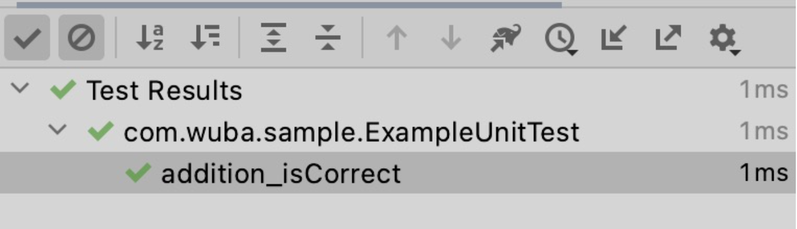
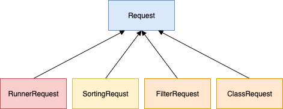
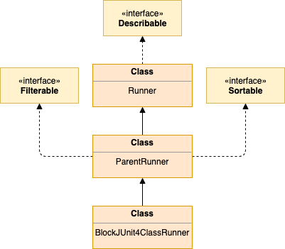
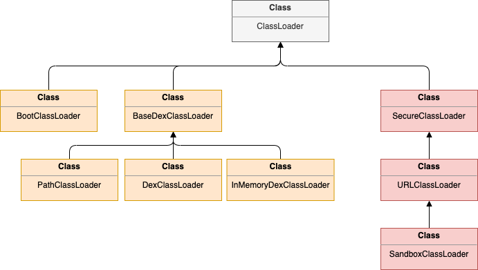
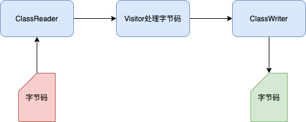
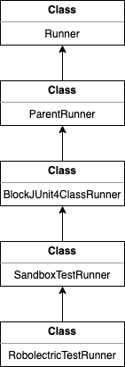
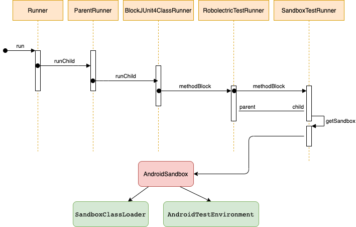
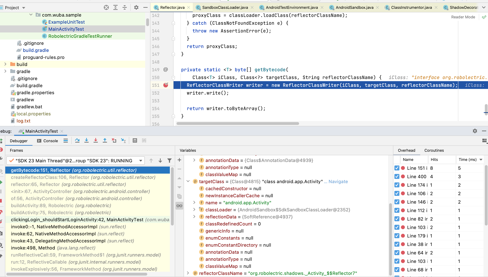

# Robolectric简介
Robolectric 是基于 JUnit 的单元测试框架，实现了在 JVM 上测试 Android 代码的功能。
# Junit简介
便于Robolectric的理解，先讲一下JUnit。   
JUnit是Java语言基于JVM的单元测试框架，理论上基于 JVM 的语言都可以使用。本文基于 JUnit4 的源码进行分析，目前最新版本为 JUnit5,由 Erich Gamma 和 Kent Beck 编写的一个回归测试框架（regression testing framework）,[相关理论可以参考冬冬的文档](https://ishare.58corp.com/articleDetail?id=72054)
- # JUnit的运行原理
  简单case入手   
  ```java
  package com.wuba.sample
  import org.junit.Assert.assertEquals
  import org.junit.Test
  class ExampleUnitTest {
    @Test
    fun addition_isCorrect() {
        assertEquals(4, 2 + 2)
    }
  }
  ```  
  执行结果： 
  
   
  
  JUnit易用性较好，0门槛上手，结合IDE的快捷键可快速启动JUnit的运行器测试单元功能；
## JUnitCore入口类 
```java
public class JUnitCore {
  private final RunNotifier notifier = new RunNotifier();

  /**
   * Run the tests contained in the classes named in the <code>args</code>.
   * If all tests run successfully, exit with a status of 0. Otherwise exit with a status of 1.
   * Write feedback while tests are running and write
   * stack traces for all failed tests after the tests all complete.
   *
   * @param args names of classes in which to find tests to run
   */
  public static void main(String... args) {
      Result result = new JUnitCore().runMain(new RealSystem(), args);
      System.exit(result.wasSuccessful() ? 0 : 1);
  }
}
```  
JUnitCore是运行测试的入口类，使用它来运行测试，它有我们程序main方法；  
如果所有测试都成功运行，则退出，状态为0。否则将以1的状态退出。在测试运行时编写反馈，并在测试全部完成后为所有失败的测试编写堆栈跟踪。
## 测试运行执行主要流程
1. 查找并创建执行主体Runner
2. 查找@Test注解方法
3. 运行单元测试
### 1.查找执行主体（Runner）
- #### Runner(BlockJUnit4ClassRunner)是由AllDefaultPossibilitiesBuilder构建
  JUnitCore的runMain方法中会执行run(Request request)方法  
  ```java
  /**
     * @param system
     * @param args from main()
     */
    Result runMain(JUnitSystem system, String... args) {
        system.out().println("JUnit version " + Version.id());
  
        JUnitCommandLineParseResult jUnitCommandLineParseResult = JUnitCommandLineParseResult.parse(args);
  
        RunListener listener = new TextListener(system);
        addListener(listener);
  
        return run(jUnitCommandLineParseResult.createRequest(defaultComputer()));
    }
  ```
  Request是请求是要运行的测试的抽象描述，当JUnit运行测试时，执行流程如下：  
  
   
   
  
  Request的子类及作用   
  
   
  
  * RunnerRequest，直接构造传入Runner对象来创建；
  * SortingRequest，作用就是可以将@Test的方法进行排序。Runner对象需要实现org.junit.runner.manipulation.Sortable
  *  FilterRequest
	- 作用就是可以将@Test的方法进行过滤，即表示是否运行,重写shouldRun方法。
	    Runner对象需要实现org.junit.runner.manipulation.Filterable
	- 跟@Ignore差不多，只不过FilterRequest是编程式，@Ignore是注解式
	- 因为jUnit是intellij发起入口测试的，所以上面的SortingRequest和FilterRequest其实不能手动自己去创建，所以可以暂时忽略，除非研究下怎么自己创建。或者扩展intellij的junit插件等。
	  * ClassRequest，该类是基础类，就是根据我们的测试类Test，来创建Runner的
	  
	  Runner是Request的成员变量,具体构建是AllDefaultPossibilitiesBuilder负责    
	  ```java
	  public abstract class Request {
	  /**
	    * Create a <code>Request</code> that, when processed, will run all the tests
	    * in a set of classes.
	    *
	    * @param computer Helps construct Runners from classes
	    * @param classes the classes containing the tests
	    * @return a <code>Request</code> that will cause all tests in the classes to be run
	    */
	   public static Request classes(Computer computer, Class<?>... classes) {
	       try {
	           AllDefaultPossibilitiesBuilder builder = new AllDefaultPossibilitiesBuilder(true);
	           Runner suite = computer.getSuite(builder, classes);
	           return runner(suite);
	       } catch (InitializationError e) {
	           throw new RuntimeException(
	                   "Bug in saff's brain: Suite constructor, called as above, should always complete");
	       }
	   }
	  }
	  ```  
	  AllDefaultPossibilitiesBuilder是如何一步步创建Runner呢？  
	  ```java
	  public class AllDefaultPossibilitiesBuilder extends RunnerBuilder {
	   @Override
	   public Runner runnerForClass(Class<?> testClass) throws Throwable {
	       List<RunnerBuilder> builders = Arrays.asList(
	               ignoredBuilder(),
	               annotatedBuilder(),
	               suiteMethodBuilder(),
	               junit3Builder(),
	               junit4Builder());
	       for (RunnerBuilder each : builders) {
	           Runner runner = each.safeRunnerForClass(testClass);
	           if (runner != null) {
	               return runner;
	           }
	       }
	       return null;
	   }
	  }
	  ```
	  runnerForClass方法作用域中List<RunnerBuilder> builders,按顺序查找RunnerBuilder，最终命中Builder创建所需Runner，按顺序讲解一下Builder的类型及作用；
	  1. IgnoredBuilder：如果测试类存在@Ignore（org.junit.Ignore），则可以从IgnoredClassRunner中发现，实际上代表什么都不做do nothing，一个@Test都不会运行。
	  2. AnnotatedBuilder，如果测试类存在@RunWith，则利用注解的class来反射实例化一个Runner对象。
	  3. SuiteMethodBuilder,会去查找测试类Class，是否存在静态的static, 方法名为suite的，则直接当作测试Test执行. 如下：
	  ```java
	   public static junit.framework.Test suite(){
	       return new junit.framework.Test(){
	           @Override
	           public int countTestCases() {
	               return 0;
	           }
	           @Override
	           public void run(TestResult result) {
	               System.out.println("haha");
	           }
	       };
	   }
	  ```
	  4. Junit3Builder,测试类是TestCase的子类用来执行。 是属于junit3的一种方式。基本可以忽略了
	  5. Junit4Builder，构建默认使用的Runner，目前JUnit4默认Runner是BlockJUnit4ClassRunner
	  ```java
	  public class JUnit4Builder extends RunnerBuilder {
	   @Override
	   public Runner runnerForClass(Class<?> testClass) throws Throwable {
	       return new BlockJUnit4ClassRunner(testClass);
	   }
	  }
	  ```
	  
	  通过上述步骤我们就找到了执行的Runner(BlockJUnit4ClassRunner)
- #### BlockJUnit4ClassRunner的构成
  是ParentRunner运行类的子类，也是junit4版本的默认执行类，类结构图如下：  
  
  
### 2.找到@Test 注解的方法
第一步创建 Runner 对象时，在构造方法里会传入 ExampleUnitTest.Class，然后利用反射，查找标记有 @Test 注解的方法，并将这些方法保存起来。   
```java
  protected List<FrameworkMethod> computeTestMethods() {
      return getTestClass().getAnnotatedMethods(Test.class);
  }
```
第二步，将注解方法组装为Description测试单元
```java
@Override
  protected Description describeChild(FrameworkMethod method) {
      Description description = methodDescriptions.get(method);

      if (description == null) {
          description = Description.createTestDescription(getTestClass().getJavaClass(),
                  testName(method), method.getAnnotations());
          methodDescriptions.putIfAbsent(method, description);
      }

      return description;
  }
```
### 3.运行单测方法
接下来最后一步，执行 Runner 对象的 run 方法。run 方法对 classBlock 方法做了简单的包装，核心还是 classBlock和methodBlock 方法。
简化版 methodBlock：
```java
protected Statement methodBlock(FrameworkMethod method) { // FrameworkMethod 是对 Method 类的包装
  Object test = createTest() // 创建 ExampleUnitTest的实例，实现代码大概是：ExampleUnitTest.Class.newInstance()
  Statement statement = methodInvoker(method, test); // 调用 method，实现代码大概是：method.invoke(test, params)
  return statement;
}
```


通过上述分析，我们了解了 JUnit 框架的基本执行流程。如果我们想以 JUnit 为基础实现自己的单元测试框架，只需自定义 Runner 类即可。
## Robolectric实现具有Android特性单元测试可在JVM上运行
综上所述，我们了解了JUnit的单元测试原理，但是该框架无法直接运行Android特性方法，通常的做法是启动 Android 模拟器进行测试。但是在模拟器上运行测试用例是非常低效的，构建、安装、启动，每个步骤都异常耗时，为了解决这一问题，Robolectric 通过 mock Android 运行时环境，使得单元测试可以在 JVM 环境上运行。
# Robolectric原理
## 如何Mock Android特性和运行环境
本节的重点是分析 Robolectric 如何 mock Android 运行时环境的。在此之前，需要先了解下所需的两门相关技术 Java 类加载器 和 ASM部分。
- ### 类加载器
  虚拟机设计团队把类加载阶段中的 "通过一个类的全限定名来获取描述此类的二进制字节流" 这个动作放到 Java 虚拟机外部去实现，以便让应用程序自己决定如何去获取所需要的类。实现这个动作的代码模块称为"类加载器"。    
   
  
  以上列出了Java（黄色）和Android（红色）的ClassLoader,以便我们整体了解：
  * ClassLoader是一个抽象类，其中定义了ClassLoader的主要功能。
  * SecureClassLoader类和JDK8中的SecureClassLoader类的代码是一样的，它继承了抽象类ClassLoader，SecureClassLoader并不是ClassLoader的实现类，而是拓展了ClassLoader类加入了权限方面的功能，加强了ClassLoader的安全性。           
  * URLClassLoader类和JDK8中的URLClassLoader类的代码是一样的，它继承自SecureClassLoader，用来通过URl路径从jar文件和文件夹中加载类和资源。在Android中基本无法使用          
  * BootClassLoader是它的内部类，用于预加载preload()常用类，加载一些系统Framework层级需要的类，我们的Android应用里也需要用到一些系统的类等        
  * BaseDexClassLoader继承自ClassLoader，是抽象类ClassLoader的具体实现类，PathClassLoader和DexClassLoader都继承它。
	- PathClassLoader加载系统类和应用程序的类，如果是加载非系统应用程序类，则会加载data/app/目录下的dex文件以及包含dex的apk文件或jar文件
	- DexClassLoader 可以加载自定义的dex文件以及包含dex的apk文件或jar文件，也支持从SD卡进行加载
	- InMemoryDexClassLoader是Android8.0新增的类加载器，继承自BaseDexClassLoader，用于加载内存中的dex文件。
- ### ASM
  字节码增强技术就是一类对现有字节码进行修改或者动态生成全新字节码文件的技术,对于需要手动操纵字节码的需求，可以使用ASM，它可以直接生产 .class字节码文件，也可以在类被加载入JVM之前动态修改类行为。ASM的应用场景有AOP（Cglib就是基于ASM）、热部署、修改其他jar包中的类等   
  
  
- 先通过ClassReader读取编译好的.class文件
- 通过访问者模式（Visitor）对字节码进行修改，常见的Visitor类有：对方法进行修改的MethodVisitor，或者对变量进行修改的FieldVisitor等
- 通过ClassWriter重新构建编译修改后的字节码文件、或者将修改后的字节码文件输出到文件中
  举个例子
  sayHello方法简单输出一句话，要在原有输出的前后增加输出"start","end"，代码如下：
  ```java
  public class Demo {
    @Override
    public void sayHello() {
        System.out.println("sayHello");
    }
  }
  ```
  声明字节码处理器    
  ```java
  public class MyClassVisitor extends ClassVisitor implements Opcodes {
    public MyClassVisitor( ClassVisitor classVisitor) {
        super(ASM5, classVisitor);
    }
    @Override
    public MethodVisitor visitMethod(int i, String s, String s1, String s2, String[] strings) {
        MethodVisitor methodVisitor = cv.visitMethod(i, s, s1, s2, strings);
        if (s.equals("sayHello")) {
     return new MyMethodVisitor(methodVisitor);
        }
        return methodVisitor;
    }
  
    class MyMethodVisitor extends MethodVisitor implements Opcodes{
  
        public MyMethodVisitor(MethodVisitor methodVisitor) {
            super(ASM5, methodVisitor);
        }
  
        @Override
        public void visitCode() {
            mv.visitFieldInsn(GETSTATIC, "java/lang/System", "out", "Ljava/io/PrintStream;");
            mv.visitLdcInsn("start");
            mv.visitMethodInsn(INVOKEVIRTUAL, "java/io/PrintStream", "println", "(Ljava/lang/String;)V", false);
            super.visitCode();
        }
  
        @Override
        public void visitInsn(int opcode) {
            if ((opcode >= Opcodes.IRETURN && opcode <= Opcodes.RETURN)
                    || opcode == Opcodes.ATHROW) {
                mv.visitFieldInsn(GETSTATIC, "java/lang/System", "out", "Ljava/io/PrintStream;");
                mv.visitLdcInsn("end");
                mv.visitMethodInsn(INVOKEVIRTUAL, "java/io/PrintStream", "println", "(Ljava/lang/String;)V", false);
            }
            super.visitInsn(opcode);
        }
    }
  }
  ```
  字节码处理执行
  ```java
  public class AsmDemo {
    public static void main(String[] args) throws IOException {
        // 读取字节码
        ClassReader classReader = new ClassReader("aop/demo/service/Demo");
        ClassWriter classWriter = new ClassWriter(ClassWriter.COMPUTE_MAXS);
        // 字节码增强
        ClassVisitor classVisitor = new MyClassVisitor(classWriter);
        classReader.accept(classVisitor, ClassReader.SKIP_DEBUG);
        byte[] data = classWriter.toByteArray();
        // 输出字节码到class文件
        File f = new File("/Users/zhangzhixin/workspace/ASMDemo/build/service/target/classes/aop/demo/service/Demo.class");
        FileOutputStream fout = new FileOutputStream(f);
        fout.write(data);
        fout.close();
    }
  
  }
  ```
  输出后的字节码
  ```java
  public class Demo {
    @Override
    public void sayHello(){
  	System.out.println("start");
        System.out.println("sayHello");
  	System.out.println("end");
    }
  }
  ```
  首先是MyClassVisitor，MyClassVisitor继承自ClassVisitor，用以观察某个类的字节码文件，其中visitMethod方法用于判断当前读取到字节码文件的哪个方法了，当读取到我们想进行增强的方法时，交给MyMethodVisitor对原方法进行增强   
  MyMethodVisitor负责对具体方法进行增强，visitCode会在某个方法被访问时调用，故前置增强逻辑在此编写，visitInsn会在无参数的指令的执行时调用，退出语句return被调用时就会调用visitInsn方法，因此，后置增强逻辑可以写在这里   
  至于具体的增强指令visitFieldInsn，visitMethodInsn，并不是用java语句级别的，而是字节码指令。
- ### Robolectric使用ClassLoader和ASM实现运行时动态替换Android特性
  1. android运行环境沙箱
  Robolectric 实现了自定义的 RobolectricTestRunner，单元测试的执行主体，也是Robolectric的启动入口   
  
   
  
  上图可见RobolectricTestRunner的继承关系
  
  
  Robolectric保障Android运行是创建了Android沙箱环境的，具体怎么创建呢？以Runner的时序图查看沙箱的创建：  
   
  
  上图可见，在SandboxTestRunner的getSandbox方法，会生成Android的沙箱，沙箱包括2个重要项SandboxClassLoader和AndroidTestEnvironment(提供Android特性环境)
  为了可以看到AndroidTestEnvironment都提供了什么，我截取了他的部分代码：  
  ```java
  @Override
  public void setUpApplicationState(
      Method method, Configuration configuration, AndroidManifest appManifest) {
    clearEnvironment();
    RuntimeEnvironment.setTempDirectory(new TempDirectory(createTestDataDirRootPath(method)));
    if (ShadowLooper.looperMode() == LooperMode.Mode.LEGACY) {
      RuntimeEnvironment.setMasterScheduler(new Scheduler());
      RuntimeEnvironment.setMainThread(Thread.currentThread()); // 把当前线程设置为主线程
      ShadowLegacyLooper.internalInitializeBackgroundThreadScheduler();
    }
    android.content.res.Configuration androidConfiguration =
        new android.content.res.Configuration(); // 模拟设备配置信息
    DisplayMetrics displayMetrics = new DisplayMetrics(); // 
    Bootstrap.applyQualifiers(config.qualifiers(), apiLevel, androidConfiguration, displayMetrics);//配置模拟设备环境
  
    // Looper needs to be prepared before the activity thread is created
    if (Looper.myLooper() == null) {
      Looper.prepareMainLooper(); // 设置MainLooper
    }
    preloadClasses(apiLevel); // 预加载Android代码
  
    RuntimeEnvironment.setActivityThread(ReflectionHelpers.newInstance(ActivityThread.class));// 设置ActiviyThread
    ReflectionHelpers.setStaticField(
        ActivityThread.class, "sMainThreadHandler", new Handler(Looper.myLooper()));
  
    Instrumentation instrumentation = createInstrumentation();//创建Instrumentation
    InstrumentationRegistry.registerInstance(instrumentation, new Bundle());
    Supplier<Application> applicationSupplier =
        createApplicationSupplier(appManifest, config, androidConfiguration, displayMetrics); // 创建application对象
    RuntimeEnvironment.setApplicationSupplier(applicationSupplier); 
  
    if (configuration.get(LazyLoad.class) == LazyLoad.ON) {
      RuntimeEnvironment.setConfiguredApplicationClass(
          getApplicationClass(appManifest, config, new ApplicationInfo()));
    } else {
      // force eager load of the application
      RuntimeEnvironment.getApplication();
    }
    ...
  }
  
  ```
  想再深入研究的可以查看源码。
  
  2. 替换系统类加载器为自定义类加载器  
  Robolectric 在 SandboxTestRunner 的 methodBlock 方法中进行了类加载器的替换：
  ```java
  // getTestClass().getJavaClass() 作用是获取 MainActivityTest 的 Class 对象
  Class bootstrappedTestClass = bootstrappedClass(getTestClass().getJavaClass());
  ```
  ```
  public <T> Class<T> bootstrappedClass(Class<?> clazz) {
    try {
    return (Class<T>) sandboxClassLoader.loadClass(clazz.getName());
    } catch (ClassNotFoundException e) {
    throw new RuntimeException(e);
    }
  }
  ```
  
  3. Shadow类对Android特性类字节码处理
  以Activity为例，查找Android特性类进行字节码处理  
  Robolectric 在 org.robolectric.shadows 包中预定义了许多 Shadow 开头的类，比如 ShadowActivity   
  在 SandboxClassLoader 的 findClass方法中，会去寻找相匹配的 Shadow 类，然后利用 ASM 工具，在加载类时进行字节码的动态处理。  
  
   
  
  进过ReflectorClassWriter字节码写入处理后，activity会添加一个__robo_data__的成员变量：  
  
      
  
   __robo_data__就是插入的ShadowActivity对象，该对象替换了原activity的原生方法，达到将原生特性转接沙箱环境特性的类,以下已findViewById方法举例说明；  
   ```java
   package org.robolectric.shadows;
  @SuppressWarnings("NewApi")
  @Implements(Activity.class)
  public class ShadowActivity extends ShadowContextThemeWrapper {
  @RealObject protected Activity realActivity;
  @Implementation
  protected View findViewById(int id) { // 重写原生findViewById方法，达到替换的作用，保证运行使用上下文为沙箱环境
    return getWindow().findViewById(id);
  }
  @Implementation
  protected Window getWindow() {
    Window window = reflector(DirectActivityReflector.class, realActivity).getWindow();
    if (window == null) {
      try {
        window = ShadowWindow.create(realActivity);
        setWindow(window);
      } catch (Exception e) {
        throw new RuntimeException("Window creation failed!", e);
      }
    }
    return window;
  }
  ...
  }
   ```  
   至此Android特性就可以运行在JVM上了，是不是很神奇，以上由于篇幅有限，只能讲解关键流程，Robolectric框架一个很优秀的框架，包括google官方的Androidx Test对其也做了支持，有很多可贵的知识点和问题解决方案，我这边只讲了冰山一角，大家感兴趣可以查看其源码自学。
# 总结
Robolectric为实现单元测试在JVM上运行Android特性，通过Shadow的来映射Android中的类，模拟了Android沙箱环境，使用ClassLoader和ASM技术实现加载类时字节码动态替换。

Robolectric允许我们在项目工程中单元测试或者持续集成中使用JVM来执行测试用例，所以就省掉了打包、安装的过程，将测试用例的执行时间由分钟级降到秒级，将单元测试周期缩短节省开发资源，同时也可以有效保障上层业务的稳定性。

XML之父Tim Bray博客里说：“代码不写测试就像上了厕所不洗手……单元测试是对软件未来的一项必不可少的投资。”
# 参考文档：
官方文档：http://robolectric.org   
github地址：https://github.com/robolectric/robolectric    
ASM：https://asm.ow2.io/#Q10