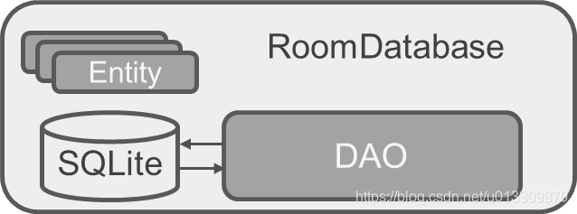

- 如下图，Room数据库包含三个对象：
  1.[[#red]]==**Entity : 对应数据库中的表**==，可以使用Entity注解将一个类变成数据库中的一张表结构。
  2. [[#red]]==**DAO**== : 全称Database Access Object,[[#red]]==**定义了对数据库中数据的读写等操作**==，DAO中可以使用SQL语句来操作数据库。
  3. [[#red]]==**RoomDatabase : 数据库持有类，用于创建数据库或者连接到数据库**==。内部包含DAO和Entity。
- 