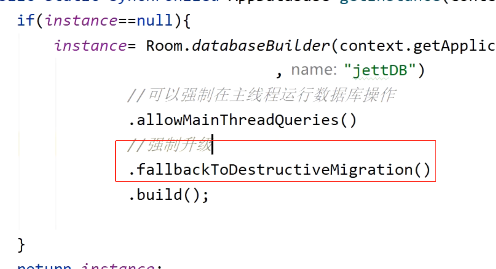
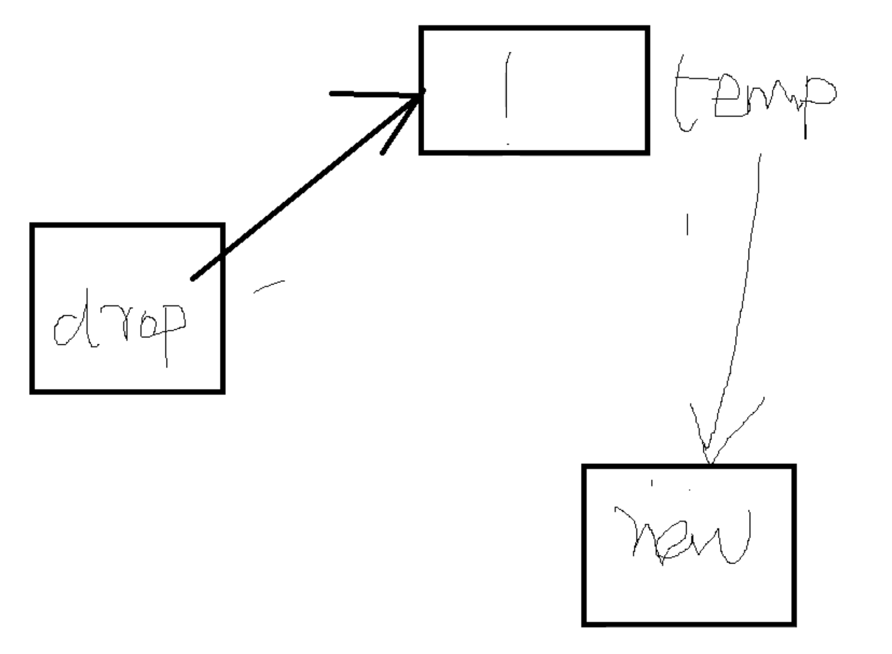

## 基本使用
	- ```java
	  Room.databaseBuilder(getApplicationContext(), MyDb.class, "database-name")
	          .addMigrations(MIGRATION_1_2, MIGRATION_2_3).build();
	  
	  static final Migration MIGRATION_1_2 = new Migration(1, 2) {
	      @Override
	      public void migrate(SupportSQLiteDatabase database) {
	          database.execSQL("CREATE TABLE `Fruit` (`id` INTEGER, "
	                  + "`name` TEXT, PRIMARY KEY(`id`))");
	      }
	  };
	  
	  static final Migration MIGRATION_2_3 = new Migration(2, 3) {
	      @Override
	      public void migrate(SupportSQLiteDatabase database) {
	          database.execSQL("ALTER TABLE Book "
	                  + " ADD COLUMN pub_year INTEGER");
	      }
	  };
	  ```
- ## 场景：数据库字段发生变化，加了一列
- ## 方式1、强制升级，数据丢失（不建议使用）
  collapsed:: true
	- 
- ## 方式2、[[#red]]==**通过Migration**==，通过SQL脚本定义 数据库的变化
  collapsed:: true
	- ```java
	  static final Migration MIGRATION_1_2 = new Migration(1, 2) {
	      @Override
	      public void migrate(SupportSQLiteDatabase database) {
	          database.execSQL("CREATE TABLE `Fruit` (`id` INTEGER, "
	                  + "`name` TEXT, PRIMARY KEY(`id`))");
	      }
	  };
	  
	  ```
	- 添加到DataBase上
		- ```java
		  Room.databaseBuilder(getApplicationContext(), MyDb.class, "database-name")
		          .addMigrations(MIGRATION_1_2, MIGRATION_2_3).build();
		  ```
- ## 表删除某一列，然后升级怎么写
  collapsed:: true
	- ## 逻辑
	  collapsed:: true
		- 
		- 1、新建正确的临时表
		- 2、将数据copy到临时表
		- 3、删除旧表
		- 4、rename 临时表 -》新表
	- ## 代码
		- ```java
		      static final Migration MIGRATION_2_3=new Migration(2,3) {
		          @Override
		          public void migrate(@NonNull SupportSQLiteDatabase database) {
		                // 创建新的临时表
		  //            database.execSQL("create table student_temp (uid integer primary key not null,name text,pwd text,addressId)");
		  //            取出数据 插入临时表
		  //            database.execSQL("insert into student (uid,name,pwd,addressid)" + " select uid,name,pwd,addressid from student");
		  //            把旧表删了
		  //            database.execSQL("drop table student");
		                // 把临时表 改名 
		  //            database.execSQL("alter table student_temp rename to student");
		          }
		      };
		  ```