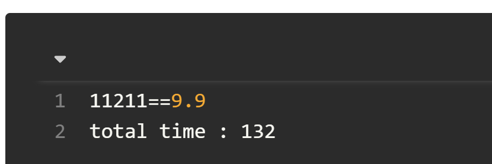

- ## 1、`select`和`Deferred`结合使用来获取最快的那个数据（缓存，网络）
  title:: Select组件
  collapsed:: true
	- ## 第一版
	  collapsed:: true
		- ```kotlin
		  fun main(){
		      runBlocking {
		          val startTime = System.currentTimeMillis()
		          val productId = "11211"
		          val product = select {
		              async { getCacheInfo(productId) }
		                  .onAwait{
		                      it
		                  }
		  
		              async { getNetworkInfo(productId) }
		                  .onAwait{
		                      it
		                  }
		          }
		          updateUI(product)
		          println("total time : ${System.currentTimeMillis() - startTime}")
		      }
		  }
		  
		  
		  ```
		- 上述用`select`优化完，打印如下：
			- 
		- 这里我们直接使用`select`包裹多个`Deferred`对象，然后在里面的对每个`Deferred`对象不是使用我们之前常用的`await()`挂起函数来获取结果，还是使用`onAwait`来获取结果，这里要注意。
		- 关于这个`select`是如何选取里面跑的最快的原理我们不做深入探究，我们单从上面名字来看`await`和`onAwait`来看出一点端倪，我们平时使用`onXXX`方法时，一般都是认为是一个回调，而这里的意思也是类似的，即多个`Deferred`有哪个回调了，就把值回调出去，从而找到最快的。
		- 上面代码虽然可以完美获取运行最快的`Deferred`，但是业务上还是有点问题，即假如缓存返回很快、网络返回较慢，我们只会显示缓存的，无法显示最新的网络的信息，所以我们只需要稍微修改一下，判断数据是否来自缓存即可，修改如下:
		-
	- ## 第二版、
		- ```kotlin
		  /**
		   * 数据类，来表示一个商品
		   * @param isCache 是否是缓存数据
		   * */
		  data class Product(val productId: String,val price: Double,val isCache: Boolean = false)
		  
		  ```
		- 先给数据类加个属性，表示是否是缓存，这里我们给`isCache`设置的是`val`变量，这里是遵循Kotlin的不变性原则：类尽量要减少对外暴露不必要api，以减少变化可能性。同时数据类的赋值，尽量都是使用构造函数，而不要单独去修改变量值。
		- 那如何修改这个`isCache`变量呢？建议使用`copy`的方式，比如优化后的代码：
		- ```kotlin
		  fun main(){
		      runBlocking {
		          val startTime = System.currentTimeMillis()
		          val productId = "11211"
		          val cacheDeferred = async { getCacheInfo(productId) }
		          val networkDeferred = async { getNetworkInfo(productId) }
		          val product = select {
		              cacheDeferred.onAwait{
		                      //这里有变化
		                      it.copy(isCache = true)
		                  }
		  
		              networkDeferred.onAwait{
		                      it.copy(isCache = false)
		                  }
		          }
		          updateUI(product)
		          println("total time : ${System.currentTimeMillis() - startTime}")
		          //如果当前是缓存信息，则再去获取网络信息
		          if (product.isCache){
		              val latest = networkDeferred.await()
		              updateUI(latest)
		              println("all total time : ${System.currentTimeMillis() - startTime}")
		          }
		      }
		  }
		  ```
	- 这里我们在缓存和网络中获取数据时，给加了判断，这里使用`copy`来减少数据变化性，同时在后面进行判断，是否是缓存信息，如果是的话，再去获取网络信息，打印如下：
		- ```
		  11211==9.9
		  total time : 134
		  11211==9.8
		  all total time : 235
		  ```
- ## 2、`select` 和 `Channel` 配合使用
  collapsed:: true
	- 上面我们以`select`和`Deferred`结合使用来获取最快的那个，这里我们再进阶一下，`select`还可以和`Channel`一起使用。
	- 我们想一下，`Channel`是一个密闭的管道，用于协程间的通信，这时假如有多个管道，就类似于上面例子中每个协程会返回多个值，这时我们可以选择合适的值。
	- 我们以一个简单例子来看看如何使用：
	- ```kotlin
	  un main() = runBlocking {
	      val startTime = System.currentTimeMillis()
	      //开启一个协程，往channel1中发送数据，这里发送完 ABC需要450ms，
	      val channel1 = produce {
	          delay(50L)
	          send("A")
	          delay(150)
	          send("B")
	          delay(250)
	          send("C")
	          //延迟1000ms是为了这个Channel不那么快close
	          //因为produce高阶函数开启协程，当执行完时，会自动close
	          delay(1000)
	      }
	      //开启一个协程，往channel2中发送数据，发送完abc需要500ms
	      val channel2 = produce {
	          delay(100L)
	          send("a")
	          delay(200L)
	          send("b")
	          delay(200L)
	          send("c")
	          delay(1000)
	      }
	  
	      //选择Channel，接收2个Channel
	      suspend fun selectChannel(channel1: ReceiveChannel<String>, channel2: ReceiveChannel<String>): String =
	          select {
	              //这里同样使用类onXXX的API
	              channel1.onReceiveCatching {
	                  it.getOrNull() ?: "channel1 is closed!"
	              }
	              channel2.onReceiveCatching {
	                  it.getOrNull() ?: "channel2 is closed!"
	              }
	          }
	  
	      //连续选择6次
	      repeat(6) {
	          val result = selectChannel(channel1, channel2)
	          println(result)
	      }
	  
	      //最后再把协程取消，因为前面设置的有1000ms延迟
	      channel1.cancel()
	      channel2.cancel()
	  
	      println("Time cost: ${System.currentTimeMillis() - startTime}")
	  }
	  
	  ```
	- 上面代码的运行结果如下：
	- ```kotlin
	  A
	  a
	  B
	  b
	  C
	  c
	  Time cost: 553
	  ```
	- 首先我们分析一下结果，耗时是553，这说明`select`在选择时，2个`Channel`交替给出数据，这也就是并发的体现。其次就是上面代码的理解，有一些注释需要仔细看看，现在来简单说明一下：
	- `produce`函数的返回值，以及为什么要在最后`delay(1000)`。我们看一下函数定义：'
		- ```kotlin
		  public fun <E> CoroutineScope.produce(
		          context: CoroutineContext = EmptyCoroutineContext,
		          capacity: Int = 0,
		          @BuilderInference block: suspend ProducerScope<E>.() -> Unit
		      ): ReceiveChannel<E> =
		          produce(context
		              , capacity
		              , BufferOverflow.SUSPEND
		              , CoroutineStart.DEFAULT
		              , onCompletion = null
		              , block = block)
		  
		  ```
	- 这个函数的返回值类型是`ReceiveChannel`，根据`Channel`章节的学习，我们知道这个是用来接收数据的。而`block`高阶函数类型的接收者是`ProducerScope`，定义如下：
		- ```kotlin
		  public interface ProducerScope<in E> : CoroutineScope, SendChannel<E> {
		  
		      public val channel: SendChannel<E>
		  }
		  ```
	- 这是一个接口，接口中有一个默认实现的`channel`，所以我们可以在`block`代码中调用`send`方法来发送数据。
	- 同时该函数会启动一个协程，然后把数据发送到返回值的`ReceiveChannel`中，当发送完毕后，会调用`close`方法，这也就是为什么我们要在后面`delay(1000)`的原因，是防止我们取数据的时候，这个`channel`已经关闭了。
	- 在`selectChannel()`方法中中，我们使用`select`包裹了2个`channel`，注意这里我们使用的方法回调是`onReceiveCatching`，当然它也有`onReceive`方法，之所以这样是因为可以防止`channel`被关闭后，导致的异常。
	- 最后就是这里的`send`、`select`都是挂起函数，所以这里的思考的时候就需要发挥一点想象力。首先第一次调用`select`来选择时，发现没得选，都没有返回，这时就会挂起。等待一会后，`channel1就会`回调第一个数据`A`，然后`select`得到数据。紧接着，又是第二次调用`select`，依旧会等待，又过了一会，`channel2`管道发送了一个数据。
	- 所以这个过程就是俩根管道同时往一个池子中放球，而`select`就是旁边拿球的人，每调用一次就来取一次。
- # 总结
	- 本篇文章介绍了非常有实际用途的`select`组件，当我们在日常开发中遇到了异步选择难题，可以使用`select`来简化我们的代码。