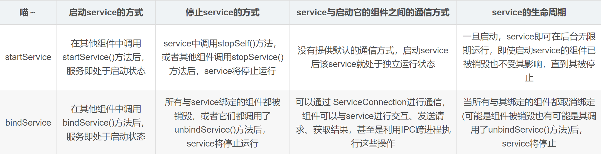

- # 一、概念
	- Service是Android实现程序后台运行的解决方案
	- 它非常适合去执行那些不需要和用户交互而且还要长期运行的任务。
- # 二、代码运行在主线程
- # 三、需要清单文件注册才能使用
  collapsed:: true
	- Manifests文件里进行声明的时候，只有android:name属性是必须要有的，其他的属性都可以没有。但是有的时候适当的配置可以让我们的开发进行地更加顺利，所以了解一下注册一个service可以声明哪些属性也是很有必要的。
	- ```xml
	  <service
	      android:enabled=["true" | "false"]
	      android:exported=["true" | "false"]
	      android:icon="drawable resource"
	      android:isolatedProcess=["true" | "false"]
	      android:label="string resource"
	      android:name="string"
	      android:permission="string"
	      android:process="string" >
	  </service>
	  ```
		- android:enabled : 如果为true，则这个service可以被系统实例化，如果为false，则不行。默认为true
		- android:exported : 如果为true，则其他应用的组件也可以调用这个service并且可以与它进行互动，如果为false，则只有与service同一个应用或者相同user ID的应用可以开启或绑定此service。它的默认值取决于service是否有intent filters。如果一个filter都没有，就意味着只有指定了service的准确的类名才能调用，也就是说这个service只能应用内部使用——其他的应用不知道它的类名。这种情况下exported的默认值就为false。反之，只要有了一个filter，就意味着service是考虑到外界使用的情况的，这时exported的默认值就为true
		- android:icon : 一个象征着这个service的icon
		- android:isolatedProcess : 如果设置为true，这个service将运行在一个从系统中其他部分分离出来的特殊进程中，我们只能通过Service API来与它进行交流。默认为false。
		- android:label : 显示给用户的这个service的名字。如果不设置，将会默认使用<application>的label属性。
		- android:name : 这个service的路径名，例如“com.lypeer.demo.MyService”。这个属性是唯一一个必须填的属性。
		- android:permission : 其他组件必须具有所填的权限才能启动这个service。
		- android:process : service运行的进程的name。默认启动的service是运行在主进程中的。
- # 四、Service的两种启动方式
  collapsed:: true
	- ## startService();
		- startService(new Intent(context,MyService.class))
	- ## [[BindService]]
		- ```java
		  Intent intent = new Intent(this, LocalService.class);
		  bindService(intent, mConnection, Context.BIND_AUTO_CREATE);
		  ```
- # 五、startService和bindService区别
	- 
- # 六、Service的生命周期
  collapsed:: true
	- 
	- ## onCreate()
		- 服务创建的时候调用
	- ## onStartCommand()
		- 每次服务启动的时候调用
		- ## 返回值的区别，服务被系统杀死后，怎么操作
			- ## 1、START_NOT_STICKY（常量值：2）
				- - 默认情况下，系统不会重新创建服务。除非有将要传递来的Intent时，系统重新创建服务，并调用`onStartCommand()`，传入此Intent。
				- ==车祸后再也没有苏醒==
				- - 这是最安全的选项，可以避免在不必要的时候运行服务。
			- ## 2、START_STICKY（常量值：1）
				- 系统重新创建服务，并调用`onStartCommand()`，默认是传入空Intent。除非存在将要传递来的Intent，那么就传递这些Intent。
				- ==特点：车祸后自己苏醒，但是失忆==
				- 适合：播放器一类的服务。独立运行，但无需执行命令，只等待任务。
			- ## 3、START_REDELIVER_INTENT（常量值：3）
				- - 系统重新创建服务，并调用`onStartCommand()`，传入上次传递给服务执行过的Intent。
				- ==车祸后自己苏醒，依然保持记忆==。
				- - 适合像下载一样的服务。立即恢复，积极执行。
	- ## onBind()
		- 当其他组件通过bindService()方法与service相绑定之后，此方法将会被调用。这个方法有一个IBinder的返回值，这意味着在重写它的时候必须返回一个IBinder对象，它是用来支撑其他组件与service之间的通信的——另外，如果你不想让这个service被其他组件所绑定，可以通过在这个方法返回一个null值来实现。
	- ## onDestory()
		- 服务销毁的时候调用
	- # 示例
		- ```java
		  public class ServiceDemo extends Service {
		  
		      private static final String TAG = "ServiceDome";
		  
		      @Override
		      public void onCreate() {
		          super.onCreate();
		          Log.d(TAG, "onCreate");
		          //只在service创建的时候调用一次，可以在此进行一些一次性的初始化操作
		      }
		  
		      @Override
		      public int onStartCommand(Intent intent, int flags, int startId) {
		          Log.d(TAG, "onStartCommand");
		          //当其他组件调用startService()方法时，此方法将会被调用
		          //在这里进行这个service主要的操作
		          return super.onStartCommand(intent, flags, startId);
		      }
		  
		      @Nullable
		      @Override
		      public IBinder onBind(Intent intent) {
		          Log.d(TAG, "onBind");
		          //当其他组件调用bindService()方法时，此方法将会被调用
		          //如果不想让这个service被绑定，在此返回null即可
		          return null;
		      }
		  
		      @Override
		      public void onDestroy() {
		          Log.d(TAG, "onDestroy");
		          //service调用的最后一个方法
		          //在此进行资源的回收
		          super.onDestroy();
		      }
		  }
		  ```
- # 两种启动方式的场景
	- ## startService
		- 适合那种启动之后不显式停止它就永远在后台运行，并且不需要客户端与服务端交互的service
	- ## bindService
		- 就适合那种可以交互的，可以掌控它什么时候停什么时候开始的。
		- 另外，如果有IPC的需求，那当然bindService是必不可少的了。
- # BindService与AIDL
-
- # [[Service面试题]]
- # 参考
	- # [Android中的Service：默默的奉献者 (1)](https://blog.csdn.net/luoyanglizi/article/details/51586437)
	- [Service](https://blog.csdn.net/luoyanglizi/article/details/51594016)