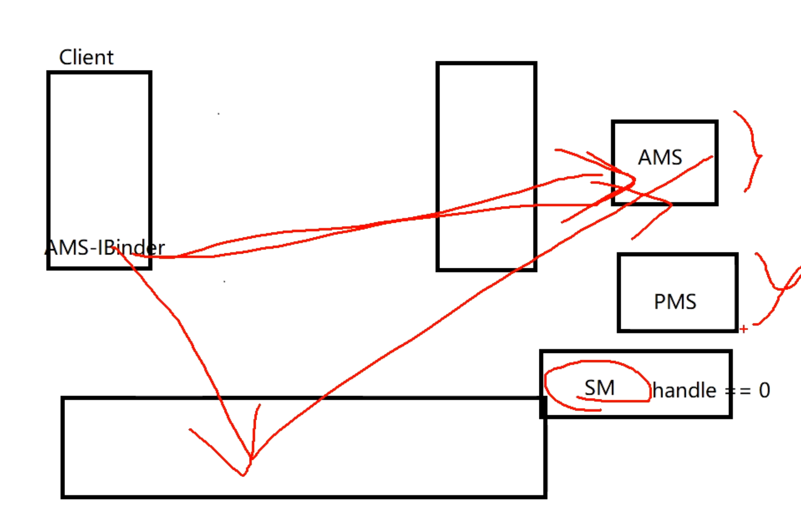

- # 一、概念
	- Android ServiceManager（服务管理器）是 Android 系统中的一个重要组件，==它充当了系统服务的注册和查找中心==。它负责管理和提供系统级服务给应用程序和其他系统组件使用
	-
	- Android 系统中的许多核心服务都通过 ServiceManager 进行注册和提供，例如 ActivityManagerService、WindowManagerService、PowerManager、PackageManagerService 等。应用程序可以通过 ServiceManager 获取这些系统服务的实例，并调用相应的方法来完成特定的功能。
	- 
	- 1、我们无法直接获取 AMS，PMS等Ibinder对象进行，进程间通信
	- 2、SM的handle = 0我们可以直接获取handle = 0来获取SM
	- 3、当系统启动的时候的时候，AMS,PMS会自动注册到SM中
	- 4、那么我们获取SM,这个大管家 就可以获取AMS PMS等，通过Binder机制进行进程间通信
- # 二、机制
	- ServiceManager 使用了 Binder IPC（Inter-Process Communication）机制，允许不同的进程之间进行通信。它维护一个全局的服务列表，并为每个服务分配一个唯一的标识符（token）。其他进程可以使用这个标识符通过 Binder IPC 与对应的服务进行交互。
- # 三、 [[ServiceManager启动和获取]]
-