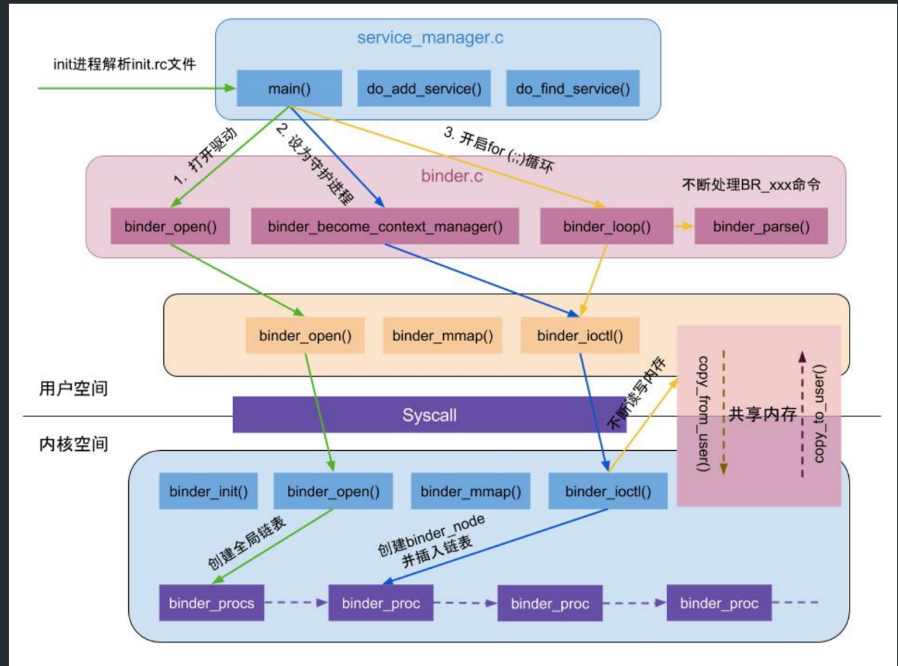

- ## SM注册启动流程图
	- 
- # 1.启动servicemanager进程
  collapsed:: true
	- ==ServiceManager是由init进程通过解析init.rc文件而创建的==，其所对应的可执行程序servicemanager，
	- 所对应的源文件是service_manager.c，进程名为servicemanager。
	- system/core/rootdir/init.rc
		- ```rc
		  // 602
		  service servicemanager /system/bin/servicemanager
		      class core
		      user system
		      group system
		      critical
		      onrestart restart healthd
		      onrestart restart zygote
		      onrestart restart media
		      onrestart restart surfaceflinger
		      onrestart restart drm
		  ```
- # 2.main:启动ServiceManager的入口函数是 service_manager.c 中的main()方法。
	- ```c
	  frameworks/native/cmds/servicemanager/service_manager.c
	  // 354
	  int main(int argc, char **argv)
	  {
	      // 358 打开 binder驱动，申请 128k字节大小的内存空间---见后面小节
	      bs = binder_open(128*1024);
	      // 364 设为守护进程，成为 binder大管理者---见后面小节
	      if (binder_become_context_manager(bs)) {
	      // 391 进入无限循环，处理client端发来的请求---见后面小节
	      binder_loop(bs, svcmgr_handler);
	  }  
	  ```
	- ## 2-1.binder_open
	  collapsed:: true
		- ```c
		  frameworks/native/cmds/servicemanager/binder.c
		  // 96
		  struct binder_state *binder_open(size_t mapsize)
		  // 98 这个结构体记录了 service_manager 中有关于 binder 的所有信息
		  struct binder_state *bs;
		  // 107 打开 binder驱动，得到文件描述符
		  bs->fd = open("/dev/binder", O_RDWR);
		  // 123
		  bs->mapsize = mapsize; // service_manager自己设置的，大小为 128kb
		  /*通过系统调用，mmap内存映射，mmap必须是 page的整数倍(即 4kb的整数倍)*/
		  bs->mapped = mmap(NULL, mapsize, PROT_READ, MAP_PRIVATE, bs->fd, 0);
		  ```
		- # 总结
			- 1、通过open打开内核层的binder驱动（设置内存大小128k）
			- 2、通过mmap，将内核驱动空间虚拟内存和 SM虚拟内存 映射同一块 物理内存
	- ## 2-2.binder_become_context_manager：设置SM为大管家
		- ```c
		  frameworks/native/cmds/servicemanager/binder.c
		  // 146
		  int binder_become_context_manager(struct binder_state *bs)
		  {
		      // 调用内核层ioctl 传入BINDER_SET_CONTEXT_MGR
		  	return ioctl(bs->fd, BINDER_SET_CONTEXT_MGR, 0);
		  }
		  ```
		- ### 2-2-1.binder_ioctl，进入内核层代码
		  collapsed:: true
			- ```c
			  kernel/drivers/staging/android/binder.c
			  // 3241
			  static long binder_ioctl(struct file *filp, unsigned int cmd, unsigned long arg)
			  // 3277
			  case BINDER_SET_CONTEXT_MGR:
			  	ret = binder_ioctl_set_ctx_mgr(filp);
			  ```
		- ### 2-2-2.binder_ioctl_set_ctx_mgr
		  collapsed:: true
			- ```c
			  kernel/drivers/staging/android/binder.c
			  // 3200
			  static int binder_ioctl_set_ctx_mgr(struct file *filp)
			  {  
			      // 根据binder驱动注册流程可知  在binder_open时会创建 当前进程的结构体对象binder_proc.
			      // 存储调用binder_open进程信息。并把binder_proc.引用存入了filp->private_data
			    
			      // 所以这里proc获取的 当前进程信息的 结构体对象
			      struct binder_proc *proc = filp->private_data
			      // 3208 保证只创建一次 mgr_node对象，不为 null就直接返回
			      if (context->binder_context_mgr_node) {xxx}
			      // 3216
			      /* uid是否有效，当前是无效的 */
			      if (uid_valid(context->binder_context_mgr_uid)) {
			       	// xxx
			      } else {
			          /* 设置当前线程 euid作为 service_manager的 uid */
			          context->binder_context_mgr_uid = curr_euid;
			      }
			      // 创建 service_manager实体
			      context->binder_context_mgr_node = binder_new_node(proc, 0, 0);
			      // 3233 将 binder_context_mgr_node的强弱引用各加 1
			      context->binder_context_mgr_node->local_weak_refs++;
			      context->binder_context_mgr_node->local_strong_refs++;
			      context->binder_context_mgr_node->has_strong_ref = 1;
			      context->binder_context_mgr_node->has_weak_ref = 1;
			  }      
			  ```
			- ### 2-2-2-1.binder_new_node
			- ```c
			  kernel/drivers/staging/android/binder.c
			  // 923
			  static struct binder_node *binder_new_node(struct binder_proc *proc,
			        binder_uintptr_t ptr,
			        binder_uintptr_t cookie)
			  {  
			        // 931 首次进来为空
			        while (*p) {
			            xxx
			        }	
			        // 943 给新创建的binder_node 分配内核空间
			        node = kzalloc(sizeof(*node), GFP_KERNEL);
			  
			        // 947 将新创建的 node对象添加到 proc红黑树
			        rb_link_node(&node->rb_node, parent, p);
			        rb_insert_color(&node->rb_node, &proc->nodes);
			  
			        // 950 初始化 binder_node
			        node->proc = proc;
			        node->ptr = ptr;
			        node->cookie = cookie;
			        node->work.type = BINDER_WORK_NODE; // 设置 binder_work的 type
			        INIT_LIST_HEAD(&node->work.entry);
			        INIT_LIST_HEAD(&node->async_todo);
			       
			  }   
			  ```
		- # 总结
			- 1、==创建SM对应的binder_node==( binder_context_mgr_node) 结构体对象
			  collapsed:: true
				- binder_node 代表 Binder 对象的数据结构
				- 这里相当于代表的SM,主要存储SM这个binder对象相关信息）
			- 2、binder_node.proc = proc
				- ==将binder_node.proc 指向 binder_proc（当前进程信息结构体==）
			- 3、==为binder_node 创建 work 和 todo的队列==。
				- 类似MessageQueue 客户端来消息存里，服务端轮训处理这2个队列
	- ## 2-3.binder_loop：循环监听
		- ```c
		  frameworks/native/cmds/servicemanager/binder.c
		  
		  // 372
		  void binder_loop(struct binder_state *bs, binder_handler func)
		  {
		    	// 378
		      bwr.write_size = 0; // 初始化为 0
		      bwr.write_consumed = 0;
		      bwr.write_buffer = 0;
		      
		      
		      //  执行这个命令 
		      readbuf[0] = BC_ENTER_LOOPER; // 读写要处理的命令
		      binder_write(bs, readbuf, sizeof(uint32_t)); // 设置线程的 looper状态为循环状态
		      for (;;) {
		          bwr.read_size = sizeof(readbuf); // 不为 0，进入 binder_thread_read
		          bwr.read_consumed = 0;
		          bwr.read_buffer = (uintptr_t) readbuf;
		          /* 不断地 binder读数据，没有数据会进入休眠状态 */
		          res = ioctl(bs->fd, BINDER_WRITE_READ, &bwr);
		          
		          xxx
		      } 
		  }  
		  
		  ```
		- ### 2-3-1.binder_write
			- ```c
			  frameworks/native/cmds/servicemanager/binder.c
			  
			  // 151
			  int binder_write(struct binder_state *bs, void *data, size_t len)
			  {
			        // 156
			        bwr.write_size = len; // 大于 0，进入 binder_thread_write
			        bwr.write_consumed = 0;
			        bwr.write_buffer = (uintptr_t) data; // 此处 data为 BC_ENTER_LOOPER
			        bwr.read_size = 0; // read 不会进去
			        bwr.read_consumed = 0;
			        bwr.read_buffer = 0;
			        /* 设置线程的 looper状态为循环状态 */
			        // 再调用 ioctl  传入 BINDER_WRITE_READ
			        res = ioctl(bs->fd, BINDER_WRITE_READ, &bwr);
			  }
			  
			  BINDER_WRITE_READ
			  kernel/drivers/staging/android/binder.c
			  // 3241
			  static long binder_ioctl(struct file *filp, unsigned int cmd, unsigned long arg)
			      // 3277
			      case BINDER_WRITE_READ:
			          ret = binder_ioctl_write_read(filp);
			  
			  binder_ioctl_write_read 这个方法里 调用的就是下边的方法
			  ```
		- ### 2-3-2.binder_thread_write
			- ```c
			  kernel/drivers/staging/android/binder.c
			  // 2250
			  static int binder_thread_write(struct binder_proc *proc,
			                                  struct binder_thread *thread,
			                                  binder_uintptr_t binder_buffer, size_t size,
			                                  binder_size_t *consumed)
			  {  
			        // 2262 获取命令，即 BC_ENTER_LOOPER
			        if (get_user(cmd, (uint32_t __user *)ptr))
			        // 2472
			        case BC_ENTER_LOOPER:
			        // 2481 设置该线程的 looper状态
			        thread->looper |= BINDER_LOOPER_STATE_ENTERED;
			  } 
			  ```
		- ### 2-3-3.binder_thread_read
			- ```c
			  kernel/drivers/staging/android/binder.c
			  // 2652
			  static int binder_thread_read(struct binder_proc *proc,
			                                struct binder_thread *thread,
			                                binder_uintptr_t binder_buffer, size_t size,
			                                binder_size_t *consumed, int non_block)
			  {
			      // 2664 设置命令为 BR_NOOP
			      if (*consumed == 0) {
			      	if (put_user(BR_NOOP, (uint32_t __user *)ptr))
			      // 2671 wait_for_proc_work 为 true
			      wait_for_proc_work = thread->transaction_stack == NULL && list_empty(&thread->todo);
			  
			      // 2694 准备就绪的线程个数加 1
			      if (wait_for_proc_work)
			      	proc->ready_threads++;
			      // 2702
			      if (wait_for_proc_work) {
			      	if (non_block) { // 非阻塞操作，service_manager是阻塞的，所以 if不命中
			      	} else // 进入 else，开始等待
			      		ret = wait_event_freezable_exclusive(proc->wait,
			      											binder_has_proc_work(proc, thread));
			      }
			  }      
			  ```
		- # 总结
			- 1、执行BC_ENTER_LOOPER命令，设置写入状态为Loop，开启for循环
			- 2、从循环队列里去读数据，binder_thread_read（）wait_event_freezable_exclusive 方法 没有数据就进入等待。相当于SM注册完成 准备好了