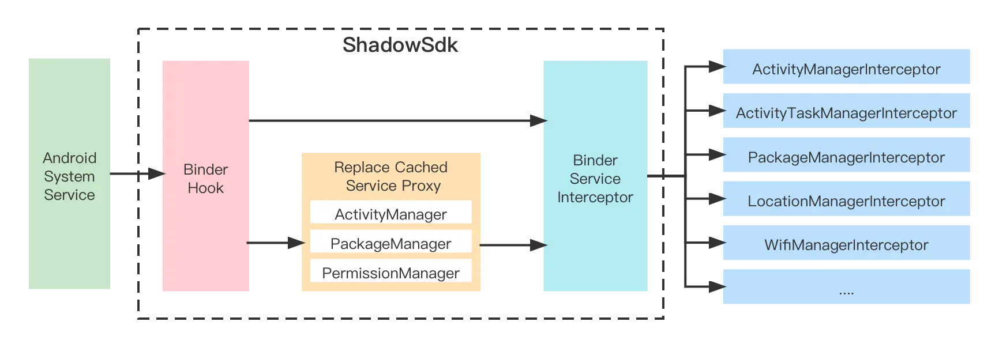

- # Android系统服务拦截概念
  collapsed:: true
	- Shadow模块代理了android系统的service，可以实现ShadowServiceInterceptor接口拦截系统服务，实现自定义逻辑，整体结构如下所示：
		- 
- # 如何使用Shadow库拦截Android系统服务？
	- 下面我们将以Android系统的TelephonyManager服务的getDeviceId()方法为例，一步步实现服务拦截。
- # 0x00 添加Shadow依赖项
  collapsed:: true
	- 添加Shadow和FreeReflection依赖到项目中，其中Shadow提供拦截系统服务功能，FreeReflection则用于解决访问Android系统的hidden-apis。
	- ```
	  allprojects {
	      repositories {
	          maven { url "https://jitpack.io" }
	      }
	  }
	  
	  dependencies {
	      implementation 'com.github.tiann:FreeReflection:3.1.0'
	      implementation 'com.coofee:shadow:0.0.9'
	  }
	  ```
- # 0x01 初始化Shadow库
	-