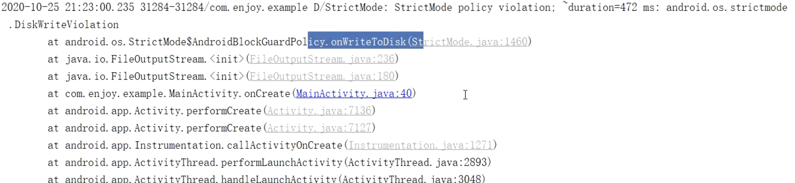

- StrictMode是一个开发人员工具，它可以检测出我们可能无意中做的事情，并将它们提请我们注意，以便我们能够修复它们。
- [[#red]]==**StrictMode最常用于捕获应用程序主线程上的意外磁盘或网络访问。帮助我们让磁盘和网络操作远离主线程**==，可以使应用程序更加平滑、响应更快。
- ## 代码打开,也可以通过手机打开
	- ```java
	  public class MyApplication extends Application {
	      @Override
	      public void onCreate() {
	          if (BuildConfig.DEBUG) {
	  			//线程检测策略
	              StrictMode.setThreadPolicy(new StrictMode.ThreadPolicy.Builder()
	                      .detectDiskReads() //读、写操作
	                      .detectDiskWrites()
	                      .detectNetwork() // or .detectAll() for all detectable problems
	                      .penaltyLog()
	                      .build());
	              // 虚拟机的检测
	              StrictMode.setVmPolicy(new StrictMode.VmPolicy.Builder()
	                      .detectLeakedSqlLiteObjects() //Sqlite对象泄露
	                      .detectLeakedClosableObjects() //未关闭的Closable对象泄露
	                      .penaltyLog() //违规打印日志
	                      .penaltyDeath() //违规崩溃
	                      .build());
	          }
	      }
	  ```
- # 提醒方式
	- 打印日志
		- 
	- 直接崩溃