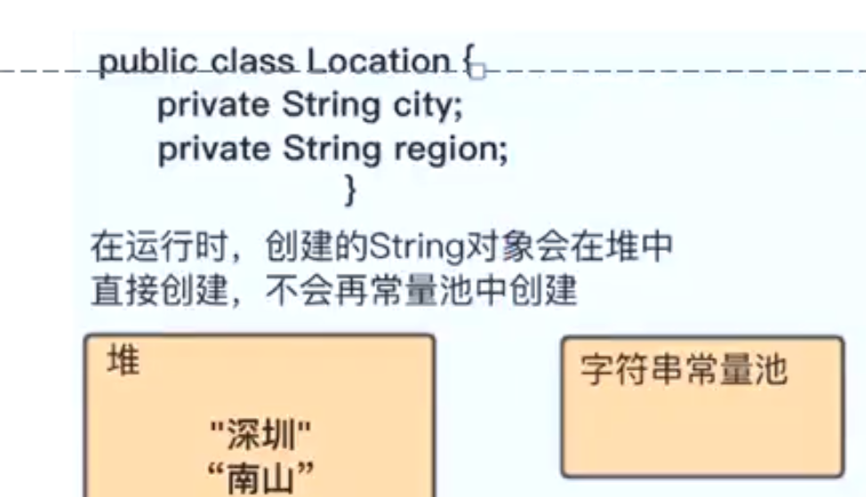

## 如前所述，class文件常量池和运行时常量池中，都没有直接存储字面量对应的实际对象，比如String对象。
- # 1、字面量赋值创建String对象
  collapsed:: true
	- 图解
		- 
	- 我们以下面这个简单的例子来说明使用字面量赋值方法来创建一个String对象的大致流程：
		- ```java
		  String s = "黄河之水天上来";
		  ```
		- 1、当Java虚拟机启动成功后，上面的字符串`"黄河之水天上来"`的字面量已经进入运行时常量池；
		- 2、然后主线程开始运行，第一次执行到这条语句时，JVM会根据运行时常量池中的这个字面量去`字符串常量池`寻找其中是否有该字面量对应的String对象的引用。注意是引用。
		- 3、如果没找到，就会去[[#red]]==**字符串常量池**==创建一个值为`"黄河之水天上来"`的String对象，并将该对象的引用保存到`字符串常量池`，然后返回该引用；
		- 4、如果找到了，说明之前已经有其他语句通过相同的字面量赋值创建了该String对象，直接返回引用即可。
- # 2、new创建字符串对象
  collapsed:: true
	- ## 图解
		- 
	- 例子1：
		- ```java
		  // 语句1
		  String s1 = new String("asdf");
		  
		  // 语句2
		  System.out.println(s1 == "asdf"); false
		  ```
		- [[#red]]==这个例子中假设`"asdf"`是首次被执行，那么语句1会创建两个String对象。==
		- 首先字面量asdf存在于class文件常量池，类加载的时候，放入运行时常量池，但是对象没创建呢
		- ## 第一个对象
			- 一个是JVM拿字面量`"asdf"`去字符串常量池试图获取其对应String对象的引用，因为是首次执行，所以没找到，于是[[#red]]==**在字符串常量池中创建了一个`"asdf"`的String对象**==，并将其引用保存到字符串常量池中，然后返回；
		- ## 第二个对象
			- 因为`new`的存在，JVM又在堆中创建了与`"asdf"`等值的另一个String对象。
		- 因此这条语句创建了两个String对象，它们值相等，都是`"asdf"`，但是引用(内存地址)不同，所以语句2返回false。
- # 3、String.intern()
	- 例2：
		- ```java
		  // 语句3
		  String s3 = new String("a") + new String("b");
		  
		  // 语句4
		  s3.intern();
		  
		  // 语句5
		  String s4 = "ab";
		  
		  // 语句6
		  System.out.println(s3 == s4);
		  ```
	- 这个例子也假设相关字符串字面量都是首次被执行到，那么语句3会创建5个对象：两个"a"，其中一个的引用被保存在字符串常量池；两个"b"，其中一个的引用被保存在字符串常量池；一个"ab"，其引用没有被保存在字符串常量池。
	- > [[#red]]==两个String对象用"+"拼接会被优化为StringBuffer的append拼接，然后toString方法，与new一样会直接在堆中创建对象。==
	- 语句4String.intern()要注意，
		- JDK1.7开始，判断"ab"在字符串常量池里不存在的话，会[[#red]]==直接把ab对象保存到字符串常量池==。
	- 而如果是JDK1.7开始的版本，结果就是true。
	- > 如果没有语句4，那么语句6结果一定是false。
- # 4、由对象传入的字符串
  collapsed:: true
	- 
	- ```java
	  public class Location{
	      // 这里不会在常量池中创建
	      private String city;
	    	private String region;
	    	
	    	public void new (){
	         Location location = new Location();
	         location.setCity("深圳");
	         location.setRegion("大大");	
	      }
	  }
	  ```
	- 会在静态常量池有，上边说的不会在字符串常量池创建
- # 5、由+号拼接的创建方式
	- ```java
	  String str2 = "ab"+"cd"+"ef";
	  ```
	- 首先在字符串常量池 生成 ab 对象 再生成 abcd对象   再生成 abcdef对象
-