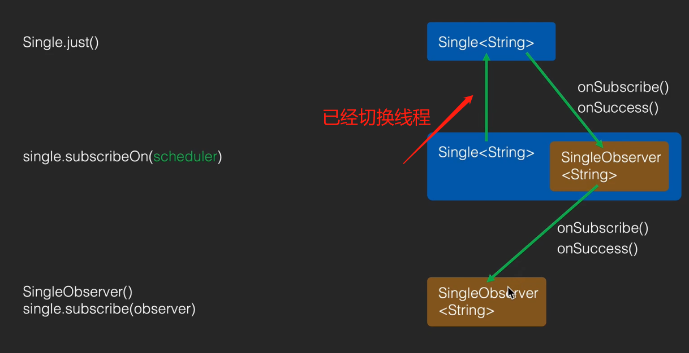

- ## 面试答
	- 1、Schedulers.io：创建了一个IoScheduler的线程池
	- 2、看订阅流程
		- 1、subscribeOn的创建了SingleSubscribeOn中间桥梁，内部传入IoScheduler线程池
		- 2、用桥梁订阅下游时，内部创建了SubscribeOnObserver，同时也是Runnable
			- 然后线程池执行这个任务，run方法，让上游订阅这个 桥梁内部的包装观察者 SubscribeOnObserver
			- 则此时已经切换成了子线程。上游订阅后发送消息到桥梁包装观察者就都在子线程了
		- 
- ## 详细流程rxjava3的SingleJust,subscribeOn举例：
  collapsed:: true
	- 代码
	  collapsed:: true
		- ```java
		          Single.just(1) //SingJust
		                  .subscribeOn(Schedulers.io()) // SingleSubscribeOn
		                  .subscribe(new SingleObserver<Integer>() {
		                      @Override
		                      public void onSubscribe(@NonNull Disposable d) {
		                          d.dispose();
		                      }
		  
		                      @Override
		                      public void onSuccess(@NonNull Integer s) {
		  
		                      }
		  
		                      @Override
		                      public void onError(@NonNull Throwable e) {
		  
		                      }
		                  });
		  ```
		-
	- ## 1、subscribeOn创建的对象SingleSubscribeOn
	  collapsed:: true
		- ```java
		      @SchedulerSupport(SchedulerSupport.CUSTOM)
		      public final Single<T> subscribeOn(@NonNull Scheduler scheduler) {
		          Objects.requireNonNull(scheduler, "scheduler is null");
		          return RxJavaPlugins.onAssembly(new SingleSubscribeOn<>(this, scheduler));
		      }
		  ```
	- ## 2、SingleSubscribeOn.subscribe  实际看他订阅方法
	  collapsed:: true
		- ```java
		      @Override
		      protected void subscribeActual(final SingleObserver<? super T> observer) {
		          final SubscribeOnObserver<T> parent = new SubscribeOnObserver<>(observer, source);
		          observer.onSubscribe(parent);
		  
		          Disposable f = scheduler.scheduleDirect(parent);
		  
		          parent.task.replace(f);
		  
		      }
		  ```
		- scheduler 为传入的线程池。parent为Runnable 看SubscribeOnObserver 的run
	- ## 3、SubscribeOnObserver 的run
	  collapsed:: true
		- ```java
		  
		           @Override
		          public void run() {
		              source.subscribe(this);
		          }
		  ```
		- 在run方法里 让上游 订阅自己SubscribeOnObserver。则上游订阅自己的时候。线程已经切换成子线程了，那么上游发送消息 也是子线程