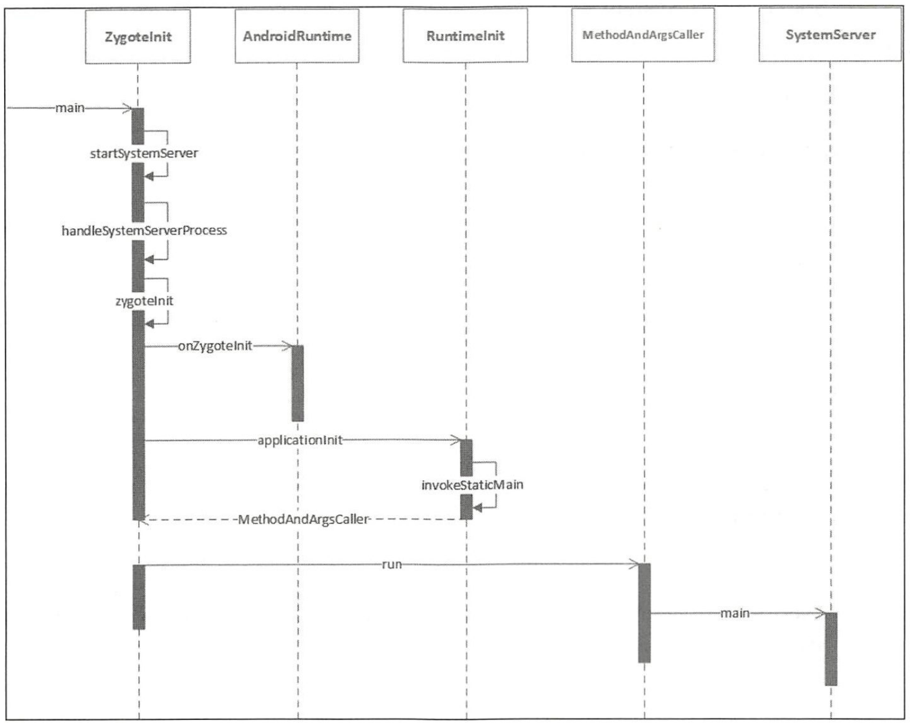
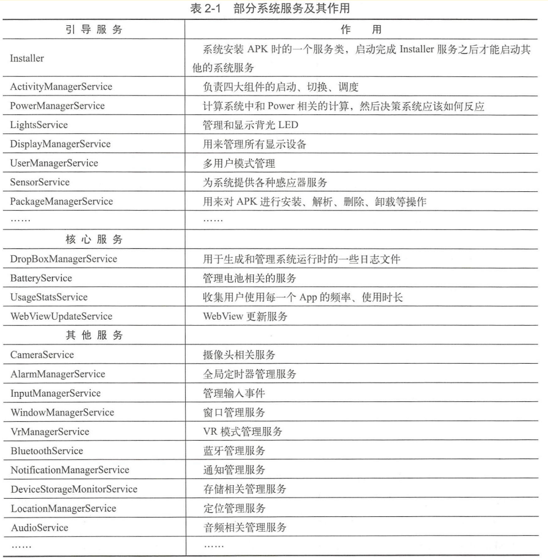

- # 一、简介
	- SystemServer 进程主要用于创建系统服务，我们熟知的 AMS WMS PMS 都是由它来创建的，#
- # 二、Zygote 如何处理SystemServer 进程的
  collapsed:: true
	- {:height 601, :width 746}
	- 1、在Zygotelnit. java 的startSystemServer 方法中启动了 SystemServer ，
	- 2、handleSystemServerProcess 方法来启动 SystemServer 进程。
- # 三、部分系统服务及其作用
	- 