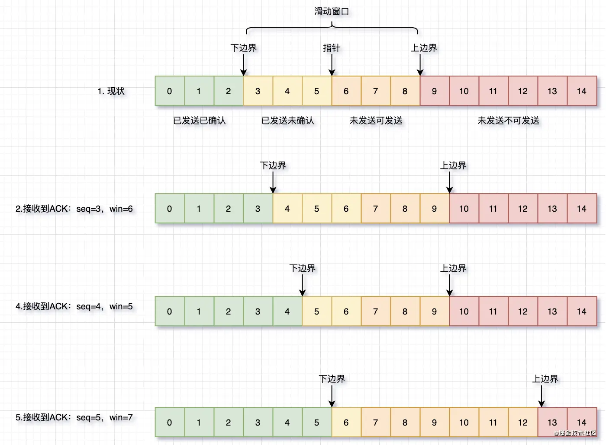

- 一、概念：
	- TCP 全称 Transmission Control Protocol（传输控制协议），是传输层协议的一种。
	  传输层位于网络层之上，用于处理网络层（IP路由）寻址成功后端对端的传输过程控制，它的发展过程如下：
		- 客户端、服务端寻址成功后，如何确定当前网络连接是需要哪个进程去处理呢？绑定一个进程端口，绑定端口后我们就基本实现了UDP（User Datagram Protocol，用户数据报协议）；
		- 传输过程中数据丢失问题如何解决？在UDP的基础上补充可靠性设计，这就是TCP。
- 二、TCP要解决的4个可靠性问题
	- 1、连接问题
	  collapsed:: true
		- 问题引入场景：寻址成功后，客户端开始发送数据了，结果服务端进程都没启动，尴尬了。。
		- 那如何解决：三次握手、四次挥手
		- 为什么挥手比握手多一次呢？建立连接的时候读写是一起开启的，但是关闭连接时读写要分开关闭
		- ```
		  1. client:FIN
		  2. server:ACK(server关闭读，client关闭写)
		       。。间隔一段时间等待server写完。。
		  3. server：FIN
		  4. client：ACK（server关闭写，client关闭读）
		  ```
	- 2、丢包问题
	  collapsed:: true
		- 问题引入场景：A向B发送了10个数据包，结果因为各种原因B只收到了8个，但是B不知道A发送了10个，A也不知道B只收到了8个
		- 如何解决：ACK确认，超时重传
		- ACK确认策略的优化手段
		  collapsed:: true
			- 1 批量确认：不再等待接收到上一个消息ACK之后再发送下一个消息，而是一次性批量发送多个数据包，后续慢慢接受ACK；
			- 2 批量确认如何判断ACK与Packet的对应关系？给每个数据包添加seq序号（Sequence Number序列号），ACK回复seq+1；
			- 3 累计确认：如果A收到ACK为10，表明前9个seq全部收到，这样的话可以一定程度上缓解ACK丢包问题。
	- 3、发送/接收数据处理速度同步问题
	  collapsed:: true
		- 问题引入场景：client发送非常快，一秒钟发了一个G，server一天才能处理完一个G的数据，那server要么溢出，要么数据就全丢了。
		- 如何解决：滑动窗口。
			- 
	- 4、 解决网络拥塞问题
		- 问题引入场景：server很强，给多少我都能处理，但是网络不大行，发送5个数据能发过去，发送10个数据肯定会丢掉几个，怎么办？
		- 如何解决：与速度滑动窗口相结合的网络拥塞窗口，先发5个试试发现都收到ACK了，再发10个试试发现有丢的，再发7个发现没问题，大概网络拥塞窗口就是7吧。
		- 最终窗口大小 = min(网络拥塞窗口cwnd, 流速窗口rwnd)