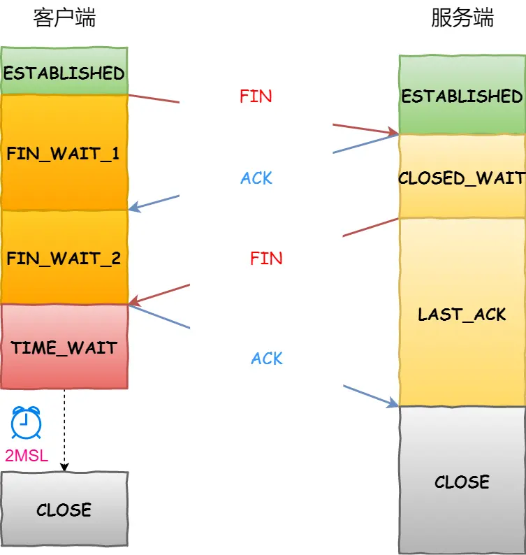

- ##  1. 网络分层
	- 1. TCP/IP四层网络模型
	  应用层/传输层/网络层/链路层
	- 2. OSI七层网络模型
	  应用层/表示层/会话层/传输层/网络层/数据链路层/物理层
	- collapsed:: true
	  3. 传输层协议: TCP UDP
		- TCP协议 Tansport Control Protocol
			- 基于连接
			- 保证顺序 可靠 段编号和确认号
			- 一对一通信
			- 面向字节流
			- 首部开销大 20-60字节
		- UDP User Data Protocol
			- 无连接
			- 不保证顺序 不可靠
			- 可以一对多通信
			- 面向报文
			- 首部开销小 8字节
- ##  2.TCP三次握手
  collapsed:: true
	- 第一次握手: SYN(Seq=x Ack=0)
	  第二次握手: SYN+ACK(Seq=y Ack=x+1)
	  第三次握手: ACK(Seq=x+1 Ack=y+1)
	- 
		- collapsed:: true
		  1. Wireshark 抓包查看握手过程
			- 
		- 2、TCP首部 标记位 SYN ACK PSH FIN URG RST
		  collapsed:: true
			- SYN Synchronize 用于建立连接
			- ACK Acknowledge 用于确认
			- PSH Push 数据续写
			- FIN Finish 用于断开连接
			- URG Urgent 紧急标记
			- RST Reset 重置
			- 
		- 3、Seq和Ack的值
		  collapsed:: true
			- Seq Sequence Number 段编号 用于自己发出的段的编号
			- 客户端和服务端生成各自的Seq初始随机值(ISN Inital Sequence Number)
			- Ack Acknowledge Number 确认号 用于确认收到的段的编号
			- 数据传输过程中的Seq和Ack
			- 
- ## 3、TCP四次挥手
	- 第一次挥手 FIN (Seq=u Ack=m)
	- 第二次挥手 ACK (Seq=v Ack=u+1)
	- 第三次挥手 FIN (Seq=w Ack=u+1)
	- 第四次挥手 ACK (Seq=u+1 Ack=w+1)
	- {:height 796, :width 747}
	- 1. Wireshark 抓包查看挥手过程
		-