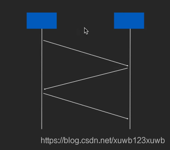
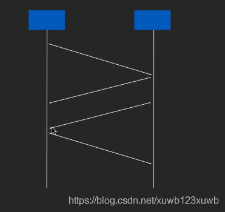

# JAVA里的tcp实现是Socket
- # 一、建立链接三次握手
	- 
	- ## 第一次握手
		- 连接方 给 接收方发个tcp消息： 目的通知对方我要给你发消息
	- ## 第二次握手
		- 接收方 给 链接方发消息： 目的1、是我知道你要给我发消息 目的2、我也要给你发消息
	- ## 第三次握手：
		- 连接方 给 接收方发消息：  告诉 接收方 我知道你给我发消息了
- >为什么要关闭连接？
  因为建立链接 认识对方是把对方的信息保存到自己机器上的，占用资源占用内存的，关闭节省资源
- # 二、四次挥手
	- 
	- 1： 发起关闭方 给 被关闭方  发消息： 意思 我没消息给你发了
	- 2 ：被关闭方 给发起方..： 我知道你没消息给我发了
	- 3 ：被关闭方 给发起方： 再发一个消息  说我也没消息给你发了
	- 4 ：发起关闭方 给 被关闭方：  我知道你也没消息给我发了
	- 全部完成才会断开