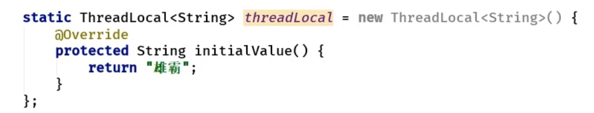
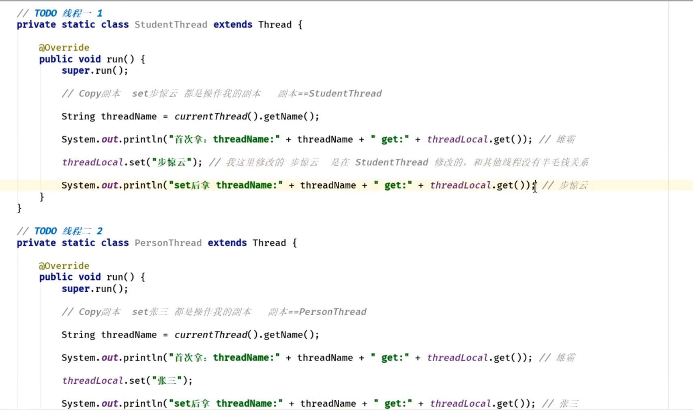

- # 一、概念
	- 多线程，线程上下文的存储变量
	- [[#red]]==**ThreadLocal 线程隔离工具类**==
- # 二、静态内部类[[ThreadLocalMap]]才是存储数据的
	- ThreadLocal中的静态内部类
- # 三、ThreadLocal 线程隔离工具类
	- ## 背景：一个ThreadLocal 两个线程操作
		- 
		- 
	- ## 现象：是线程隔离的
		- 1、线程1，
			- 传入Threadlocal后，进行操作，开始拿到的是Threadlocal初始值 雄霸
			- 修改成步惊云后，取出的是步惊云
		- 2、再把Threadlocal传给线程2时，
		- 3、线程2
			- 拿到ThreadLocal后，输出还是雄霸，
			-
	- ## 原因：每个线程对应一个ThreadLocalMap。通过ThreadLocal 操作值，也是存在每个线程的这个map里的。所以线程1操作ThreadLocal，也是存在线程1的map里。当线程2拿到threadLocal时，获取值，内部也是去找的线程2内部的map的