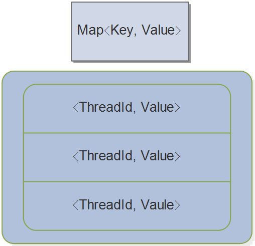

# 一  简介：
	- ThreadLocalMap类的定义在ThreadLocal类中，是ThreadLocal类的静态内部类，属于threadLocal类，而不是属于threadLocal对象
	- 在ThreadLocal类中的方法创建threadLoalMap对象，赋予给Thread对象(若thread对象中已有threadLocalMap对象，则直接取即可)
	- [[#red]]==**每个Thread对象都持有一个ThreadLocalMap引用，不同Thread类的 map不同**==
		- ```java
		  class Thread implements Runnable {
		        /* ThreadLocal values pertaining to this thread. This map is maintained
		       * by the ThreadLocal class. */
		      // 与此线程相关的ThreadLocal值。此映射由ThreadLocal类维护
		      ThreadLocal.ThreadLocalMap threadLocals = null;
		  }
		  ```
- # 二、内部数据结构
	- 内部是一个数组   存的值是叫做 Entry  是一个key  value 的形式    key是 ThreadLocal的 弱引用  value 就是你存的值
	- 
- # 三、用途
	- 每个线程Thread对象具有一个自己的ThreadLocalMap对象;
	- 存入到threadlocalMap对象中value，同一个线程thread在任何地方都可以拿出来
	- threadLocalMap对象的元素entry的key是ThreadLocal对象弱引用，value是需要存储的数据，可以具有多个threadLocal对象(多个不同key)及对应的value数据
	- ## [[Handler中的如何保证一个线程只有一个Looper]]
- # 四、注意事项
	- entry的key是一个弱引用的ThreadLocal对象（弱引用对象存活到下一次垃圾回收发生前），所以垃圾回收之前会清除entry对象的key，则会出现key为null的entry
	- 但value所占内存不会释放，则可能会出现内存泄露（无法释放已申请的内存空间），最终导致内存溢出（没有内存可以分配给新的对象）。在ThreadLocal类的get（）、set（）、remove（）方法，均有实现回收 key 为 null 的 Entry 的 value所占的内存。所以为了防止内存泄露，当线程任务不会再用ThreadLocal对象的末尾，调用一次上述三个方法的其中一个即可。
	- 个人理解其实线程死亡时会回收所有内存。