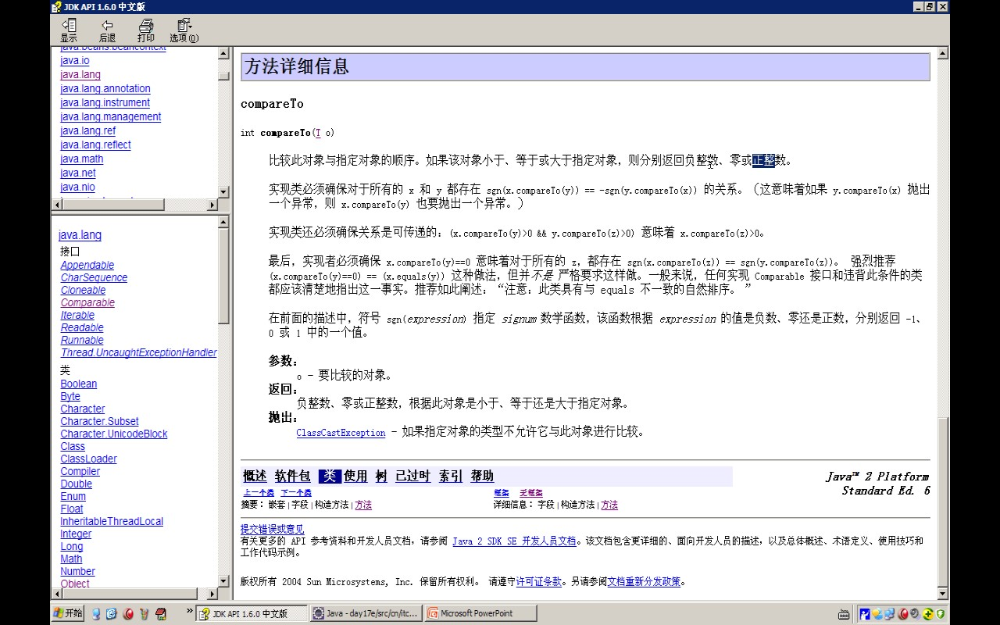
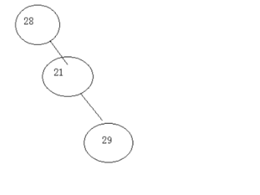

# 一、数据结构
	- TreeSet 就是==红黑树结构的 Set==。在增删改查方面是 O(log n) 的二分法复杂度。
	- TreeSet 是基于 HashSet 实现的，同时又是基于 TreeMap 实现的。
- # 二、常用方法：floor, lower, ceiling, higher, first, last。
	- 更小一点的：floor, lower。
	- 更大一点的：ceiling, higher。
	- 头尾：first, last。
- # 三、对元素进行排序
	- ## 方式1、[[#red]]==**让元素自身具备比较功能**==，元素需要实现Comparable接口重写comparaTo方法
	  collapsed:: true
		- 
		- 代码
			- ```java
			  package cn.itcast.p.bean;
			  
			  public class Person /*extends Object*/ implements Comparable {
			  
			  	private String name;
			  	private int age;
			  	
			  	
			  	public Person() {
			  		super();
			  		
			  	}
			  	public Person(String name, int age) {
			  		super();
			  		this.name = name;
			  		this.age = age;
			  	}
			  	
			  	
			  	
			  	@Override
			  	public int hashCode() {
			  //		System.out.println(this+".......hashCode");
			  		
			  		return name.hashCode()+age*27;
			  //		return 100;
			  	}
			  	@Override
			  	public boolean equals(Object obj) {
			  		
			  		if(this == obj)
			  			return true;
			  		if(!(obj instanceof Person))
			  			throw new ClassCastException("类型错误");
			  		
			  //		System.out.println(this+"....equals....."+obj);
			  		Person p = (Person)obj;
			  		return this.name.equals(p.name) && this.age == p.age;
			  	}
			  	public String getName() {
			  		return name;
			  	}
			  	public void setName(String name) {
			  		this.name = name;
			  	}
			  	public int getAge() {
			  		return age;
			  	}
			  	public void setAge(int age) {
			  		this.age = age;
			  	}
			  	public String toString(){
			  		return name+":"+age;
			  	}
			  	@Override
			  	public int compareTo(Object o) {
			  		
			  		Person p = (Person)o;
			  		
			  		int  temp = this.age-p.age;
			  		return temp==0?this.name.compareTo(p.name):temp;
			  		
			  //		int  temp = this.name.compareTo(p.name);
			  //		return temp==0?this.age-p.age:temp;
			  		
			  		/*
			  		if(this.age>p.age)
			  			return 1;
			  		if(this.age<p.age)
			  			return -1;	
			  		
			  		else{
			  			
			  			return this.name.compareTo(p.name);
			  		}
			  		*/
			  		
			  	}
			  	
			  }
			  ```
			- ```java
			  	/**
			  	 * 
			  	 */
			  	public static void demo1() {
			  		TreeSet ts = new TreeSet();
			  		
			  		ts.add("abc");
			  		ts.add("zaa");
			  		ts.add("aa");
			  		ts.add("nba");
			  		ts.add("cba");
			  		
			  		Iterator it = ts.iterator();
			  		
			  		while(it.hasNext()){
			  			System.out.println(it.next());
			  		}
			  	}
			  ```
	- ## 方式2、如果不要对象按照自然顺序进行排序，如果对象中不具备自然顺序。->[[#red]]==**让集合具备比较功能**==
	  collapsed:: true
		- 那么[[#red]]==**让集合具备比较功能**==。
		- 先创建一个比较器实现comparator比较器接口   然后实现compare方法
		- 在创建TreeSet集合时   TreeSet   ts=new TreeSet(new myComparator());
		- 代码
			- ```java
			  package cn.itcast.p5.comparator;
			  
			  import java.util.Comparator;
			  
			  import cn.itcast.p.bean.Person;
			  /**
			   * 创建了一个根据Person类的name进行排序的比较器。
			   */
			  public class ComparatorByName implements Comparator {
			  
			  	@Override
			  	public int compare(Object o1, Object o2) {
			  
			  		Person p1 = (Person)o1;
			  		Person p2 = (Person)o2;
			  		
			  		int temp = p1.getName().compareTo(p2.getName());
			  		
			  		return temp==0?p1.getAge()-p2.getAge(): temp;
			  //		return 1;//有序。
			  	}
			  
			  }
			  
			  
			  
			  
			  
			  
			  package cn.itcast.p5.treeset.demo;
			  
			  import java.util.Iterator;
			  import java.util.TreeSet;
			  
			  import cn.itcast.p.bean.Person;
			  import cn.itcast.p5.comparator.ComparatorByName;
			  
			  public class TreeSetDemo {
			  
			  	/**
			  	 * @param args
			  	 */
			  	public static void main(String[] args) {
			  
			  		TreeSet ts = new TreeSet(new ComparatorByName());
			  		
			  		/*
			  		 * 以Person对象年龄进行从小到大的排序。
			  		 * 
			  		 */
			  		
			  		ts.add(new Person("zhangsan",28));
			  		ts.add(new Person("lisi",21));
			  		ts.add(new Person("zhouqi",29));
			  		ts.add(new Person("zhaoliu",25));
			  		ts.add(new Person("wangu",24));
			  		
			  		Iterator it = ts.iterator();
			  		
			  		while(it.hasNext()){
			  			Person p = (Person)it.next();
			  			
			  			System.out.println(p.getName()+":"+p.getAge());
			  		}
			  	
			  	}
			  
			  
			  
			  	/**
			  	 * 
			  	 */
			  	public static void demo1() {
			  		TreeSet ts = new TreeSet();
			  		
			  		ts.add("abc");
			  		ts.add("zaa");
			  		ts.add("aa");
			  		ts.add("nba");
			  		ts.add("cba");
			  		
			  		Iterator it = ts.iterator();
			  		
			  		while(it.hasNext()){
			  			System.out.println(it.next());
			  		}
			  	}
			  
			  }
			  
			  ```
- # 四、TreeSet默认是按照自然顺序取出的从小到大，怎么按照存入的顺序取出？
  collapsed:: true
	- ## 自定义比较器实现
		- comparator接口 重写compare方法  返回1即可
		- 然后在TreeSet的构造里传入该比较器
		- 【返回1 说明新存入的都比前一个大，treeSet的数据结构是两岔树   左小右大，，传入1为全右边 取出时就实现了按存入顺序取出】
		- 【输入-1为倒序    主要使用的还是比较器  comparator】
		- 
		- **全右型逐渐增大**
-