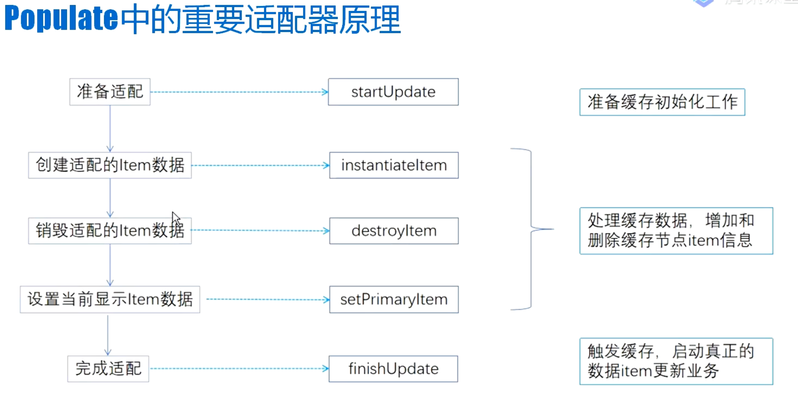

# populate函数
collapsed:: true
	- ## 入口
	  collapsed:: true
		- 1、onMeasure
		- 2、setOffscreenPageLimit
	- ## 代码,因为vp需要靠adapter实现绑定数据的，寻找adapter
		- ```java
		  this.mAdapter.startUpdate(this);
		  ```
	- ## 适配器原理图
		- 
		- 
- # [[FragmentPagerAdapter]]