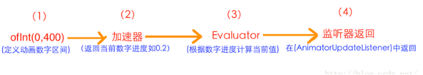

- # 一、概述和构造函数
	- ```java
	  public static ValueAnimator ofInt(int... values)  
	  public static ValueAnimator ofFloat(float... values)  
	  ```
	- 他们的参数类型都是可变参数长参数，所以我们可以传入任何数量的值；
	- 传进去的值列表，就表示动画时的变化范围；
	- 比如ofInt(2,90,45)就表示从数值2变化到数字90再变化到数字45；
	- 所以我们传进去的数字越多，动画变化就越复杂。
	- 从参数类型也可以看出ofInt与ofFloat的唯一区别就是传入的数字类型不一样，ofInt需要传入Int类型的参数，而ofFloat则表示需要传入Float类型的参数。
- # 二、代码示例
  collapsed:: true
	- ```java
	  		//获取ValueAnimator实例    设置持续时间
	          ValueAnimator animator = ValueAnimator.ofFloat(0f,400f,50f,300f);
	          animator.setDuration(3000);
	          //添加动画更新监听     使用layout动态设置控件移动位置
	          animator.addUpdateListener(new ValueAnimator.AnimatorUpdateListener() {
	              @Override
	              public void onAnimationUpdate(ValueAnimator animation) {
	                  //获得当前动画的值  返回的object的类型要强转
	                  Float curValueFloat = (Float)animation.getAnimatedValue();
	                  int curValue = curValueFloat.intValue();
	                  view.layout(curValue,curValue,curValue+view.getWidth(),curValue+view.getHeight());
	              }
	          });
	          animator.start();
	  ```
- # 三、常用函数
  collapsed:: true
	- ```java
	   /** 
	       * 设置动画时长，单位是毫秒 
	       */  
	      ValueAnimator setDuration(long duration)  
	      /** 
	       * 获取ValueAnimator在运动时，当前运动点的值 
	       */  
	      Object getAnimatedValue();  
	      /** 
	       * 开始动画 
	       */  
	      void start()  
	      /** 
	       * 设置循环次数,设置为INFINITE表示无限循环 
	       */  
	      void setRepeatCount(int value)  
	      /** 
	       * 设置循环模式 
	       * value取值有RESTART，REVERSE， 
	       */  
	      void setRepeatMode(int value)  
	      /** 
	       * 取消动画 
	       */  
	  void cancel()  
	  setRepeatCount(int value)用于设置动画循环次数,设置为0表示不循环，
	  设置为ValueAnimation.INFINITE表示无限循环。 
	  cancel()用于取消动画 
	  我们着重说一下setRepeatMode：
	  
	  用于设置循环模式，取值为ValueAnimation.RESTART时,
	  表示正序重新开始，当取值为ValueAnimation.REVERSE表示倒序重新开始。
	  setRepeatMode(int value)
	        
	  ```
- # 四、两个监听器
  collapsed:: true
	- ### 监听器一：监听动画变化时的实时值
		- ```java
		  public static interface AnimatorUpdateListener {  
		      void onAnimationUpdate(ValueAnimator animation);  
		  }  
		  //添加方法为：public void addUpdateListener(AnimatorUpdateListener listener)  
		  ```
	- ### **监听器二：监听动画变化时四个状态 **
		- ```java
		  public static interface AnimatorListener {  
		      void onAnimationStart(Animator animation);  
		      void onAnimationEnd(Animator animation);  
		      void onAnimationCancel(Animator animation);  
		      void onAnimationRepeat(Animator animation);  
		  }  
		  //添加方法为：public void addListener(AnimatorListener listener)
		  ```
	- ### 移除监听
		- ```java
		  /** 
		   * 移除AnimatorUpdateListener 
		   */  
		  void removeUpdateListener(AnimatorUpdateListener listener);  
		  void removeAllUpdateListeners();  
		   /** 
		    * 移除AnimatorListener 
		    */  
		  void removeListener(AnimatorListener listener);  
		  void removeAllListeners();
		  ```
- # 五、时间插值器和自定义时间插值器
  collapsed:: true
	- **简单实用：**
		- ```java
		     ValueAnimator animator = ValueAnimator.ofInt(0,600);  
		        
		      animator.addUpdateListener(new ValueAnimator.AnimatorUpdateListener() {  
		          @Override  
		          public void onAnimationUpdate(ValueAnimator animation) {  
		              int curValue = (int)animation.getAnimatedValue();  
		              tv.layout(tv.getLeft(),curValue,tv.getRight(),curValue+tv.getHeight());  
		          }  
		      });  
		      animator.setDuration(1000);  
		      animator.setInterpolator(new BounceInterpolator());  //设置插值器
		  	animator.start();  
		  ```
	- ### 自定义时间插值器:
		- 介绍：
			- **插值器是实现 **Interpolator 接口的   而Interpolator 继承了TimeInterpolator
			- TimeInterpolator 里边就一个函数float getInterpolation(float input);  讲解
			- **参数input:**
				- input参数是一个float类型，它取值范围是0到1，表示当前动画的进度，取0时表示动画刚开始，取1时表示动画结束，取0.5时表示动画中间的位置，其它类推。
			- **返回值：**表示当前实际想要显示的进度。取值可以超过1也可以小于0，超过1表示已经超过目标值，小于0表示小于开始位置。
			- 对于input参数，它表示的是当前动画的进度，匀速增加的。什么叫动画的进度，动画的进度就是动画在时间上的进度，与我们的任何设置无关，随着时间的增长，动画的进度自然的增加，从0到1；input参数相当于时间的概念，我们通过setDuration()指定了动画的时长，在这个时间范围内，动画进度肯定是一点点增加的；就相当于我们播放一首歌，这首歌的进度是从0到1是一样的。
			- 而返回值则表示动画的数值进度，它的对应的数值范围是我们通过ofInt(),ofFloat()来指定的，这个返回值就表示当前时间所对应的数值的进度。
			- input参数与任何我们设定的值没关系，只与时间有关，随着时间的增长，动画的进度也自然的增加，input参数就代表了当前动画的进度。而返回值则表示动画的当前数值进度
		- ```java
		  在getInterpolation函数中，我们将进度反转过来，当传0的时候，我们让它数值进度在完成的位置，
		  当完成的时候，我们让它在开始的位置   
		  public class MyInterploator implements TimeInterpolator {  
		          @Override  
		          public float getInterpolation(float input) {  
		              return 1-input;  
		          }  
		  }  
		  ```
		-
- # 六、ValueAnimator的实现原理：
  collapsed:: true
	- 
	- 1)、ofInt(0,400)表示指定动画的数字区间，是从0运动到400； 
	  (2)、加速器：上面我们讲了，在动画开始后，通过加速器会返回当前动画进度所对应的数字进度，但这个数字进度是百分制的，以小数表示，如0.2 
	  (3)、Evaluator:我们知道我们通过监听器拿到的是当前动画所对应的具体数值，而不是百分制的进度。那么就必须有一个地方会根据当前的数字进度，将其转化为对应的数值，这个地方就是Evaluator；Evaluator就是将从加速器返回的数字进度转成对应的数字值。所以上部分中，我们讲到的公式：
	  **当前的值 = 100 + （400 - 100）* 显示进度  **
	- 监听器：我们通过在AnimatorUpdateListener监听器使用animation.getAnimatedValue()函数拿到Evaluator中返回的数字值。 
	  讲了这么多，**Evaluator其实就是一个转换器，他能把小数进度转换成对应的数值位置**
- # 七、自定义Evaluator转换器
  collapsed:: true
	- **实现  **TypeEvaluator<Integer>   系统的也是实现这个
	- 只有定义动画时的数值类型ofInt()与Evalutor的返回值类型一样时，才能使用这个Evalutor即系统的intEvaluator  或者自定义的泛型为interger的【实现TypeEvaluator<Integer>  】
	- **看一下系统的计算公式    ****startInt****是of****Int****输入的第一个值   ****fraction****是插值器返回来的一个0到1的一个小数字     ****endValue****是of****Int****输入的尾部值**
	  **return (int)(startInt + fraction * (endValue - startInt));  **
	- 100+（300-100）*0.2代表    ofInt(100,300)起始位置100终止位置300整体的时间上的进度为0.2
	- **总结：我们可以通过重写加速器改变数值进度来改变数值位置，也可以通过改变****Evaluator中进度所对应的数值来改变数值位置。**
	- **实现倒序输出的Eva****luator**
	  collapsed:: true
		- ```java
		      public class ReverseEvaluator implements TypeEvaluator<Integer> {  
		          @Override  
		          public Integer evaluate(float fraction, Integer startValue, Integer endValue) {  
		              int startInt = startValue;  
		              return (int) (endValue - fraction * (endValue - startInt));  
		          }  
		  }  
		  ```
	- fraction * (endValue - startInt)表示动画实际运动的距离，我们用endValue减去实际运动的距离就表示随着运动距离的增加，离终点越来越远，这也就实现了从终点出发，最终运动到起点的效果了。
	-
	- **重要注：value****Animator****的构造of****Int  ofFloat   ofObject****传入的值   是什么类型   转换器Evalutor返回的值就是什么类型的必须一致  所以自定义转换器Evalutor的返回值类型看valueAnimator的构造传入的什么类型。也是自定义转换器时**implements TypeEvaluator<Character>**时的泛型是什么类型**
- # 八、颜色转换器关于ArgbEvalutor
	- ### 原理和前两个转换器大致一样       由输入  输出值和插值器返回来的进度计算并返回当前进度数值
- # 九、valueAnimator的另一构造函数ofObject
	- ```java
	  - public static ValueAnimator ofObject(TypeEvaluator evaluator, Object... values);
	  ```
	- 第一个是自定义的Evaluator，第二个是可变长参数，Object类型的；
	-
	- 这个是自定义CharEvaluator转换器     输入起始和终止字符由数值转换成字符
		- ```java
		  public class CharEvaluator implements TypeEvaluator<Character> {  
		      @Override  
		      public Character evaluate(float fraction, Character startValue, Character endValue) {  
		          int startInt  = (int)startValue;  
		          int endInt = (int)endValue;  
		          int curInt = (int)(startInt + fraction *(endInt - startInt));  
		          char result = (char)curInt;  
		          return result;  
		      }  
		  }
		  ```
	-
	- 下边使用ofObject输入自定义的evaluator    和自定义的类
	- **首先自定义类带有圆的参数半径**
	  collapsed:: true
		- ```java
		    public class Point {  
		          private int radius;  
		        
		          public Point(int radius){  
		              this.radius = radius;  
		          }  
		        
		          public int getRadius() {  
		              return radius;  
		          }  
		        
		          public void setRadius(int radius) {  
		              this.radius = radius;  
		          }  
		  }  
		  ```
	- ### 自定义的view
		- ```java
		  public class MyPointView extends View {  
		          private Point mCurPoint;  
		          public MyPointView(Context context, AttributeSet attrs) {  
		              super(context, attrs);  
		          }  
		        
		          @Override  
		          protected void onDraw(Canvas canvas) {  
		              super.onDraw(canvas);  
		              if (mCurPoint != null){  
		                  Paint paint = new Paint();  
		                  paint.setAntiAlias(true);  
		                  paint.setColor(Color.RED);  
		                  paint.setStyle(Paint.Style.FILL);  
		                  canvas.drawCircle(300,300,mCurPoint.getRadius(),paint);  
		              }  
		          }  
		        
		          public void doPointAnim(){  
		              ValueAnimator animator = ValueAnimator.ofObject(new PointEvaluator(),new Point(20),new Point(200));  
		              animator.addUpdateListener(new ValueAnimator.AnimatorUpdateListener() {  
		                  @Override  
		                  public void onAnimationUpdate(ValueAnimator animation) {  
		                      mCurPoint = (Point)animation.getAnimatedValue();  
		                      invalidate();  
		                  }  
		              });  
		              animator.setDuration(1000);  
		              animator.setInterpolator(new BounceInterpolator());  
		              animator.start();  
		          }  
		  }  
		  
		  看构造：
		  ValueAnimator animator = ValueAnimator.ofObject(new PointEvaluator(),new Point(20),new Point(200));
		  自定义的PointEvalutor的实现：
		      public class PointEvaluator implements TypeEvaluator<Point> {  
		          @Override  
		          public Point evaluate(float fraction, Point startValue, Point endValue) {  
		              int start = startValue.getRadius();  
		              int end  = endValue.getRadius();  
		              int curValue = (int)(start + fraction * (end - start));  
		              return new Point(curValue);  
		          }  
		      }  
		  ```