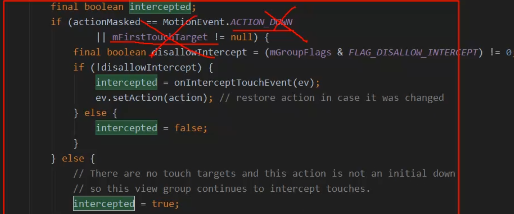
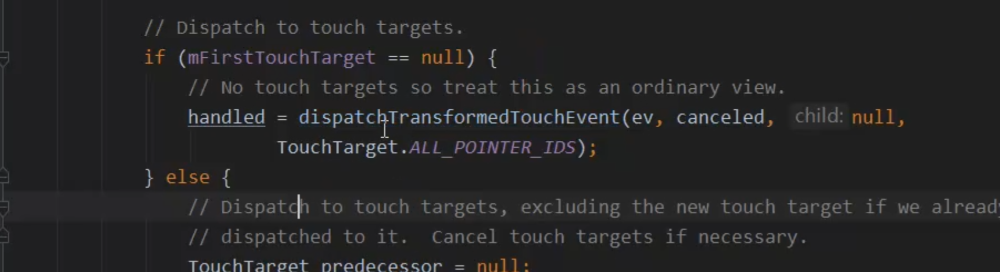

## 1、move进入ViewGroup(还是从最上层的进入)的 dispatchTouchEvent
collapsed:: true
	- 因为down 分发完mFirstTouchTarget != null 还是会走if语句
	- ```java
	   if (actionMasked == MotionEvent.ACTION_DOWN
	                      || mFirstTouchTarget != null) {
	                  final boolean disallowIntercept = (mGroupFlags & FLAG_DISALLOW_INTERCEPT) != 0;
	                  if (!disallowIntercept) {
	                      intercepted = onInterceptTouchEvent(ev);
	                      ev.setAction(action); // restore action in case it was changed
	                  } else {
	                      intercepted = false;
	                  }
	              } else {
	                  // There are no touch targets and this action is not an initial down
	                  // so this view group continues to intercept touches.
	                  intercepted = true;
	              }
	  ```
	- 全部不拦截的话走
	  collapsed:: true
		- ```java
		   if (!canceled && !intercepted) {
		  
		                  // If the event is targeting accessibility focus we give it to the
		                  // view that has accessibility focus and if it does not handle it
		                  // we clear the flag and dispatch the event to all children as usual.
		                  // We are looking up the accessibility focused host to avoid keeping
		                  // state since these events are very rare.
		                  View childWithAccessibilityFocus = ev.isTargetAccessibilityFocus()
		                          ? findChildWithAccessibilityFocus() : null;
		  
		                  if (actionMasked == MotionEvent.ACTION_DOWN
		                          || (split && actionMasked == MotionEvent.ACTION_POINTER_DOWN)
		                          || actionMasked == MotionEvent.ACTION_HOVER_MOVE) {
		                      final int actionIndex = ev.getActionIndex(); // always 0 for down
		                      final int idBitsToAssign = split ? 1 << ev.getPointerId(actionIndex)
		                              : TouchTarget.ALL_POINTER_IDS;
		  
		                      // Clean up earlier touch targets for this pointer id in case they
		                      // have become out of sync.
		                      removePointersFromTouchTargets(idBitsToAssign);
		  
		                      final int childrenCount = mChildrenCount;
		                      if (newTouchTarget == null && childrenCount != 0) {
		                          final float x = ev.getX(actionIndex);
		                          final float y = ev.getY(actionIndex);
		                          // Find a child that can receive the event.
		                          // Scan children from front to back.
		                          final ArrayList<View> preorderedList = buildTouchDispatchChildList();
		                          final boolean customOrder = preorderedList == null
		                                  && isChildrenDrawingOrderEnabled();
		                          final View[] children = mChildren;
		                          for (int i = childrenCount - 1; i >= 0; i--) {
		                              final int childIndex = getAndVerifyPreorderedIndex(
		                                      childrenCount, i, customOrder);
		                              final View child = getAndVerifyPreorderedView(
		                                      preorderedList, children, childIndex);
		  
		                              // If there is a view that has accessibility focus we want it
		                              // to get the event first and if not handled we will perform a
		                              // normal dispatch. We may do a double iteration but this is
		                              // safer given the timeframe.
		                              if (childWithAccessibilityFocus != null) {
		                                  if (childWithAccessibilityFocus != child) {
		                                      continue;
		                                  }
		                                  childWithAccessibilityFocus = null;
		                                  i = childrenCount - 1;
		                              }
		  
		                              if (!child.canReceivePointerEvents()
		                                      || !isTransformedTouchPointInView(x, y, child, null)) {
		                                  ev.setTargetAccessibilityFocus(false);
		                                  continue;
		                              }
		  
		                              newTouchTarget = getTouchTarget(child);
		                              if (newTouchTarget != null) {
		                                  // Child is already receiving touch within its bounds.
		                                  // Give it the new pointer in addition to the ones it is handling.
		                                  newTouchTarget.pointerIdBits |= idBitsToAssign;
		                                  break;
		                              }
		  
		                              resetCancelNextUpFlag(child);
		                              if (dispatchTransformedTouchEvent(ev, false, child, idBitsToAssign)) {
		                                  // Child wants to receive touch within its bounds.
		                                  mLastTouchDownTime = ev.getDownTime();
		                                  if (preorderedList != null) {
		                                      // childIndex points into presorted list, find original index
		                                      for (int j = 0; j < childrenCount; j++) {
		                                          if (children[childIndex] == mChildren[j]) {
		                                              mLastTouchDownIndex = j;
		                                              break;
		                                          }
		                                      }
		                                  } else {
		                                      mLastTouchDownIndex = childIndex;
		                                  }
		                                  mLastTouchDownX = ev.getX();
		                                  mLastTouchDownY = ev.getY();
		                                  newTouchTarget = addTouchTarget(child, idBitsToAssign);
		                                  alreadyDispatchedToNewTouchTarget = true;
		                                  break;
		                              }
		  
		                              // The accessibility focus didn't handle the event, so clear
		                              // the flag and do a normal dispatch to all children.
		                              ev.setTargetAccessibilityFocus(false);
		                          }
		                          if (preorderedList != null) preorderedList.clear();
		                      }
		  
		                      if (newTouchTarget == null && mFirstTouchTarget != null) {
		                          // Did not find a child to receive the event.
		                          // Assign the pointer to the least recently added target.
		                          newTouchTarget = mFirstTouchTarget;
		                          while (newTouchTarget.next != null) {
		                              newTouchTarget = newTouchTarget.next;
		                          }
		                          newTouchTarget.pointerIdBits |= idBitsToAssign;
		                      }
		                  }
		              }
		  ```
	- 但是第一层if判断actionMasked == MotionEvent.ACTION_DOWN.所以进不去,
	- 直接进最下边分发处理环节mFirstTouchTarget ！=null  走 else
		- ```java
		   // Dispatch to touch targets.
		              if (mFirstTouchTarget == null) {
		                  // No touch targets so treat this as an ordinary view.
		                  handled = dispatchTransformedTouchEvent(ev, canceled, null,
		                          TouchTarget.ALL_POINTER_IDS);
		              } else {
		                  // Dispatch to touch targets, excluding the new touch target if we already
		                  // dispatched to it.  Cancel touch targets if necessary.
		                  TouchTarget predecessor = null;
		                  TouchTarget target = mFirstTouchTarget;
		                  while (target != null) {
		                      final TouchTarget next = target.next;
		                      // 这里 新事件进来 初始化false
		                      if (alreadyDispatchedToNewTouchTarget && target == newTouchTarget) {
		                          handled = true;
		                      } else { // 走这里
		                         // false
		                          final boolean cancelChild = resetCancelNextUpFlag(target.child)
		                                  || intercepted;
		                          // 分发给targetchild
		                          if (dispatchTransformedTouchEvent(ev, cancelChild,
		                                  target.child, target.pointerIdBits)) {
		                              handled = true;
		                          }
		                          if (cancelChild) {
		                              if (predecessor == null) {
		                                  mFirstTouchTarget = next;
		                              } else {
		                                  predecessor.next = next;
		                              }
		                              target.recycle();
		                              target = next;
		                              continue;
		                          }
		                      }
		                      predecessor = target;
		                      target = next;
		                  }
		              }
		  ```
	- while 循环，[[dispatchTransformedTouchEvent]],分发给mFirstTouchTarget 。接受Down事件的那个view
-
- ## 2、move的拦截流程-处理事件冲突，只能在move事件处理
	- 就比如 事件冲突解决应用里。listView 在down请求父亲不拦截，move的时候 上下滑动也是不拦截。左右滑动可以拦截
	- 看viewGroup 拦截是咋处理的
	  collapsed:: true
		- ```java
		   // Dispatch to touch targets.
		              if (mFirstTouchTarget == null) {
		                  // No touch targets so treat this as an ordinary view.
		                  handled = dispatchTransformedTouchEvent(ev, canceled, null,
		                          TouchTarget.ALL_POINTER_IDS);
		              } else {
		                  // Dispatch to touch targets, excluding the new touch target if we already
		                  // dispatched to it.  Cancel touch targets if necessary.
		                  TouchTarget predecessor = null;
		                  TouchTarget target = mFirstTouchTarget;
		                  while (target != null) {
		                      final TouchTarget next = target.next;
		                      if (alreadyDispatchedToNewTouchTarget && target == newTouchTarget) {
		                          handled = true;
		                      } else {
		                          // move 这里可以拦截 intercepted = true
		                          final boolean cancelChild = resetCancelNextUpFlag(target.child)
		                                  || intercepted;
		                          if (dispatchTransformedTouchEvent(ev, cancelChild,
		                                  target.child, target.pointerIdBits)) {
		                              handled = true;
		                          }
		                          if (cancelChild) {
		                              if (predecessor == null) {
		                                  mFirstTouchTarget = next;
		                              } else {
		                                  predecessor.next = next;
		                              }
		                              target.recycle();
		                              target = next;
		                              continue;
		                          }
		                      }
		                      predecessor = target;
		                      target = next;
		                  }
		              }
		  ```
	- move事件，viewGroup可以拦截的时候 这里可以拦截 intercepted = true，则cancelChild = true
	- 1、再次进入dispatchTransformedTouchEvent 这个方法。这次关注第二个参数 true,进入if
	  collapsed:: true
		- ```java
		   if (cancel || oldAction == MotionEvent.ACTION_CANCEL) {
		              event.setAction(MotionEvent.ACTION_CANCEL);
		              if (child == null) {
		                  handled = super.dispatchTouchEvent(event);
		              } else {
		                  handled = child.dispatchTouchEvent(event);
		              }
		              event.setAction(oldAction);
		              return handled;
		          }
		  ```
		- 事件变成ACTION_CANCEL 。将ACTION_CANCEL 交给子view处理。。
		- [[#red]]==**所以事件被上层拦截的时候。下层触发 ACTION_CANCEL**==，横滑listView触发Cancel。viewPager响应事件。
	- 2、出来后mFirstTouchTarget  设置 为null。第一个move事件结束了
- ## 3、第二个move事件，还是从viewPager 分发到Listview
	- 这里不是down，mFirstTouchTarget  也为null,这里不进去。直接走else  为拦截 = true
	  collapsed:: true
		- 
	- 接着走
		- 
		- 父view 进行消费