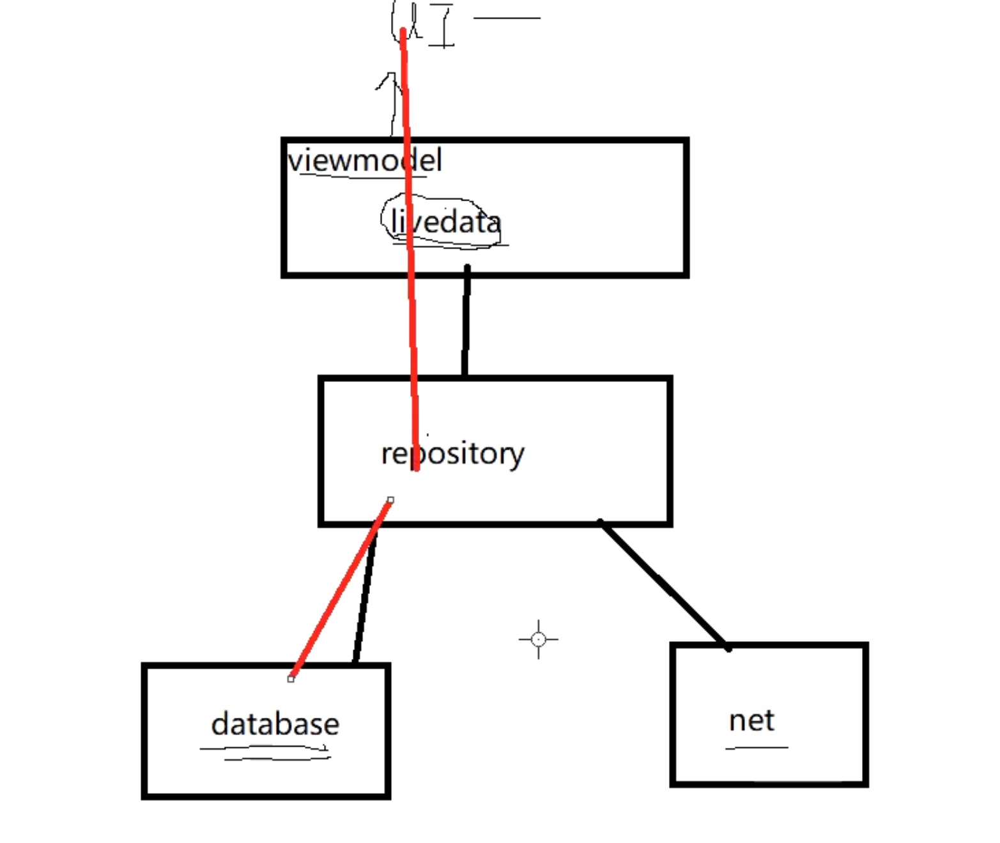

## 整体结构
collapsed:: true
	- 
- ## Dao里返回值用liveData包装
  collapsed:: true
	- ```java
	  @Dao
	  public interface StudentDao {
	  
	      @Insert
	      void insert(Student... students);
	  
	      @Delete
	      void delete(Student student);
	  
	      @Update
	      void update(Student student);
	  
	      @Query("select * from Student")
	      List<Student> getAll();
	  
	  
	      //使用Livedata
	      @Query("select * from Student order by uid")
	      LiveData<List<Student>> getAllLiveDataStudent();
	  
	  
	  }
	  
	  ```
- ## Repository层 持有Dao层
  collapsed:: true
	- ```java
	  /**
	   * 数据仓库
	   */
	  public class StudentRepository {
	      private LiveData<List<Student>> liveDataAllStudent;
	      /**
	       * 持有 Dao 层 对数据库的操作
	       */
	      private StudentDao studentDao;
	  
	      public StudentRepository(Context context){
	          AppDatabase database=AppDatabase.getInstance(context);
	          studentDao=database.studentDao();
	          if(liveDataAllStudent==null){
	              liveDataAllStudent=studentDao.getAllLiveDataStudent();
	          }
	      }
	  
	      //提供一些API给viewmodel使用。内部使用Dao层去完成的
	      void insert(Student... students){
	          studentDao.insert(students);
	      }
	      void delete(Student student){
	          studentDao.delete(student);
	      }
	      void update(Student student){
	          studentDao.update(student);
	      }
	      List<Student> getAll(){
	          return studentDao.getAll();
	      }
	  
	      LiveData<List<Student>> getAllLiveDataStudent(){
	          return studentDao.getAllLiveDataStudent();
	      }
	  }
	  ```
- ## viewModel 持有 Repository层
  collapsed:: true
	- ```java
	  public class StudentViewModel extends AndroidViewModel {
	  
	      private StudentRepository studentRepository;
	  
	      public StudentViewModel(@NonNull Application application) {
	          super(application);
	          studentRepository=new StudentRepository(application);
	      }
	  
	      void insert(Student... students){
	          studentRepository.insert(students);
	      }
	      void delete(Student student){
	          studentRepository.delete(student);
	      }
	      void update(Student student){
	          studentRepository.update(student);
	      }
	      List<Student> getAll(){
	          return studentRepository.getAll();
	      }
	  
	      LiveData<List<Student>> getAllLiveDataStudent(){
	          return studentRepository.getAllLiveDataStudent();
	      }
	  }
	  ```
- ## viewModel在 MainActivity使用
  collapsed:: true
	- ```java
	  public class MainActivity extends AppCompatActivity {
	  
	      StudentViewModel studentViewModel;
	      ListView listView;
	  
	      @Override
	      protected void onCreate(Bundle savedInstanceState) {
	          super.onCreate(savedInstanceState);
	          setContentView(R.layout.activity_main);
	          listView = findViewById(R.id.listView);
	  
	          studentViewModel = ViewModelProviders.of(this).get(StudentViewModel.class);
	          studentViewModel.getAllLiveDataStudent().observe(this, new Observer<List<Student>>() {
	              @Override
	              public void onChanged(List<Student> students) {
	                  listView.setAdapter(new GoodsAdapter(MainActivity.this, students));
	              }
	          });
	  
	          for (int i = 0; i < 50; i++) {
	              studentViewModel.insert(new Student("jett", "123", 1));
	          }
	  
	          new Thread() {
	              @Override
	              public void run() {
	                  for (int i = 0; i < 50; i++) {
	                      try {
	                          Thread.sleep(1000);
	                      } catch (Exception e) {
	                          e.printStackTrace();
	                      }
	                      studentViewModel.update(new Student(6, "jett" + i, "123", 1));
	                  }
	              }
	          }.start();
	  
	      }
	  }
	  ```
- ## AppDatabase
  collapsed:: true
	- ```java
	  @Database(entities = {Student.class}, version = 3,exportSchema = false)
	  public abstract class AppDatabase extends RoomDatabase {
	      private static AppDatabase instance;
	      public static synchronized AppDatabase getInstance(Context context){
	          if(instance==null){
	              instance= Room.databaseBuilder(context.getApplicationContext(),AppDatabase.class
	                                      ,"jettDB")
	                      //可以强制在主线程运行数据库操作
	                      .allowMainThreadQueries()
	                      //强制升级
	  //                    .fallbackToDestructiveMigration()
	                      .addMigrations(MIGRATION_2_3)
	                      .build();
	  
	          }
	          return instance;
	      }
	      public abstract  StudentDao studentDao();
	  
	      //进行数据库升级
	      static final Migration MIGRATION_1_2=new Migration(1,2) {
	          @Override
	          public void migrate(@NonNull SupportSQLiteDatabase database) {
	              //在这里用sql脚本完成数据变化
	              database.execSQL("alter table student add column flag integer not null default 1");
	          }
	      };
	  
	      static final Migration MIGRATION_2_3=new Migration(2,3) {
	          @Override
	          public void migrate(@NonNull SupportSQLiteDatabase database) {
	  //            database.execSQL("create table student_temp (uid integer primary key not null,name text,pwd text,addressId)");
	  //            database.execSQL("insert into student (uid,name,pwd,addressid)" + " select uid,name,pwd,addressid from student");
	  //            database.execSQL("drop table student");
	  //            database.execSQL("alter table student_temp rename to student");
	          }
	      };
	  
	  
	  }
	  ```