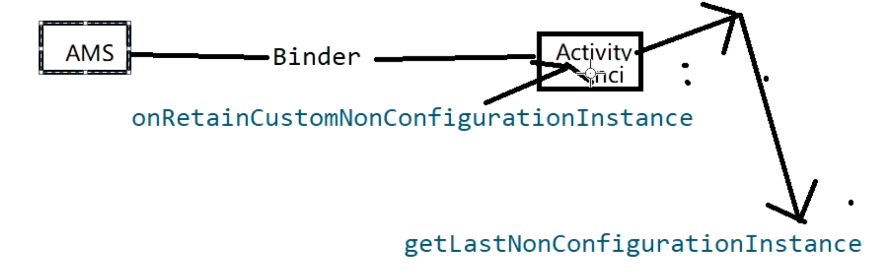

## 1、介绍
	- viewmodel是 ==**系统配置发生变更时**==，比如横竖屏切换，[[#red]]==**管理界面数据的保存和恢复**==
- ## 2、作用
	- 1、Fragment==**共享ViewModel。实现通信**==
	- 2、==**当系统配置发生变更时**==，比如横竖屏切换，切换字体字号 语言等。[[#red]]==**用于管理数据的保存与恢复,**==以前需要自己在saveInstanceState 里处理，现在ViewModel 可以自动处理
- ## 3、 [[ViewModel数据恢复原理总结]]
	- 1、我们使用[[#red]]==**ViewModel**== 时。通过 [[#red]]==**new ViewModelProvider**==(activity)获取实例的
	- 2、在ViewModelProvider构造函数中，[[#red]]==**第一次使用会创建一个存储ViewModel的map集合：ViewModelStore**==
	- 3、通过[[#red]]==**get**==(ViewModel.class)函数，获取viewModel实例时。
		- [[#red]]==**第一次调用会反射创建ViewModel 实例 加入ViewModelStore  的集合中**==
		- 第二次获取的话，就可以直接从ViewModelStore 这map获取了
	- 4、当屏幕发生配置变化时，AMS会调用ComponentActivity 的[[#red]]==**onRetainNonConfigurationInstance**== 方法，[[#red]]==**创建NonConfigurationInstances，将ViewModelStory 存入**==。并将NonConfigurationInstances赋值到Activity的mLastNonConfigurationInstances变量上
	- 5、通过getLastNonConfigurationInstance 方法可以获取到
	- 6、当我们再次通过new ViewModelProvider().get(ViewModel.class)获取viewmodel实例时，会先通过getLastNonConfigurationInstance 获取最后一次配置更改实例。从中取到配置变更前存入的ViewModelStore
	- 7、get，方法获取ViewModel 时。就相当于还是从变更前的map里取实例
	- 
- ## 4、什么时候调用clear清空数据
	- 在ComponentActivity ，注册lifeCycle，观测Activity的生命周期。如果调用==**onDestroy**==时&& 配置没有发生变更时。就会调用clear
	- ```java
	          getLifecycle().addObserver(new LifecycleEventObserver() {
	              @Override
	              public void onStateChanged(@NonNull LifecycleOwner source,
	                      @NonNull Lifecycle.Event event) {
	                  if (event == Lifecycle.Event.ON_DESTROY) {
	                      // Clear out the available context
	                      mContextAwareHelper.clearAvailableContext();
	                      // And clear the ViewModelStore
	                      // 配置没变更才清除
	                      if (!isChangingConfigurations()) {
	                          getViewModelStore().clear();
	                      }
	                  }
	              }
	          });
	  ```