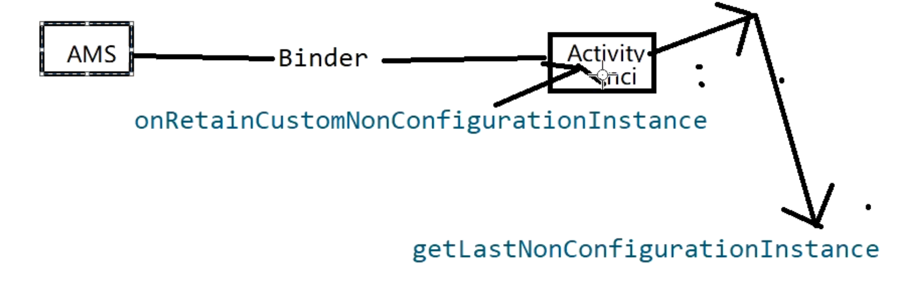

- 1、我们使用[[#red]]==**ViewModel**== 时。通过new [[#red]]==**ViewModelProvider**==(activity)
- 2、这里，第一次在ViewModelProvider构造函数中，[[#red]]==**创建ViewModelStore，一个存储ViewModel的集合**==
- 3、[[#red]]==**get**==(ViewModel.class)函数[[#red]]==**，第一次调用会反射创建ViewModel 实例 加入ViewModelStore  的集合中**==，第二次获取的话，就可以直接从ViewModelStore 这map获取了
- 4、当屏幕发生配置变化时，AMS会调用ComponentActivity 的[[#red]]==**onRetainNonConfigurationInstance**== 方法，[[#red]]==**创建NonConfigurationInstances，将ViewModelStory 存入**==。并将NonConfigurationInstances赋值到Activity的mLastNonConfigurationInstances变量上
- 6、通过getLastNonConfigurationInstance 方法可以获取到
- 7、当我们再次通过new ViewModelProvider，去获取ViewModelStore时。会先通过getLastNonConfigurationInstance 获取最后一次配置更改实例。从中取到配置变更前存入的ViewModelStore
- 8、get，方法获取ViewModel 时。就相当于还是从变更前的map里取实例
- 