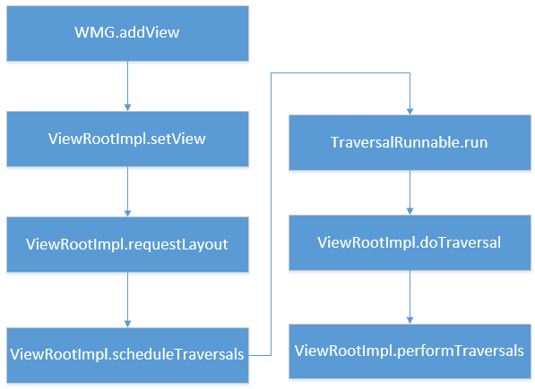
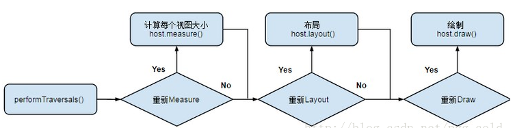
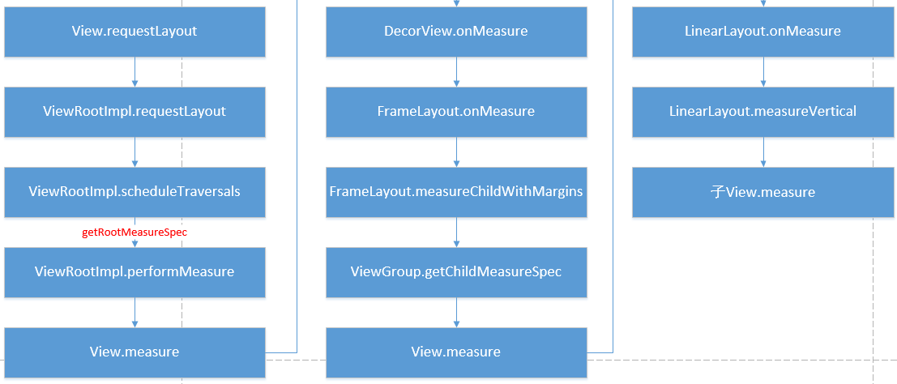
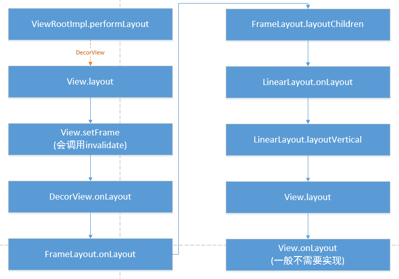
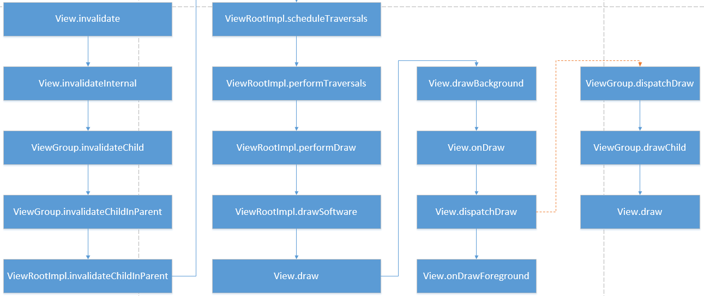

## View树的绘制流程是谁负责的？
collapsed:: true
	- view树的绘制流程是通过ViewRoot去负责绘制的，ViewRoot这个类的命名有点坑，最初看到这个名字，翻译过来是
	  view的根节点，但是事实完全不是这样，ViewRoot其实不是View的根节点，它连view节点都算不上，它的主要作用
	  是View树的管理者，负责将DecorView和PhoneWindow“组合”起来，而View树的根节点严格意义上来说只有
	  DecorView；每个DecorView都有一个ViewRoot与之关联，这种关联关系是由WindowManager去进行管理的；
- ## view的添加
  collapsed:: true
	- 
- ## view的绘制流程
	- 
	- [[自定义view需要重写的方法-面试]]
- ## measure
	- 1. 系统为什么要有measure过程？
	- 2. measure过程都干了点什么事？
	- 3. 对于自适应的尺寸机制，如何合理的测量一颗View树？
	- 4. 那么ViewGroup是如何向子View传递限制信息的？
	- 5. ScrollView嵌套ListView问题？
	- 
- ## layout
	- 1. 系统为什么要有layout过程？
	  2. layout过程都干了点什么事？
	- 
- ## draw
	- 1. 系统为什么要有draw过程？
	  2. draw过程都干了点什么事？
	- 