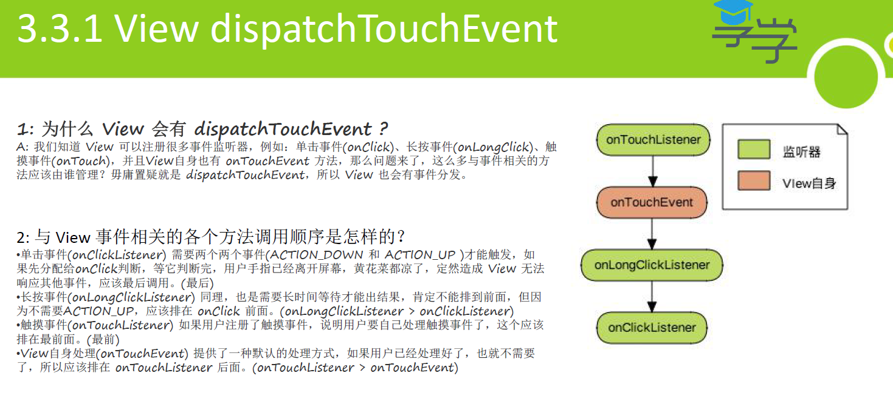

# [[View的dispatchTouchEvent，主要是事件处理]]
- # 为什么 View 会有 dispatchTouchEvent ?
  collapsed:: true
	- 
	- 我们知道 View 可以注册很多事件监听器，例如：单击事件(onClick)、长按事件(onLongClick)、触
	  摸事件(onTouch)，并且View自身也有 onTouchEvent 方法，那么问题来了，这么多与事件相关的方
	  法应该由谁管理？毋庸置疑就是 dispatchTouchEvent，所以 View 也会有事件分发。
- # 与 View 事件相关的各个方法调用顺序是怎样的？
  collapsed:: true
	- ## 触摸事件(onTouchListener) [[#red]]==**最前**==
		- 如果用户注册了触摸事件，说明用户要自己处理触摸事件了，这个应该
		  排在最前面。(最前)
	- ## View自身处理(onTouchEvent) 提供了一种默认的处理方式[[#red]]==**第二**==
		- 如果用户已经处理好了，也就不需要了，所以应该排在 onTouchListener 后面。(onTouchListener > onTouchEvent)
	- ## 长按事件(onLongClickListener)[[#red]]==**第三**==
		- 也是需要长时间等待才能出结果，肯定不能排到前面，但因
		  为不需要ACTION_UP，应该排在 onClick 前面。[[#red]]==**(onLongClickListener > onClickListener)**==
	- ## 单击事件(onClickListener)[[#red]]==**最后调用**==
		- 需要两个[[#red]]==**两个事件(ACTION_DOWN 和 ACTION_UP )**==才能触发，如
		  果先分配给onClick判断，等它判断完，用户手指已经离开屏幕，黄花菜都凉了，定然造成 View 无法
		  响应其他事件，应该最后调用。(最后)