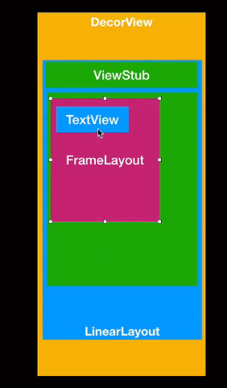

-
- ## Activity 里 有两个成员变量  PhoneWindow  和  WindowManagerImpl
- ### 1、Activity的布局流程-performLaunchActivity
  collapsed:: true
	- ### 1、activity 在 onCreate()里调用了setContentView()  实际调用 PhoneWindow的 setContentView（）
		- 【activity 通过 phoneWindow  与View 链接的】
	- ### 2、PhoneWindow在setContentView（）里创建了DecorView
	  collapsed:: true
		- 【PhoneWindow 和 View 通过DecorView联系起来的  】
		- [[#red]]==**并添加默认布局**==：一个LinearLayout 里包含一个 标题栏 和 Framelayout（id为Content）
		- ### 3、DecorVIew里  有个默认布局：
		  collapsed:: true
			- 我们 从 SetContentView传入的布局文件通过inflat  成view , 然后添加到这个id为content的 Framelayout里的
			- 
	- ### 3、通过LayoutInflater.inflate实例化xml里的布局，实际调用到createaViewFromTag 反射创建view实例的，生成布局参数，通过addView方法添加到Framlayout上
-
- # View的首次绘制流程发生在ActivityThread的handleResumeActivity-答这个#card
	- 1、在ActivityThred的[[#green]]==**handleResumeActivity**==()中，调用activity.[[#green]]==**makeVisible**== 内部判断 window是否添加
	- 2、未添加的话，会调用[[#red]]==**WindowManagerGlobal.addView**==添加mDecorview
	  collapsed:: true
		- 拿到windowManager（父类 viewManager）添加mDecor
	- 3、addView方法会创建[[#red]]==**ViewRootImpl**==实例，调用ViewRootImpl.==**setView**==方法
	- 4、ViewRootImpl的setView里先调用了[[#green]]==**requestLayout**==触发绘制流程，然后Session.addToDisplay 和WMS通信，通知底层绘制
	- 5、requestLayout通过 scheduleTraversals 最终调用到performTraversals，内部执行performMeasure()  performLayout   performDraw 【然后逐层向下测量绘制】
-
-
- >ViewRootImpl         是在WindowmanagerGlobal里创建的
- >DecorView 的父view 是 ViewRootImpl
-
- # [[View的requestLayout到performTraversals]]这个好像不对