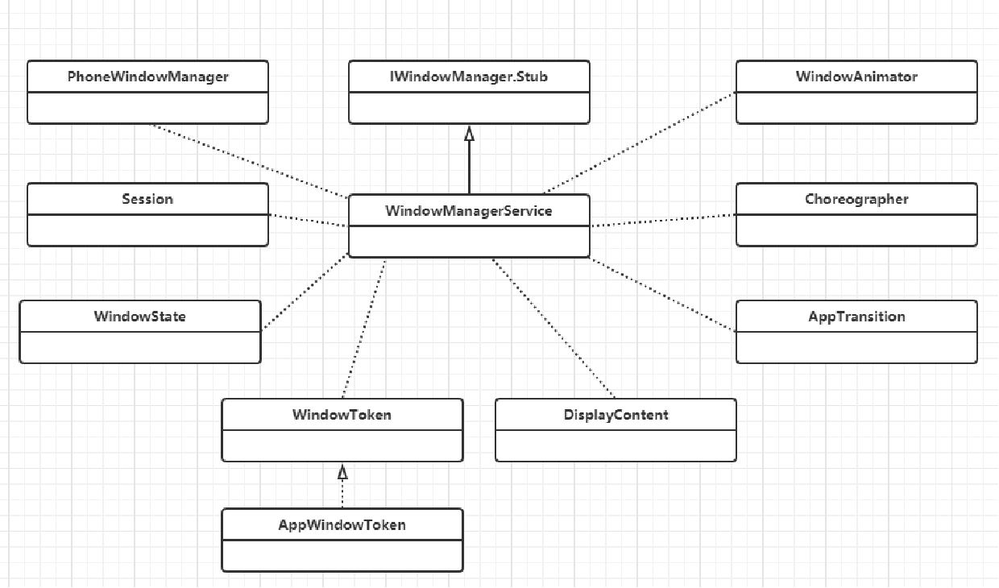
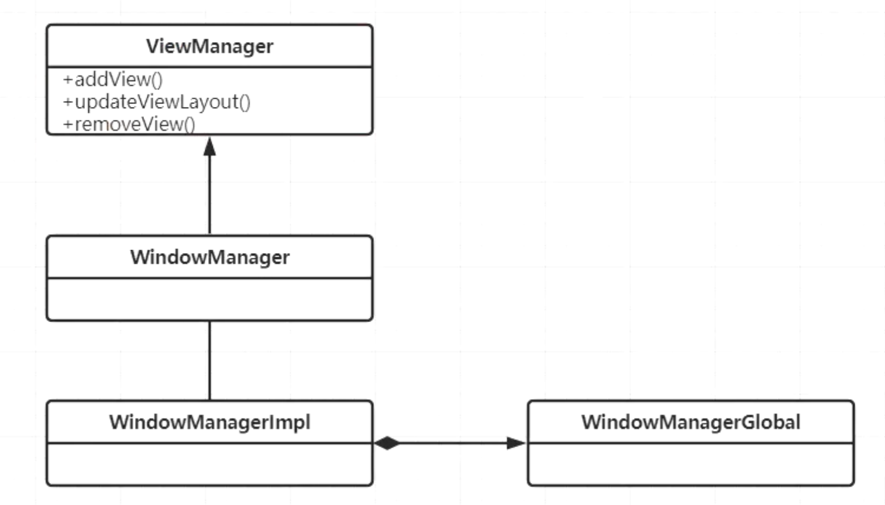
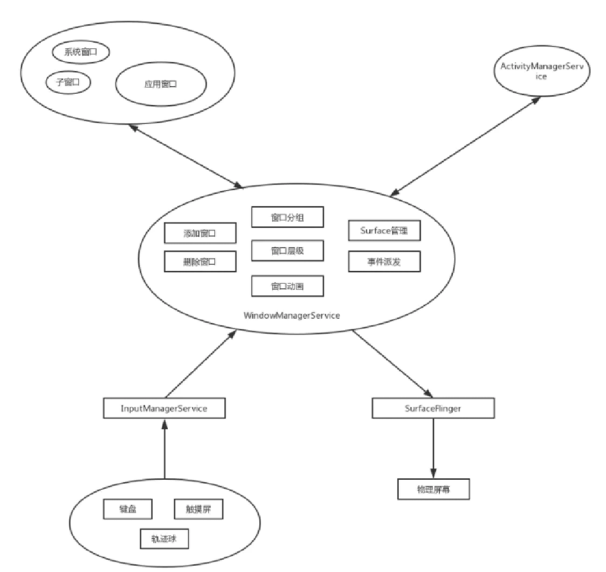

- [WMS.xmind](../assets/WMS_1689040883577_0.xmind)
- ## WMS职责：主要管理WIndow的，不管实际绘制
- # 一、WMS相关概念
  collapsed:: true
	- 
	- ## [[WMS-Window]]
	  collapsed:: true
		- “Window”表明它是和窗口相关的，“窗口”是一个抽象的概念，从用户的角度来讲，它是一个“界面”；从SurfaceFlinger的角度来看，它是一个Layer，承载着和界面有关的数据和属性；
			- Window具体实现位于WindowManagerService中
			- WindowManager和WindowManagerService的交互是通过IPC完成
			- 定义窗口样式和行为的抽象基类，用于作为顶层的view加到WindowManager中，其实现类是PhoneWindow。
			- 每个Window都需要指定一个Type（应用窗口、子窗口、系统窗口）。Activity对应的窗口是应用窗口；PopupWindow，ContextMenu，OptionMenu是常用的子窗口；像Toast和系统警告提示框（如ANR）就是系窗口，还有很多应用的悬浮框也属于系统窗口类型。
	- ## [[Surface]]
	- ## [[WMS-WindowManager]]
	  collapsed:: true
		- 
	- ## [[PhoneWindowManager（AMS侧）]]
	- ## Choreographer
		- [[#red]]==**用于控制窗口动画、屏幕旋转等操作,它拥有从显示子系统获取VSYNC同步事件的能力，从而可以在合适的时机通知渲染动作，**==避免在渲染的过程中因为发生屏幕重绘而导致的画面撕裂。WMS使用Choreographer负责驱动所有的窗口动画、屏幕旋转动画、墙纸动画的渲染
	- ## [[DisplayContent]]
	- ## [[WindowState（在WMS中）]]
	- ## WindowManagerService [[WMS概念]]
	- ## WindowToken[[WMS-WindowToken]]
	  collapsed:: true
		- 窗口Token，用来做Binder通信；同时也是一种标识
			- @1 在进行窗口Zorder排序时，属于同一个WindowToken的窗口会被安排在一起，而且在其中定义的一些属性将会影响所有属于此WindowToken的窗口，这些都表明了属于同一个WindowToken的窗口之间的紧密联系
			- @2 应用组件在需要新的窗口时，必须提供WindowToken以表明自己的身份，并且窗口的类型必须与所持有的WindowToken的类型一致
			- @3 在创建系统类型的窗口时不需要提供一个有效的Token，WMS会隐式地为其声明一个WindowToken，看起来谁都可以添加个系统级的窗口。难道Android为了内部使用方便而置安全于不顾吗？非也，addWindow()函数一开始的mPolicy.checkAddPermission()的目的就是如此。它要求客户端必须拥有SYSTEM_ALERT_WINDOW或INTERNAL_SYSTEM_WINDOW权限才能创建系统类型的窗口
	- ## Window的type[[窗口类型]]
	- ## [[Session]]
	- ## SurfaceFlinger
		- SurfaceFlinger负责管理Android系统的帧缓冲区（Frame Buffer)，Android设备的显示屏被抽象为一个帧缓冲区，而Android系统中的SurfaceFlinger服务就是通过向这个帧缓冲区写入内容来绘制应用程序的用户界面的
	- ## InputManager
		- IMS实例。管理每个窗口的输入事件通道（InputChannel）以及向通道上派发事件
	- ## Animator
		- 所有窗口动画的总管（WindowStateAnimator对象）。在Choreographer的驱动下，逐个渲染所有的动画
- # 二、WMS相关交互图
  collapsed:: true
	- 
- # 三、WMS重要成员变量
  collapsed:: true
	- ## mTokenMap:新版进行了拆分
		- 保存所有显示令牌（类型为WindowToken），一个窗口必须隶属于某一个显示令牌。
		- 衍生变量还有：
			- mAppTokens，保存了所有属于Activity的显示令牌（WindowToken的子类AppWindowToken），mAppTokens列表是有序的，它与AMS中的mHistory列表的顺序保持一致，反映了系统中Activity的顺序。
			- mExitingTokens，保存了正在退出过程中的显示令牌等
	- ## mWindowMap：WindowHashMap保存的
	  collapsed:: true
		- 保存所有窗口的状态信息（类型为WindowState），
		- ## 衍生变量还有
			- mPendingRemove，保存了那些退出动画播放完成并即将被移除的窗口
			- mLosingFocus，保存了那些失去了输入焦点的窗口
			- 在DisplayContent中，也有一个windows列表，这个列表存储了显示在此DisplayContent中的窗口，并且它是有序的。窗口在这个列表中的位置决定了其最终显示时的Z序
	- ## mSessions：ArraySet保存的
		- 保存了当前所有想向WMS寻求窗口管理服务的客户端。[[#red]]==**注意Session是具有进程唯一性**==
- # 四、[[window,WindowManager和WMS关系]]
- # 五、Activity相关变量
  collapsed:: true
	- ## mWindow
		- [[#red]]==**PhoneWindow对象，继承于Window，是窗口对象**==
	- ## mWindowManager
		- WindowManagerImpl对象，实现WindowManager接口
	- ## mMainThread
		- Activity对象，并非真正的线程，是运行在主线程里的对象
	- ## mUIThread
		- Thread对象，主线程
	- ## mHandler
		- Handler对象，主线程Handler
	- ## mDecor（DecorView）
		- View对象，用来显示Activity里的视图
- # 六、[[WMS启动流程]]
- # 七、[[View的显示层级]]
- # 八、[[窗口类型]]
- # 九、[[WMS中添加view前提知识]]
	- ## [[AMS-Token]]
- # 十、[[从Activity启动角度看WMS]]
- # 十一、[[Activity启动窗口（StartingWindow）启动流程]]
- # 十二、[[DecorView是什么？]]
- # 十三、[[窗口显示次序分析]]
- # 十四、[[窗口的尺寸计算]]
-
-
-
- # [[WMS面试题]]
-