- 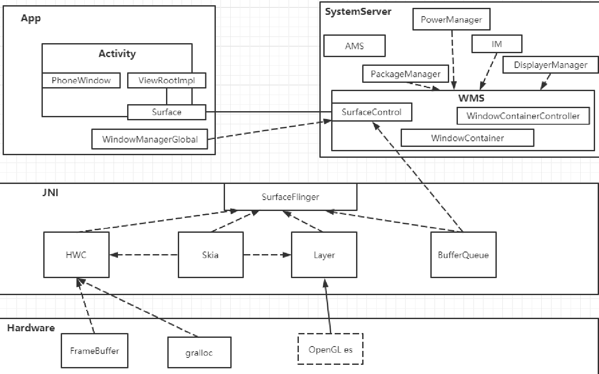
- ## [[ViewRootImpl]]
- ## SurfaceFlinger（Surface 投递者）
	- 投递相应的jni层 间接到硬件层进行绘制
- ## WMS中两个重要的东西
	- ## [[WindowContainer]]
		- 继承关系
			- 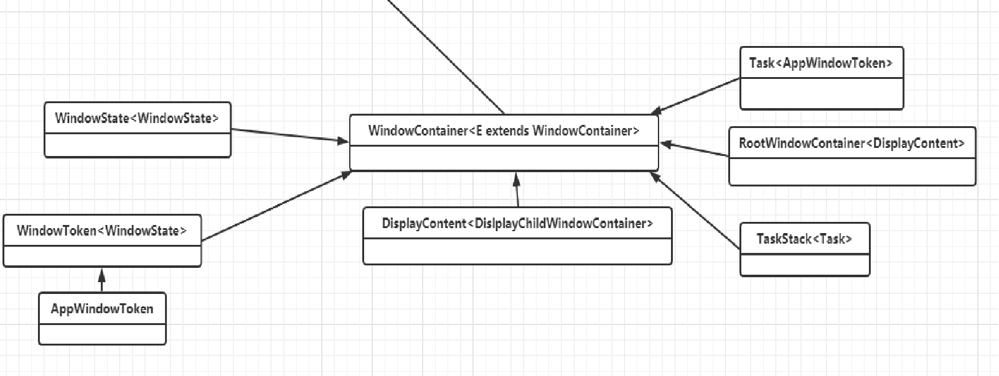
		- 作用“
			- 管理我们的窗口：显示的次序（添加窗口时会排序），窗口尺寸的计算，和AMS沟通
		- 装载我们window的
		- ## 父类ConfigurationContainer<E>
			- 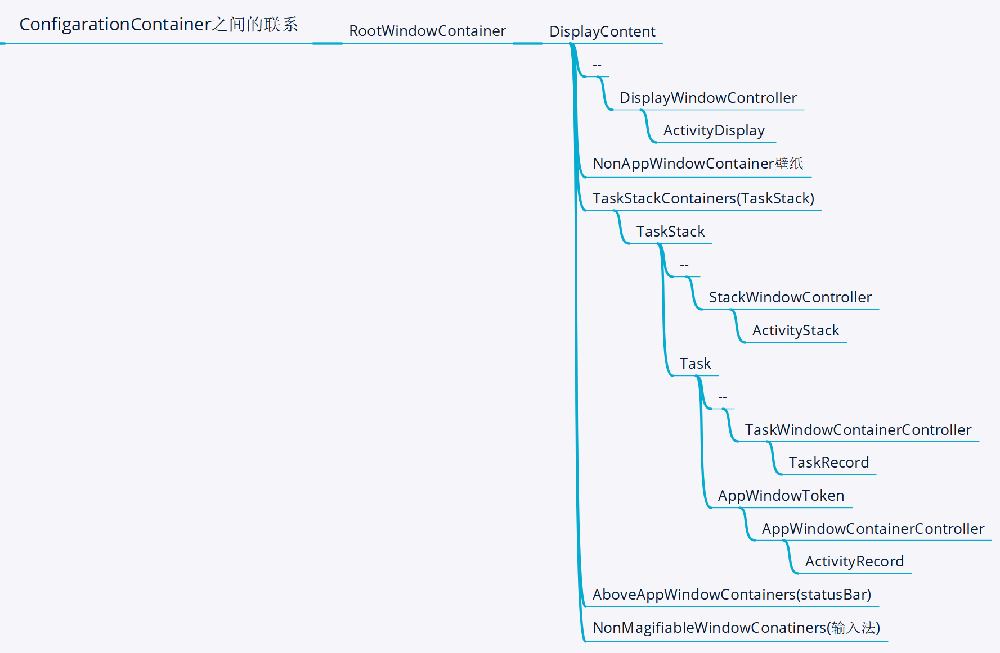
			- 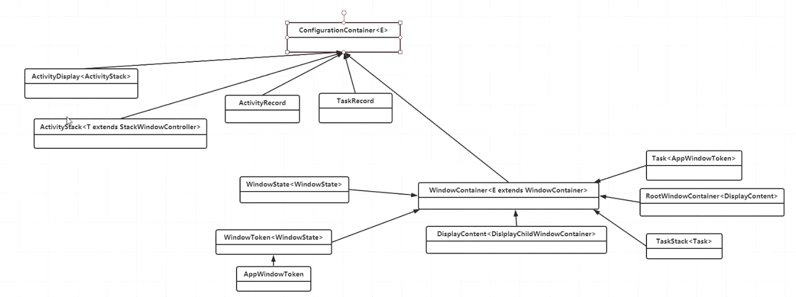{:height 265, :width 687}
			- 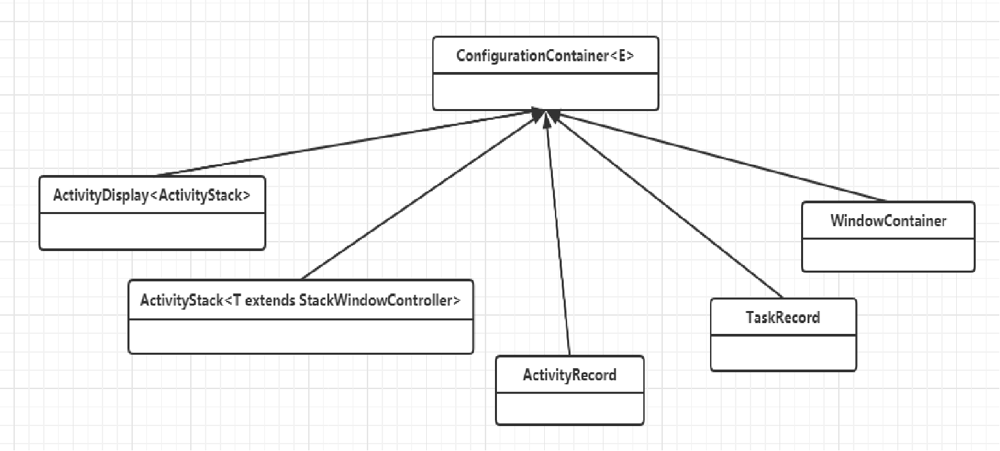
	- ## WindowContainerController
		- 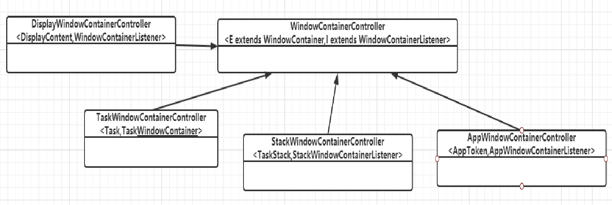
		-
	- ## WindowContainerController和WindowContainer关系
		- 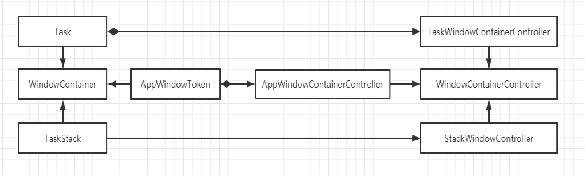
		- 1、将界面显示的东西抽象成 windowContainer。
		- 2、这个container 相关的计算显示的逻辑 抽象成了WindowContainerController进行管理
- # 总结
	- 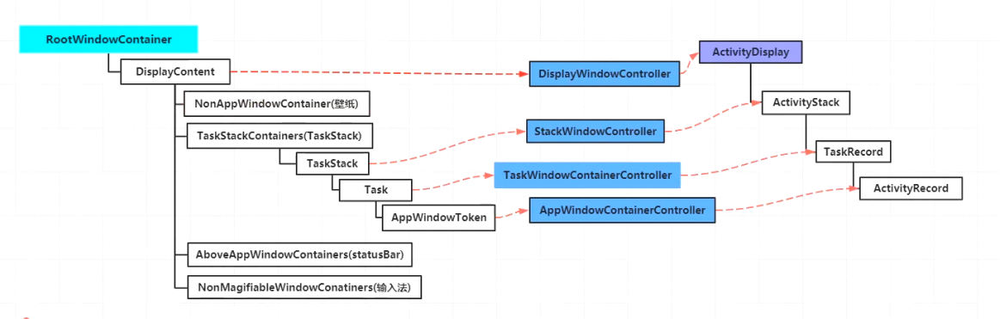
	- 左侧为window相关概念
		- 最上层是RootWindowContainer,管理 DisPlayContent手机屏幕相关东西
			- 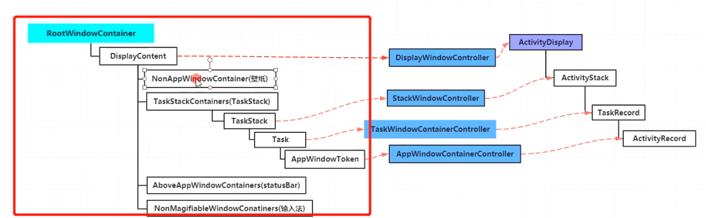
		- DisPlayContent每块屏幕也是如图所示分层次的
			- 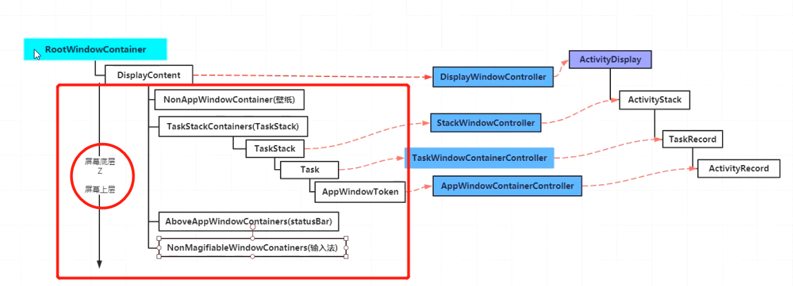
	- 右侧为AMS相关
		- 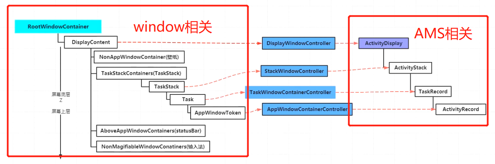