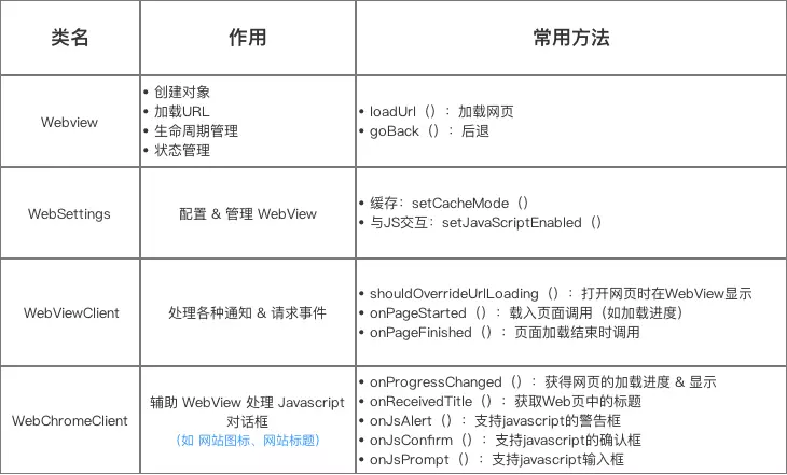
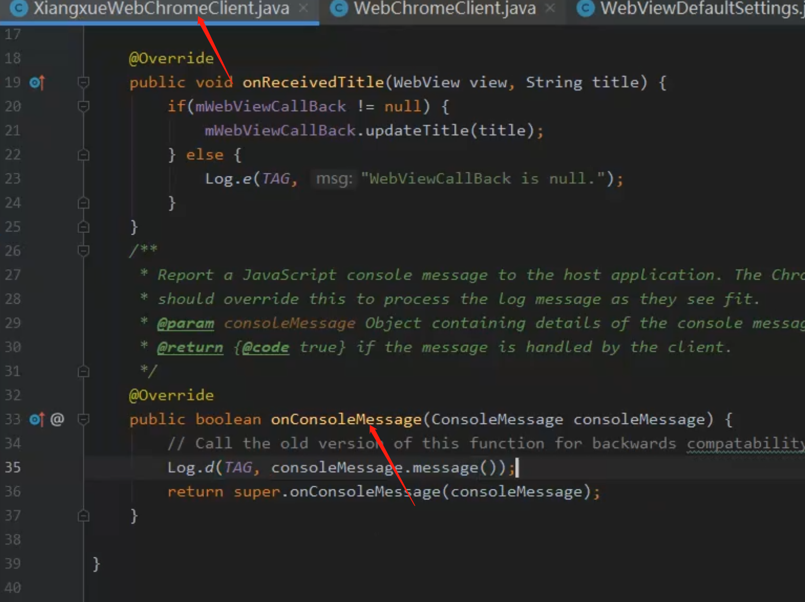
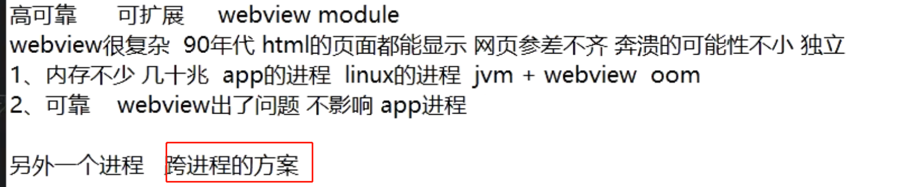

- # 一、基础
  collapsed:: true
	- ## [基础知识](https://mp.weixin.qq.com/s/5Hs9Bg93IbY2uRUMeIqAJQ)
	  collapsed:: true
		- 
		- 
	- ## JavascriptInterface:通信用
	- ## 打印html的日志到控制台
	  collapsed:: true
		- 
- # 二、[[Webview和Native之间的通信]]
- # 三、[[webview放入独立的进程上]]
  collapsed:: true
	- 
- # 四、高阶+优化
	- [[解决WebView多进程崩溃]]
	- [[Webview优化]]
- # 面试题
	- [[WebView面试题]]
-