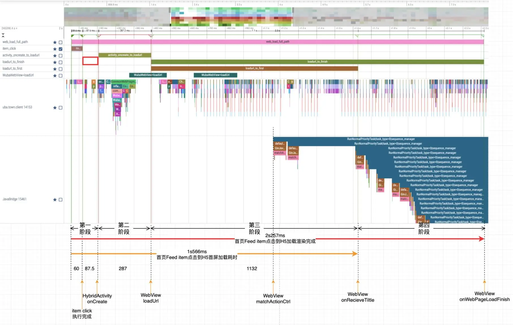
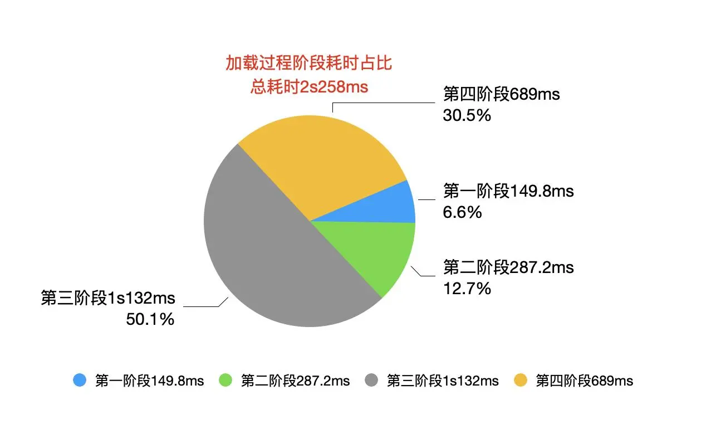
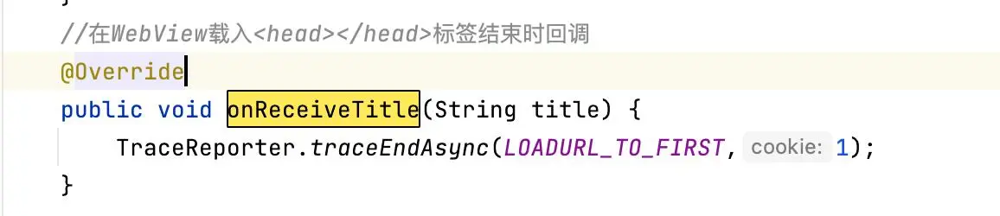
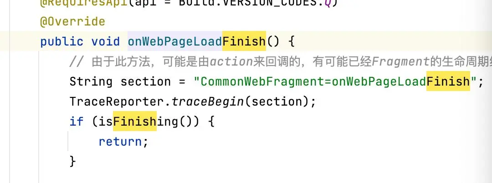
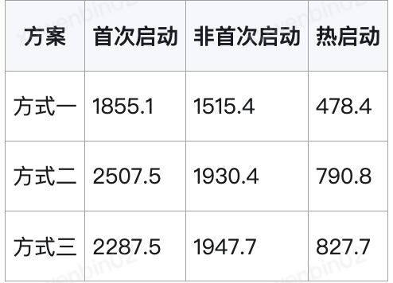

- # 1.背景
  collapsed:: true
	- 本地版App，PM点击内容推送通知到内容落地页，出现过两次白屏，经分析为加载中白屏现象，白屏默认超时间30s，长时间的白屏极大的影响用户体验，对此问题需要进行深度优化，优化H5的加载速度，解决白屏的问题，提升用户体验并提高H5的转化率。
- # 2.android客户端统计分析
  collapsed:: true
	- android客户端Web页加载过程统计分析(应用启动首次启动Web页，非首次安装启动)
	- 统计从首页Feeditem点击到Web页加载完成总耗时2s258ms
	- 
	- 加载H5页面分为以下4个阶段：
		- 
		- 第一阶段：Feed item click事件开始到载体页Activity.OnCreate 149.8ms 占比总耗时 6.6%
		- 第二阶段：载体页Activity.OnCreate到WebView.loadUrl 287.2ms 占比总耗时 12.7%
		- 第三阶段：WebView.loadUrl 到 web页首屏渲染 耗时 1s132ms 占比总耗时 50.1%
		- web页面的首屏渲染使用的是BaseWebChromeClient.onReceiveTitle回调
		  collapsed:: true
			- 
		- 第四阶段：web页首屏渲染 到 加载渲染完成 耗时 689ms 占比总耗时 30.5%
			- 加载渲染完成使用的是WebPageLoadCallBack.onWebPageLoadFinish
				- 
- # 3.优化思路
	- 第三阶段耗时优化 -- Web加载提速
	- 该阶段主要是css、js、html网络请求时间的耗时。
	- 优化方案：预加载所需的css、js、html
	  第四阶段耗时优化 -- 渲染提速
	- 预加载动态文本数据内容并缓存；
	- ### 三种web的优化方式：
		- 1.客户端内置模版（html），webview加载模板，模板请求内容数据并渲染；
		- 2.native请求预加载组装好内容的html，webview渲染；
		- 3.使用webview原生加载url，服务端组装好内容html；
	- ### 采样规则：
	- webview展示耗时=webview加载完成时间（native webview回调）-进入页面时间
	- 采样10次算出平均值。
	- 单位：毫秒
	- ### 采样时间：
	- 上述三种加载方式，在不内置js和css的情况下，分别统计app首次启动、非首次启动以及热启动的webview展示耗时。
	- 以下是耗时统计：
	  collapsed:: true
		- 
	- 结论：通过上述结果可以看出方式一效果最好，即：客户端内置模版（html）。webview加载模板，模板请求内容数据并渲染。
	- 方式一更多维度统计数据
		- 对方式一再分别统计出内置js和css在正常网络下、4G网络下的耗时和不内置js和css在正常网络下、4G网络下的耗时
		-