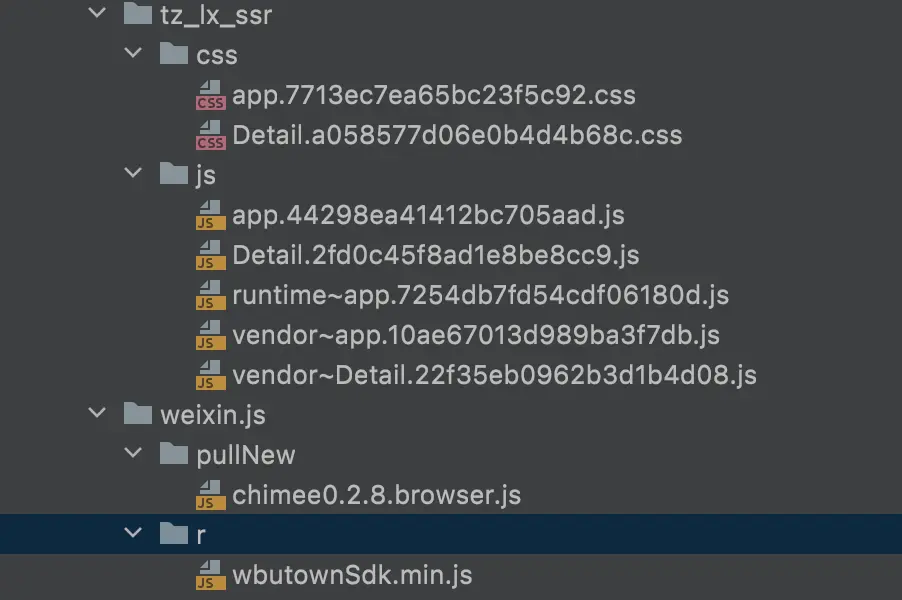

- # 1.背景
  collapsed:: true
	- 本地版App，PM点击内容推送通知到内容落地页，出现过两次白屏，经分析为加载中白屏现象，白屏默认超时间30s，长时间的白屏极大的影响用户体验，对此问题需要进行深度优化，优化H5的加载速度，解决白屏的问题，提升用户体验并提高H5的转化率。
- # 2.android客户端统计分析
  collapsed:: true
	- android客户端Web页加载过程统计分析(应用启动首次启动Web页，非首次安装启动)
	- 统计从首页Feeditem点击到Web页加载完成总耗时2s258ms
	- 
	- 加载H5页面分为以下4个阶段：
		- 
		- 第一阶段：Feed item click事件开始到载体页Activity.OnCreate 149.8ms 占比总耗时 6.6%
		- 第二阶段：载体页Activity.OnCreate到WebView.loadUrl 287.2ms 占比总耗时 12.7%
		- 第三阶段：WebView.loadUrl 到 web页首屏渲染 耗时 1s132ms 占比总耗时 50.1%
		- web页面的首屏渲染使用的是BaseWebChromeClient.onReceiveTitle回调
		  collapsed:: true
			- 
		- 第四阶段：web页首屏渲染 到 加载渲染完成 耗时 689ms 占比总耗时 30.5%
			- 加载渲染完成使用的是WebPageLoadCallBack.onWebPageLoadFinish
				- 
- # 3.优化思路
  collapsed:: true
	- 第三阶段耗时优化 -- Web加载提速
	- 该阶段主要是css、js、html网络请求时间的耗时。
	- 优化方案：预加载所需的css、js、html
	  第四阶段耗时优化 -- 渲染提速
	- 预加载动态文本数据内容并缓存；
	- ### 三种web的优化方式：
		- 1.客户端内置模版（html），webview加载模板，模板请求内容数据并渲染；
		- 2.native请求预加载组装好内容的html，webview渲染；
		- 3.使用webview原生加载url，服务端组装好内容html；
	- ### 采样规则：
	- webview展示耗时=webview加载完成时间（native webview回调）-进入页面时间
	- 采样10次算出平均值。
	- 单位：毫秒
	- ### 采样时间：
	- 上述三种加载方式，在不内置js和css的情况下，分别统计app首次启动、非首次启动以及热启动的webview展示耗时。
	- 以下是耗时统计：
	  collapsed:: true
		- 
	- 结论：通过上述结果可以看出方式一效果最好，即：客户端内置模版（html）。webview加载模板，模板请求内容数据并渲染。
	- 方式一更多维度统计数据
		- 对方式一再分别统计出内置js和css在正常网络下、4G网络下的耗时和不内置js和css在正常网络下、4G网络下的耗时
		  collapsed:: true
			- 
		- 结论：通过上述结果得出正常网络，内置资源与不内置资源在首次启动速度有差异，内置资源速度更快，但提升加载速度不明显，只有10%
		- 4G网络，内置资源在首次启动、非首次启动、热启动加载速度均有所提升，尤其是首次启动，速度提升45%。
		- 针对首次启动app，提升webview的打开速度，可以采取内置资源和模版的方案。
		- 和前端同事看完统计数据后都认为结论和预期一致，但是又出新问题了。
- # 4.Performance
  collapsed:: true
	- performance 是W3C性能小组引入的新的API，performance 接口可以获取到当前页面中与性能相关的信息。可以通过调用只读属性 window.performance 来获取。
	- 通过performance可以获取到：
	- FP（First Paint）：首次绘制时间，这个指标用于记录页面第一次绘制像素的时间。
	- FCP（First Contentful Paint）：首次内容绘制时间，这个指标用于记录页面首次绘制文本、图片、非空白 Canvas 或 SVG 的时间。
		- {:height 206, :width 716}
		- 可以获取更多的信息
		  collapsed:: true
			- 
		- 指标解读：
		  collapsed:: true
			- 
		- 我们按前端的指标重新统计数据，统计首次绘制耗时。加载url方式还是上述三种方式。
		  collapsed:: true
			- 
		- 可以得出结论native请求预加载组装好内容的html，webview渲染。按前端指标计算这种方式效果最好
- # 5.Webview调试方法
	- ## 代码中把WebView的浏览器调试开关打开
	  collapsed:: true
		- ```
		  if (Build.VERSION.SDK_INT >= Build.VERSION_CODES.KITKAT) {
		      webView.setWebContentsDebuggingEnabled(true);
		  }
		  ```
	- ## 其次在浏览器的地址栏输入如下网址：
		- chrome://inspect/#devices
		- 
		- 可以看到这个网址内容出现了变化，出现如下类似信息就表示成功了，注意看这里的MI 9，这里就是我当前开发所使用的手机机型，它下面的网址就是我当前所打开的网址。
		- 点击inspect，顾名思义就是开始检查当前网页，点击之后会弹出一个调试窗口，就是如下的效果：
		  collapsed:: true
			- 
		- 可以查看打印信息或者点击其他的选项来进行更多的调试操作了。这里能操作或者看到什么信息？
		- 1.调用action
		  collapsed:: true
			- 可以调用各种action，和前端定好action可以自己先聊天，不用等待前端调试的环境。
			- 在控制台输入以下代码，可以调用getUserInfo。
			  collapsed:: true
				- ```
				  WBUTOWN.action.getUserInfo('', (headers) => {
				        console.log('headers:', headers);
				  });
				  ```
				-
			- 
		- 2.观察资源的加载过程
			- 我们内置js和css，怎么能看出webview的确是加载本地文件了？我们在测试中内置了以下js和css：
			- 
			- 通过控制台可以看出，内置的js都没有网络请求。
			  collapsed:: true
				- 
			- webview有自己的缓存机制，代码可以设置缓存方式，如下
				-
	-