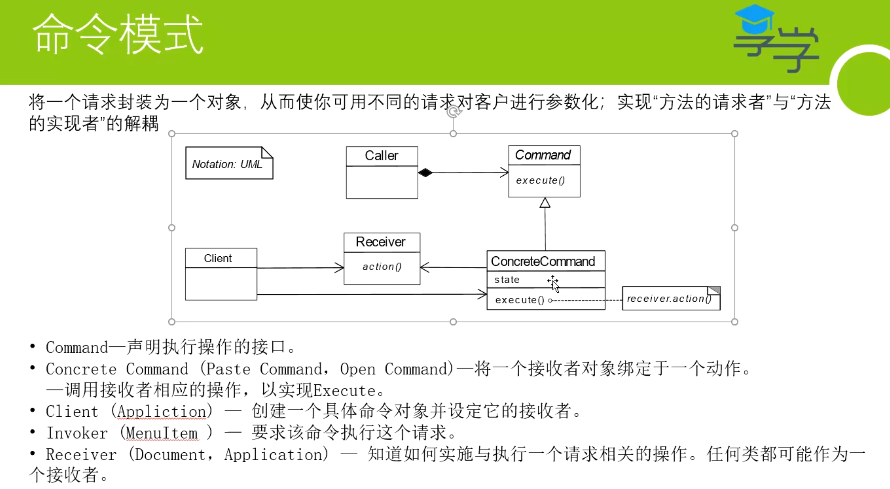
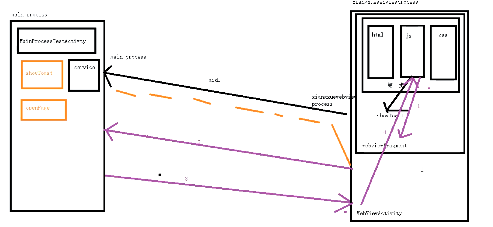
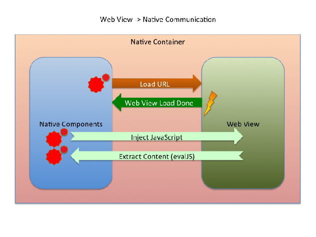

- # 背景
  collapsed:: true
	- js需要调用native很多功能：showToast,openActivity,openDialog,login
	- 不能每加一个功能就改一次webview。
	- 将所有的功能，放入一个接口里（见下方实现 一个接口takeNativeAction）：包括命令 = 名字+操作
	  collapsed:: true
		- 
	- 上述的设计模式为：命令模式
	  collapsed:: true
		- 
- # 实战
	- ## 跨进程+跨平台通信
		- 
	- ## [[搭建js-Native通信框架]]
- # 概念
	- ## 框架
	  collapsed:: true
		- 
	- ## [[Native调用Webview JS对比]]
	- ## [[Webview JS调用Native]]
		-
- # 参考
	- # [JSBridge 技术原理分析](https://blog.csdn.net/g6U8W7p06dCO99fQ3/article/details/121433439)
-