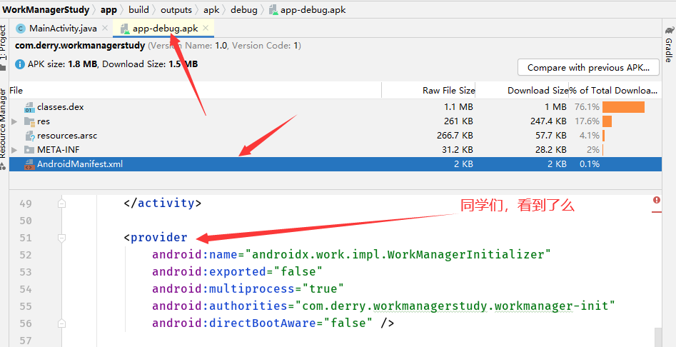

# 自动在Apk清单文件里注册ContentProvide
collapsed:: true
	- 
- # WorkManagerInitializer：
  collapsed:: true
	- ```java
	  public class WorkManagerInitializer extends ContentProvider {
	      @Override
	      public boolean onCreate() {
	  // Initialize WorkManager with the default configuration.
	          WorkManager.initialize(getContext(), new
	                       Configuration.Builder().build());
	          return true;
	      }
	  }
	  
	  ```
	- workManager
		- ```java
		      public static void initialize(@NonNull Context context, @NonNull Configuration configuration) {
		          WorkManagerImpl.initialize(context, configuration);
		      }
		  ```
	- 由于WorkManager是个单例，在此时WorkManager就已经被初始化了，
	- 在initialize()之前，会创建一个默认的Configuration，Configuration设置了许多属性，用来管理和调度工作的方式，看initialize()的实现，由于WorkManager是个抽象类，真正的构造方法是在他的子类WorkManagerImpl实现的哦
- # WorkManagerImpl
  collapsed:: true
	- ```java
	      // WorkManagerImpl.java 类
	      @RestrictTo(RestrictTo.Scope.LIBRARY_GROUP)
	      public static void initialize(@NonNull Context context,
	                                    @NonNull Configuration configuration) {
	          synchronized (sLock) {
	  			// 同学们：代码省略...
	              if (sDelegatedInstance == null) {
	                  context = context.getApplicationContext();
	                  if (sDefaultInstance == null) {
	                      sDefaultInstance = new WorkManagerImpl(
	                              context,
	                              configuration,
	                              new WorkManagerTaskExecutor(configuration.getTaskExecutor()));
	                  }
	                  sDelegatedInstance = sDefaultInstance;
	              }
	          }
	      }
	  ```
	- 此时sDelegatedInstance为null，WorkManager会先创建一个默认的WorkManagerTaskExecutor对象，用来执行WorkManager的任务，下面[[#red]]==**创建一个WorkManagerImpl对象**==：
	- ## 看WorkManagerImpl构造
		- ```java
		      // WorkManagerImpl.java累
		      @RestrictTo(RestrictTo.Scope.LIBRARY_GROUP)
		      public WorkManagerImpl(
		              @NonNull Context context,
		              @NonNull Configuration configuration,
		              @NonNull TaskExecutor workTaskExecutor) {
		          this(context,
		                  configuration,
		                  workTaskExecutor,
		                  context.getResources().getBoolean(R.bool.workmanager_test_config
		                          uration));
		      }
		  ```
		- ```java
		      // WorkManagerImpl.java
		      @RestrictTo(RestrictTo.Scope.LIBRARY_GROUP)
		      public WorkManagerImpl(
		              @NonNull Context context,
		              @NonNull Configuration configuration,
		              @NonNull TaskExecutor workTaskExecutor,
		              boolean useTestDatabase) {
		          this(context,
		                  configuration,
		                  workTaskExecutor,
		                  WorkDatabase.create(
		                          context.getApplicationContext(),
		                          workTaskExecutor.getBackgroundExecutor(),
		                          useTestDatabase)
		          );
		      }
		  ```
		- 在这里就[[#red]]==**创建了数据库勒，WorkDatabase.create()将任务列表序列化到本地，记录每一个任务的属性，执行条件，执行顺序及执行状态等**==，从而保证任务在冷启动或硬件重启后，然后根据条件继续执行哦：
		- ```java
		      // WorkManagerImpl.java 类
		      @RestrictTo(RestrictTo.Scope.LIBRARY_GROUP)
		      public WorkManagerImpl(
		              @NonNull Context context,
		              @NonNull Configuration configuration,
		              @NonNull TaskExecutor workTaskExecutor,
		              @NonNull WorkDatabase database) {
		          Context applicationContext =
		                  context.getApplicationContext();
		          Logger.setLogger(new Logger.LogcatLogger(configuration.getMinimumLoggingLevel()));
		          List<Scheduler> schedulers =
		                  createSchedulers(applicationContext, workTaskExecutor);
		          Processor processor = new Processor(
		                  context,
		                  configuration,
		                  workTaskExecutor,
		                  database,
		                  schedulers);
		          internalInit(context, configuration, workTaskExecutor,
		                  database, schedulers, processor);
		      }
		  ```
	- ## 三个重要的初始化步
		- ## 步骤一：createSchedulers()创建的Schedulers进行任务调度。
		  collapsed:: true
			- ```java
			   // WorkManagerImpl.java 类
			      @RestrictTo(RestrictTo.Scope.LIBRARY_GROUP)
			      @NonNull
			      public List<Scheduler> createSchedulers(
			              @NonNull Context context,
			              @NonNull TaskExecutor taskExecutor) {
			  // 同学们注意：return一个Scheduler数组。其中GreedyScheduler()  是实例化好了哦
			          return Arrays.asList(
			                  Schedulers.createBestAvailableBackgroundScheduler(context,
			                          this),
			  // Specify the task executor directly here as
			                  this happens before internalInit.
			  // GreedyScheduler creates ConstraintTrackers and
			                          controllers eagerly.
			  // TOOD 同学们注意：埋下伏笔 GreedyScheduler贪婪调度程   序
			          new GreedyScheduler(context, taskExecutor,
			                  this));
			      }
			  ```
		- ## 步骤二：Processor()用来管理Schedulers的执行。
		  collapsed:: true
			- ```java
			   public WorkManagerImpl(...) {
			  ...
			          List<Scheduler> schedulers =
			                  createSchedulers(applicationContext, workTaskExecutor);
			          Processor processor = new Processor(
			                  context,
			                  configuration,
			                  workTaskExecutor,
			                  database,
			                  schedulers);
			  ....
			      }
			  ```
		- ## 步骤三：internalInit()真正的初始化。
			- ```java
			      private void internalInit(@NonNull Context context,
			                                @NonNull Configuration configuration,
			                                @NonNull TaskExecutor workTaskExecutor,
			                                @NonNull WorkDatabase workDatabase,
			                                @NonNull List<Scheduler> schedulers,
			                                @NonNull Processor processor) {
			          context = context.getApplicationContext();
			          mContext = context;
			          mConfiguration = configuration;
			          mWorkTaskExecutor = workTaskExecutor;
			          mWorkDatabase = workDatabase;
			          mSchedulers = schedulers;
			          mProcessor = processor;
			          mPreferenceUtils = new PreferenceUtils(workDatabase);
			          mForceStopRunnableCompleted = false;
			  // Checks for app force stops.
			  // 同学们注意：这里的 【检查应用程序强制停止】 例如：正在执行任务的时
			  //         候，手机关机了，或者发生了意外，这里就会重试之前失败的任务哦
			          mWorkTaskExecutor.executeOnBackgroundThread(new
			                  ForceStopRunnable(context, this));
			      }
			      // ForceStopRunnable.java 类
			      @Override
			      public void run() {
			  // Migrate the database to the no-backup directory if necessary.
			                  WorkDatabasePathHelper.migrateDatabase(mContext);
			  // Clean invalid jobs attributed to WorkManager, and Workers that might have been
			  // interrupted because the application crashed (RUNNING  state).
			          Logger.get().debug(TAG, "Performing cleanup
			                  operations.");
			          try {
			              boolean needsScheduling = cleanUp();
			              if (shouldRescheduleWorkers()) {
			                  Logger.get().debug(TAG, "Rescheduling Workers.");
			                  mWorkManager.rescheduleEligibleWork();
			  // Mark the jobs as migrated.
			                  mWorkManager.getPreferenceUtils().setNeedsReschedule(false);
			              } else if (isForceStopped()) {
			                  Logger.get().debug(TAG, "Application was forcestopped,
			                          rescheduling.");
			                          mWorkManager.rescheduleEligibleWork();
			              } else if (needsScheduling) {
			                  Logger.get().debug(TAG, "Found unfinished work,
			                          scheduling it.");
			                          Schedulers.schedule(
			                                  mWorkManager.getConfiguration(),
			                                  mWorkManager.getWorkDatabase(),
			                                  mWorkManager.getSchedulers());
			              }
			              mWorkManager.onForceStopRunnableCompleted();
			          } catch (SQLiteCantOpenDatabaseException
			                   | SQLiteDatabaseCorruptException
			                   | SQLiteAccessPermException exception) {
			  // ForceStopRunnable is usually the first thing that  accesses a database (or an app's
			  // internal data directory). This means that weird    PackageManager bugs are attributed
			  // to ForceStopRunnable, which is unfortunate. This gives the developer a better error
			  // message.
			              String message =
			                      "The file system on the device is in a bad
			              state. WorkManager cannot access "
			                      + "the app's internal data store.";
			              Logger.get().error(TAG, message, exception);
			              throw new IllegalStateException(message, exception);
			          }
			      }
			  ```
			- 以上代码的Runnable的作用就是在WorkManager初始化过程中，发现
			  了未完成的，需要重新执行的任务。
- # [[WorkManager的初始化 总结]]
-