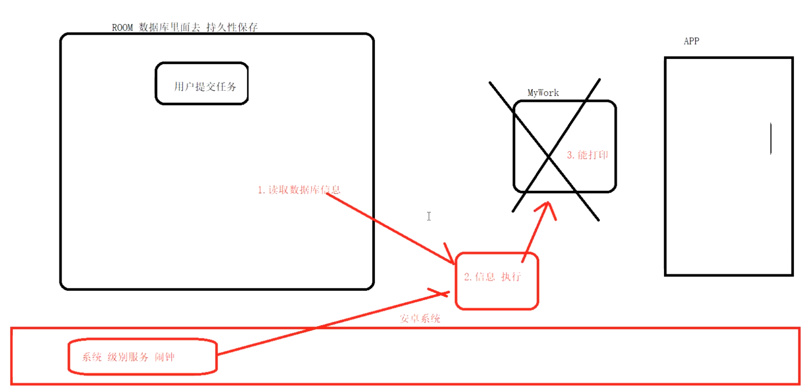

# 大致图解
collapsed:: true
	- 
- # 代码
  collapsed:: true
	- ```java
	      /**
	       * TODO 分析源码
	       * 测试后台任务 6
	       * @param view
	       */
	      @RequiresApi(api = Build.VERSION_CODES.M)
	      public void codeStudy(View view) {
	  
	          // 请求对象
	          OneTimeWorkRequest request = new OneTimeWorkRequest.Builder(MainWorker3.class)
	                  .build();
	  
	          // TODO 1 初始化环境  初始化工作源码
	          /**
	           * 这是第二次执行getInstance  ---  最终返回：WorkManagerImpl
	           *
	           * APK清单文件里面（第一次）执行  面试官
	           * 1.初始化 数据库 ROOM 来保存你的任务 （持久性保存的） 手机重新，APP被杀掉 没关系 一定执行
	           * 2.初始化 埋下伏笔  new GreedyScheduler
	           * 3.初始化 配置信息 configuration  （执行的信息，线程池任务，...）
	           */
	          WorkManager.getInstance(this) // 这是第二次执行，        APK清单文件里面（第一次）执行  面试官
	  
	  
	  
	                  // TODO 2 加入队列执行 执行流程
	                  .enqueue(request);
	  
	      }
	  ```
- # 初始化
	- ## 第一次初始化：ContentProvide：[[WorkManager-初始化]]
	- ## 使用 WorkManager.getInstance(this),返回WorkManagerImpl
		- 这是第二次调用，不是第一次初始化,
- # [[WorkManager-enqueue执行流程]]