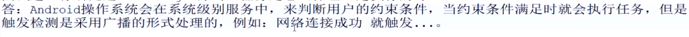

## 1、workManager是什么，干嘛用的？
	- 处理非及时任务用的，比如，每天同步一次数据到服务器，这种类似的需求，不是及时执行，但是又保证会执行的非及时任务
- > 没有约束会直接执行doWork.有约束是不及时的
- ## 2、WorkManager怎么保证，app杀死后，还能执行任务的？
	- 记录用户的所有信息并[[#red]]==**全部保存到数据库中**==。而非保存到内存中，这样做的好处就是持久性保存记录，所有APP被杀掉后。依然可以获取所有任务信息
- ## 简历：研究过jetPack的workManager源码
- ## 3、任务怎么保证一定会执行的？
	- 
- ## 2、[[WorkManager-使用场景]]
- ## 3、[[WorkManager-特点]]
- ## 4、[[WorkManager的初始化 总结]]
- ## 5、 [[WorkManager的 无约束的任务的执行源码 总结]]：
- ## 6、[[有约束条件思路图-总结]]