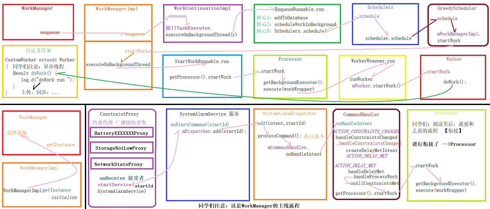

#
- ## 1、workManager是什么？
- ## 2、[[WorkManager-使用场景]]
- ## 3、[[WorkManager-特点]]
- # [[WorkManager-使用]]
- # [[WorkManager-原理]]
- # 脑图
  collapsed:: true
	- [workmanager.xmind](../assets/workmanager_1691823197293_0.xmind)
- # 流程
  collapsed:: true
	- 
- # 参考
	- ## [[剖析WorkManager]]
- # 面试
	- ## [[WorkManager-面试]]