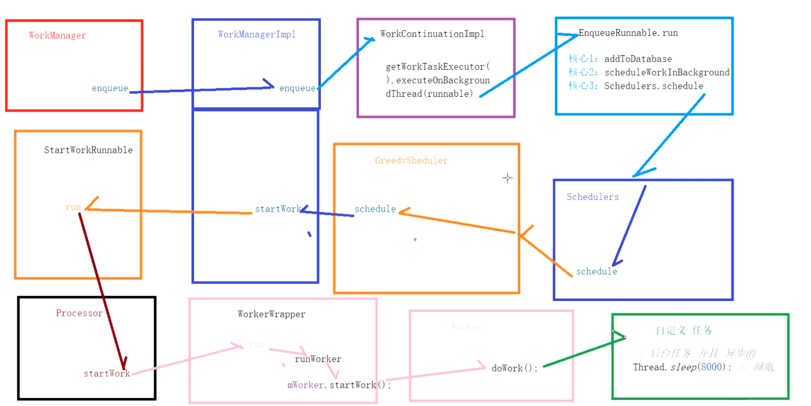

- 1、WorkManager执行了enqueue()后，创建[[#red]]==**WorkContinuationImpl**==对象执行[[#red]]==**enqueue**==()方法。
- 2、WorkContinuationImpl持有的EnqueueRunnable对象[[#red]]==**将任务信息添加到db，并交给Schedulers去调度**==。
- 3、Schedulers将任务交给每一个Scheduler去处理，GreedyScheduler会先处理这个任务。
- 4、GreedyScheduler经过一系列判断后，调用WorkManager的startWork()方法执行这种一次性，非延迟，无约束的任务。
- 5、WorkManager持有的StartWorkRunnable对象会将任务交给Processor去处理，执行startWork()方法。
- 6、Processor创建一个WorkerWrapper对象，由它去调用Worker的startWork()方法。
- ## 总结图
	- 