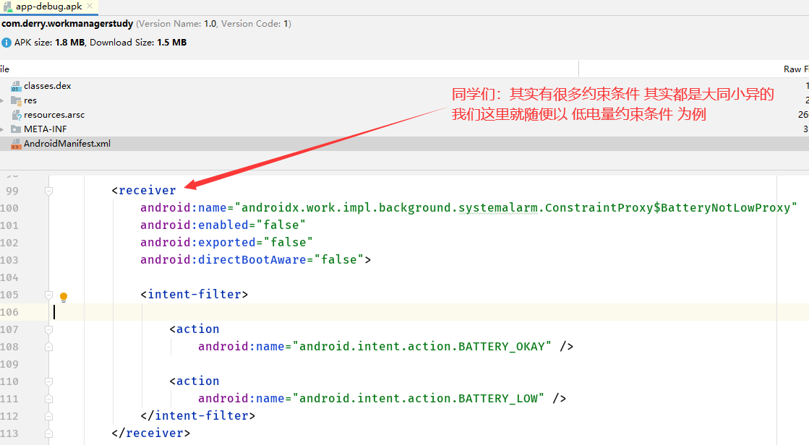
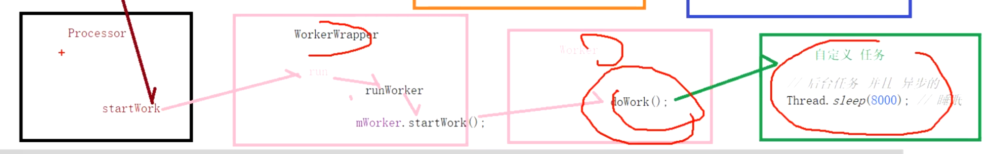
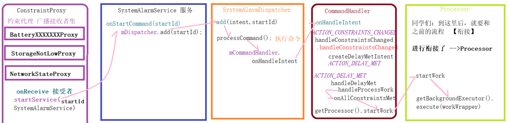

# [[有约束条件思路图-总结]]
- ## apk清单文件注册了很多广播接受者，电量，联网等
  collapsed:: true
	- 
- ## 当在电量变化时，收到BATTERY_LOW的广播，在ConstraintProxy的onReceive()进行处理：
  collapsed:: true
	- ```JAVA
	  abstract class ConstraintProxy extends BroadcastReceiver {
	      private static final String TAG = Logger.tagWithPrefix("ConstraintProxy");
	  
	      @Override
	      public void onReceive(Context context, Intent intent) {
	          Logger.get().debug(TAG, String.format("onReceive : %s", intent));
	          Intent constraintChangedIntent = CommandHandler.createConstraintsChangedIntent(context);
	          context.startService(constraintChangedIntent);
	      }
	  
	      /**
	       * Proxy for Battery Not Low constraint
	       */
	      public static class BatteryNotLowProxy extends ConstraintProxy {
	      }
	  ```
	- createConstraintsChangedIntent,启动闹钟服务。系统级别。和应用无关
		- ```java
		      static Intent createConstraintsChangedIntent(@NonNull Context context) {
		          Intent intent = new Intent(context, SystemAlarmService.class);
		          intent.setAction(ACTION_CONSTRAINTS_CHANGED);
		          return intent;
		      }
		  ```
- ## SystemAlarmService，的onStartCommand()处理如下:
  collapsed:: true
	- ```java
	    @Override
	      public int onStartCommand(Intent intent, int flags, int startId) {
	          super.onStartCommand(intent, flags, startId);
	          if (mIsShutdown) {
	              Logger.get().info(TAG,
	                      "Re-initializing SystemAlarmDispatcher after a request to shut-down.");
	  
	              // Destroy the old dispatcher to complete it's lifecycle.
	              mDispatcher.onDestroy();
	              // Create a new dispatcher to setup a new lifecycle.
	              initializeDispatcher();
	              // Set mIsShutdown to false, to correctly accept new commands.
	              mIsShutdown = false;
	          }
	  
	          if (intent != null) {
	            调用了SystemAlarmDispatcher.add()方法
	              mDispatcher.add(intent, startId);
	          }
	  
	          // If the service were to crash, we want all unacknowledged Intents to get redelivered.
	          return Service.START_REDELIVER_INTENT;
	      }
	  ```
- ## 调用了SystemAlarmDispatcher add  闹钟分发器
  collapsed:: true
	- ```java
	    @MainThread
	      public boolean add(@NonNull final Intent intent, final int startId) {
	          Logger.get().debug(TAG, String.format("Adding command %s (%s)", intent, startId));
	          assertMainThread();
	          String action = intent.getAction();
	          if (TextUtils.isEmpty(action)) {
	              Logger.get().warning(TAG, "Unknown command. Ignoring");
	              return false;
	          }
	  
	          // If we have a constraints changed intent in the queue don't add a second one. We are
	          // treating this intent as special because every time a worker with constraints is complete
	          // it kicks off an update for constraint proxies.
	          if (CommandHandler.ACTION_CONSTRAINTS_CHANGED.equals(action)
	                  && hasIntentWithAction(CommandHandler.ACTION_CONSTRAINTS_CHANGED)) {
	              return false;
	          }
	  
	          intent.putExtra(KEY_START_ID, startId);
	          synchronized (mIntents) {
	              boolean hasCommands = !mIntents.isEmpty();
	              mIntents.add(intent);
	              if (!hasCommands) {
	                  // Only call processCommand if this is the first command.
	                  // The call to dequeueAndCheckForCompletion will process the remaining commands
	                  // in the order that they were added.
	                  processCommand();
	              }
	          }
	          return true;
	      }
	  ```
	- ## processCommand
	  collapsed:: true
		- ```java
		   private void processCommand() {
		          assertMainThread();
		          PowerManager.WakeLock processCommandLock =
		                  WakeLocks.newWakeLock(mContext, PROCESS_COMMAND_TAG);
		          try {
		              processCommandLock.acquire();
		              // Process commands on the background thread.
		              mWorkManager.getWorkTaskExecutor().executeOnBackgroundThread(new Runnable() {
		                  @Override
		                  public void run() {
		                      synchronized (mIntents) {
		                          mCurrentIntent = mIntents.get(0);
		                      }
		  
		                      if (mCurrentIntent != null) {
		                          final String action = mCurrentIntent.getAction();
		                          final int startId = mCurrentIntent.getIntExtra(KEY_START_ID,
		                                  DEFAULT_START_ID);
		                          Logger.get().debug(TAG,
		                                  String.format("Processing command %s, %s", mCurrentIntent,
		                                          startId));
		                          final PowerManager.WakeLock wakeLock = WakeLocks.newWakeLock(
		                                  mContext,
		                                  String.format("%s (%s)", action, startId));
		                          try {
		                              Logger.get().debug(TAG, String.format(
		                                      "Acquiring operation wake lock (%s) %s",
		                                      action,
		                                      wakeLock));
		  
		                              wakeLock.acquire();
		                     这个代码就是核心，等下下面我们就要分析
		                              mCommandHandler.onHandleIntent(mCurrentIntent, startId,
		                                      SystemAlarmDispatcher.this);
		                          } catch (Throwable throwable) {
		                              Logger.get().error(
		                                      TAG,
		                                      "Unexpected error in onHandleIntent",
		                                      throwable);
		                          }  finally {
		                              Logger.get().debug(
		                                      TAG,
		                                      String.format(
		                                              "Releasing operation wake lock (%s) %s",
		                                              action,
		                                              wakeLock));
		                              wakeLock.release();
		                              // Check if we have processed all commands
		                              postOnMainThread(
		                                      new DequeueAndCheckForCompletion(SystemAlarmDispatcher.this));
		                          }
		                      }
		                  }
		              });
		          } finally {
		              processCommandLock.release();
		          }
		      }
		  
		  ```
- ## mCommandHandler    onHandleIntent,就是广播启动服务时intent的传入的ACTION_CONSTRAINTS_CHANGED、
	- 代码
		- ```java
		    @WorkerThread
		      void onHandleIntent(
		              @NonNull Intent intent,
		              int startId,
		              @NonNull SystemAlarmDispatcher dispatcher) {
		  
		          String action = intent.getAction();
		  
		          if (ACTION_CONSTRAINTS_CHANGED.equals(action)) {
		              handleConstraintsChanged(intent, startId, dispatcher);
		          } else if (ACTION_RESCHEDULE.equals(action)) {
		              handleReschedule(intent, startId, dispatcher);
		          } else {
		              Bundle extras = intent.getExtras();
		              if (!hasKeys(extras, KEY_WORKSPEC_ID)) {
		                  Logger.get().error(TAG,
		                          String.format("Invalid request for %s, requires %s.",
		                                  action,
		                                  KEY_WORKSPEC_ID));
		              } else {
		                  if (ACTION_SCHEDULE_WORK.equals(action)) {
		                      handleScheduleWorkIntent(intent, startId, dispatcher);
		                  } else if (ACTION_DELAY_MET.equals(action)) {
		                      handleDelayMet(intent, startId, dispatcher);
		                  } else if (ACTION_STOP_WORK.equals(action)) {
		                      handleStopWork(intent, dispatcher);
		                  } else if (ACTION_EXECUTION_COMPLETED.equals(action)) {
		                      handleExecutionCompleted(intent, startId);
		                  } else {
		                      Logger.get().warning(TAG, String.format("Ignoring intent %s", intent));
		                  }
		              }
		          }
		      }
		  ```
	- ## handleConstraintsChanged
		- ```java
		      //CommandHandler.java 类
		      private void handleConstraintsChanged(
		              @NonNull Intent intent, int startId,
		              @NonNull SystemAlarmDispatcher dispatcher) {
		          Logger.get().debug(TAG, String.format("Handling
		                  constraints changed %s", intent));
		  // Constraints changed command handler is synchronous. No  cleanup
		  // is necessary.
		                  ConstraintsCommandHandler changedCommandHandler =
		                          new ConstraintsCommandHandler(mContext, startId,
		                                  dispatcher);
		          changedCommandHandler.handleConstraintsChanged();
		      }
		  ```
		-
	- ## ConstraintsCommandHandler 改变标记
		- 代码
			- ```java
			   for (WorkSpec workSpec : eligibleWorkSpecs) {
			              String workSpecId = workSpec.id;
			              Intent intent = CommandHandler.createDelayMetIntent(mContext, workSpecId);
			              Logger.get().debug(TAG, String.format(
			                      "Creating a delay_met command for workSpec with id (%s)", workSpecId));
			              mDispatcher.postOnMainThread(
			                      new SystemAlarmDispatcher.AddRunnable(mDispatcher, intent, mStartId));
			          }
			  
			          mWorkConstraintsTracker.reset();
			  ```
		- ## createDelayMetIntent
			- ```java
			      static Intent createDelayMetIntent(@NonNull Context context, @NonNull String workSpecId) {
			          Intent intent = new Intent(context, SystemAlarmService.class);
			          intent.setAction(ACTION_DELAY_MET);
			          intent.putExtra(KEY_WORKSPEC_ID, workSpecId);
			          return intent;
			      }
			  ```
		- > 更改Intent Action 标记ACTION_CONSTRAINTS_CHANGED-》ACTION_DELAY_MET
		- 当再次回到onHandleIntent()方法，在CommandHandler的onHandleIntent()方法
		  中，action为ACTION_DELAY_MET的执行是：
	-
- ## 更换标记后，再次执行CommandHandler    onHandleIntent，这次ACTION_DELAY_MET
	- 代码
		- ```java
		    @WorkerThread
		      void onHandleIntent(
		              @NonNull Intent intent,
		              int startId,
		              @NonNull SystemAlarmDispatcher dispatcher) {
		  
		          String action = intent.getAction();
		  
		          if (ACTION_CONSTRAINTS_CHANGED.equals(action)) {
		              handleConstraintsChanged(intent, startId, dispatcher);
		          } else if (ACTION_RESCHEDULE.equals(action)) {
		              handleReschedule(intent, startId, dispatcher);
		          } else {
		              Bundle extras = intent.getExtras();
		              if (!hasKeys(extras, KEY_WORKSPEC_ID)) {
		                  Logger.get().error(TAG,
		                          String.format("Invalid request for %s, requires %s.",
		                                  action,
		                                  KEY_WORKSPEC_ID));
		              } else {
		                  if (ACTION_SCHEDULE_WORK.equals(action)) {
		                      handleScheduleWorkIntent(intent, startId, dispatcher);
		                  } else if (ACTION_DELAY_MET.equals(action)) {
		                      handleDelayMet(intent, startId, dispatcher);
		                  } else if (ACTION_STOP_WORK.equals(action)) {
		                      handleStopWork(intent, dispatcher);
		                  } else if (ACTION_EXECUTION_COMPLETED.equals(action)) {
		                      handleExecutionCompleted(intent, startId);
		                  } else {
		                      Logger.get().warning(TAG, String.format("Ignoring intent %s", intent));
		                  }
		              }
		          }
		      }
		  ```
	- ```java
	  // CommandHandler.java 类
	  else if (ACTION_DELAY_MET.equals(action)) {
	  handleDelayMet(intent, startId, dispatcher);
	  }
	  ```
	- ## handleDelayMet
		- ```java
		  private void handleDelayMet(
		              @NonNull Intent intent,
		              int startId,
		              @NonNull SystemAlarmDispatcher dispatcher) {
		  
		          Bundle extras = intent.getExtras();
		          synchronized (mLock) {
		              String workSpecId = extras.getString(KEY_WORKSPEC_ID);
		              Logger.get().debug(TAG, String.format("Handing delay met for %s", workSpecId));
		  
		              // Check to see if we are already handling an ACTION_DELAY_MET for the WorkSpec.
		              // If we are, then there is nothing for us to do.
		              if (!mPendingDelayMet.containsKey(workSpecId)) {
		                  DelayMetCommandHandler delayMetCommandHandler =
		                          new DelayMetCommandHandler(mContext, startId, workSpecId, dispatcher);
		                  mPendingDelayMet.put(workSpecId, delayMetCommandHandler);
		                  delayMetCommandHandler.handleProcessWork();
		              } else {
		                  Logger.get().debug(TAG,
		                          String.format("WorkSpec %s is already being handled for ACTION_DELAY_MET",
		                                  workSpecId));
		              }
		          }
		      }
		  ```
- ## DelayMetCommandHandler handleProcessWork(
	- ```java
	      @WorkerThread
	      void handleProcessWork() {
	          mWakeLock = WakeLocks.newWakeLock(
	                  mContext,
	                  String.format("%s (%s)", mWorkSpecId, mStartId));
	          Logger.get().debug(TAG,
	                  String.format("Acquiring wakelock %s for WorkSpec %s", mWakeLock, mWorkSpecId));
	          mWakeLock.acquire();
	  
	          WorkSpec workSpec = mDispatcher.getWorkManager()
	                  .getWorkDatabase()
	                  .workSpecDao()
	                  .getWorkSpec(mWorkSpecId);
	  
	          // This should typically never happen. Cancelling work should remove alarms, but if an
	          // alarm has already fired, then fire a stop work request to remove the pending delay met
	          // command handler.
	          if (workSpec == null) {
	              stopWork();
	              return;
	          }
	  
	          // Keep track of whether the WorkSpec had constraints. This is useful for updating the
	          // state of constraint proxies when onExecuted().
	          mHasConstraints = workSpec.hasConstraints();
	  
	          if (!mHasConstraints) {
	              Logger.get().debug(TAG, String.format("No constraints for %s", mWorkSpecId));
	              onAllConstraintsMet(Collections.singletonList(mWorkSpecId));
	          } else {
	              // Allow tracker to report constraint changes
	              mWorkConstraintsTracker.replace(Collections.singletonList(workSpec));
	          }
	      }
	  ```
	- ## onAllConstraintsMet
		- ```java
		   @Override
		      public void onAllConstraintsMet(@NonNull List<String>
		                                              workSpecIds) {
		  ... ...
		          synchronized (mLock) {
		              if (mCurrentState == STATE_INITIAL) {
		  // 同学们：是不是可以香花刷起来了，这里就是我们前面分析的流
		                  程，进行详解了
		  ... ...
		                  boolean isEnqueued =
		                          mDispatcher.getProcessor().startWork(mWorkSpecId);
		  ... ...
		              } else {
		                  Logger.get().debug(TAG, String.format("Already
		                          started work for %s", mWorkSpecId));
		              }
		          }
		      }
		  ```
	- 后边就和无条件任务一样了
		- 
- # 总结
	- 