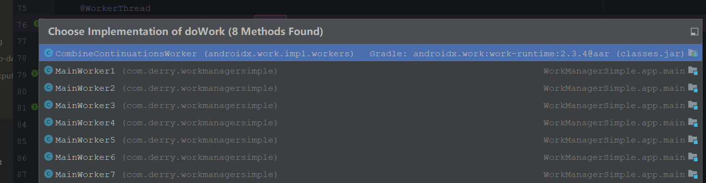

# 代码
	- ```java
	  WorkManager.getInstance(this).enqueue(request)
	  ```
- ## WorkManager.enqueue
	- ```java
	      @NonNull
	      public final Operation enqueue(@NonNull WorkRequest workRequest) {
	          return enqueue(Collections.singletonList(workRequest));
	      }
	  	    public abstract Operation enqueue(@NonNull List<? extends WorkRequest> requests);
	  ```
- ## 看子类实现WorkManagerImpl
	- ```java
	  @Override
	  @NonNull
	  public Operation enqueue(
	    @NonNull List<? extends WorkRequest> workRequests) {
	  
	    // This error is not being propagated as part of the Operation, as we want the
	    // app to crash during development. Having no workRequests is always a developer error.
	    if (workRequests.isEmpty()) {
	      throw new IllegalArgumentException(
	        "enqueue needs at least one WorkRequest.");
	    }
	    return new WorkContinuationImpl(this, workRequests).enqueue();
	  }
	  ```
- ## WorkContinuationImpl（WorkContinuation的子类）的enqueue
  collapsed:: true
	- ```java
	      @Override
	      public @NonNull Operation enqueue() {
	          // Only enqueue if not already enqueued.
	          if (!mEnqueued) {
	              // The runnable walks the hierarchy of the continuations
	              // and marks them enqueued using the markEnqueued() method, parent first.
	              EnqueueRunnable runnable = new EnqueueRunnable(this);
	              mWorkManagerImpl.getWorkTaskExecutor().executeOnBackgroundThread(runnable);
	              mOperation = runnable.getOperation();
	          } else {
	              Logger.get().warning(TAG,
	                      String.format("Already enqueued work ids (%s)", TextUtils.join(", ", mIds)));
	          }
	          return mOperation;
	      }
	  ```
	- 创建EnqueueRunnable任务
	- mWorkManagerImpl的TaskExecutor执行了EnqueueRunnable
- ## 看EnqueueRunnable任务的run
  collapsed:: true
	- ```java
	      // EnqueueRunnable.java 类
	      @Override
	      public void run() {
	          try {
	              if (mWorkContinuation.hasCycles()) {
	                  throw new IllegalStateException(
	                          String.format("WorkContinuation has
	                                  cycles (%s)", mWorkContinuation));
	              }
	  // 同学们注意：addToDatabase()的作用是把WorkSpec存入到数据 库,并对任务的状态进行校验
	              boolean needsScheduling = addToDatabase();
	              if (needsScheduling) { // 建立好数据库的话
	  // Enable RescheduleReceiver, only when there are Worker's that need scheduling.
	                  final Context context =
	                          mWorkContinuation.getWorkManagerImpl().getApplicationContext();
	                  PackageManagerHelper.setComponentEnabled(context,
	                          RescheduleReceiver.class, true);
	  // 同学们，下面重点就是看着这个函数了
	                  scheduleWorkInBackground();
	              }
	              mOperation.setState(Operation.SUCCESS);
	          } catch (Throwable exception) {
	              mOperation.setState(new
	                      Operation.State.FAILURE(exception));
	          }
	      }
	  ```
	- 1、addToDatabase：[[#red]]==**建立数据库的链接**==
	- 2、scheduleWorkInBackground();[[#red]]==**Schedulers.schedule**==,执行调度
		- ```java
		      @VisibleForTesting
		      public void scheduleWorkInBackground() {
		          WorkManagerImpl workManager = mWorkContinuation.getWorkManagerImpl();
		          Schedulers.schedule(
		                  workManager.getConfiguration(),
		                  workManager.getWorkDatabase(),
		                  workManager.getSchedulers());
		      }
		  ```
- ## Schedulers.schedule：执行调度
  collapsed:: true
	- 传入了Configuration,WorkDatabase, Scheduler这三个对象。执行schedule()函数
		- ```java
		   public static void schedule(
		              @NonNull Configuration configuration,
		              @NonNull WorkDatabase workDatabase,
		              List<Scheduler> schedulers) {
		          if (schedulers == null || schedulers.size() == 0) {
		              return;
		          }
		  
		          WorkSpecDao workSpecDao = workDatabase.workSpecDao();
		          List<WorkSpec> eligibleWorkSpecs;
		  
		          workDatabase.beginTransaction();
		          try {
		              eligibleWorkSpecs = workSpecDao.getEligibleWorkForScheduling(
		                      configuration.getMaxSchedulerLimit());
		              if (eligibleWorkSpecs != null && eligibleWorkSpecs.size() > 0) {
		                  long now = System.currentTimeMillis();
		  
		                  // Mark all the WorkSpecs as scheduled.
		                  // Calls to Scheduler#schedule() could potentially result in more schedules
		                  // on a separate thread. Therefore, this needs to be done first.
		                  for (WorkSpec workSpec : eligibleWorkSpecs) {
		   // 先进行了一系列的数据库操作，然后开始根据条件每个任务进行调度，更新保存数据库等操作
		                      workSpecDao.markWorkSpecScheduled(workSpec.id, now);
		                  }
		              }
		              workDatabase.setTransactionSuccessful();
		          } finally {
		              workDatabase.endTransaction();
		          }
		  
		          if (eligibleWorkSpecs != null && eligibleWorkSpecs.size() > 0) {
		              WorkSpec[] eligibleWorkSpecsArray = eligibleWorkSpecs.toArray(new WorkSpec[0]);
		              // Delegate to the underlying scheduler.
		              for (Scheduler scheduler : schedulers) {
		    同学们注意：scheduler.schedule()对每个任务进行调度处
		  理，我们是没有约束的一次性任务，所以看一下GreedyScheduler对于schedule()方法
		  的实现
		                  scheduler.schedule(eligibleWorkSpecsArray);
		              }
		          }
		      }
		  ```
	- 1、[[#red]]==**将所有提交任务信息，同步到数据库**==
	- 2、GreedyScheduler每个任务进行调度处理
		- scheduler.schedule()对每个任务进行调度处
		  理，我们是没有约束的一次性任务，所以看一下GreedyScheduler对于schedule()方法
		  的实现
- ## GreedyScheduler.schedule贪婪调度程序执行
  collapsed:: true
	- 代码
	  collapsed:: true
		- ```java
		   @Override
		      public void schedule(@NonNull WorkSpec... workSpecs) {
		          if (mIsMainProcess == null) {
		              // The default process name is the package name.
		              mIsMainProcess = TextUtils.equals(mContext.getPackageName(), getProcessName());
		          }
		  
		          if (!mIsMainProcess) {
		              Logger.get().info(TAG, "Ignoring schedule request in non-main process");
		              return;
		          }
		  
		          registerExecutionListenerIfNeeded();
		  
		          // Keep track of the list of new WorkSpecs whose constraints need to be tracked.
		          // Add them to the known list of constrained WorkSpecs and call replace() on
		          // WorkConstraintsTracker. That way we only need to synchronize on the part where we
		          // are updating mConstrainedWorkSpecs.
		          List<WorkSpec> constrainedWorkSpecs = new ArrayList<>();
		          List<String> constrainedWorkSpecIds = new ArrayList<>();
		          for (WorkSpec workSpec : workSpecs) {
		              if (workSpec.state == WorkInfo.State.ENQUEUED
		                      && !workSpec.isPeriodic()
		                      && workSpec.initialDelay == 0L
		                      && !workSpec.isBackedOff()) {
		                  if (workSpec.hasConstraints()) {
		                      if (SDK_INT >= 23 && workSpec.constraints.requiresDeviceIdle()) {
		                          // Ignore requests that have an idle mode constraint.
		                          Logger.get().debug(TAG,
		                                  String.format("Ignoring WorkSpec %s, Requires device idle.",
		                                          workSpec));
		                      } else if (SDK_INT >= 24 && workSpec.constraints.hasContentUriTriggers()) {
		                          // Ignore requests that have content uri triggers.
		                          Logger.get().debug(TAG,
		                                  String.format("Ignoring WorkSpec %s, Requires ContentUri triggers.",
		                                          workSpec));
		                      } else {
		                          constrainedWorkSpecs.add(workSpec);
		                          constrainedWorkSpecIds.add(workSpec.id);
		                      }
		                  } else {
		                      Logger.get().debug(TAG, String.format("Starting work for %s", workSpec.id));
		     // 同学们注意：由于无约束条件，所以进入此else阶段 的 startWork这个函数
		                      mWorkManagerImpl.startWork(workSpec.id);
		                  }
		              }
		          }
		  
		          // onExecuted() which is called on the main thread also modifies the list of mConstrained
		          // WorkSpecs. Therefore we need to lock here.
		          synchronized (mLock) {
		              if (!constrainedWorkSpecs.isEmpty()) {
		                  Logger.get().debug(TAG, String.format("Starting tracking for [%s]",
		                          TextUtils.join(",", constrainedWorkSpecIds)));
		                  mConstrainedWorkSpecs.addAll(constrainedWorkSpecs);
		                  mWorkConstraintsTracker.replace(mConstrainedWorkSpecs);
		              }
		          }
		      }
		  
		  ```
	- [[#red]]==**无约束条件进入**== mWorkManagerImpl.startWork(workSpec.id);
- ## WorkManagerImpl.startWork
  collapsed:: true
	- 代码
		- ```java
		      @RestrictTo(RestrictTo.Scope.LIBRARY_GROUP)
		      public void startWork(@NonNull String workSpecId) {
		          startWork(workSpecId, null);
		      }
		      @RestrictTo(RestrictTo.Scope.LIBRARY_GROUP)
		      public void startWork(
		              @NonNull String workSpecId,
		              @Nullable WorkerParameters.RuntimeExtras runtimeExtras) {
		          mWorkTaskExecutor
		                  .executeOnBackgroundThread(
		                          new StartWorkRunnable(this, workSpecId, runtimeExtras));
		      }
		  
		  ```
	- 线程池执行 Runnable
- ## StartWorkRunnable的run
  collapsed:: true
	- ```java
	  @RestrictTo(RestrictTo.Scope.LIBRARY_GROUP)
	  public class StartWorkRunnable implements Runnable {
	  
	      private WorkManagerImpl mWorkManagerImpl;
	      private String mWorkSpecId;
	      private WorkerParameters.RuntimeExtras mRuntimeExtras;
	  
	      public StartWorkRunnable(
	              WorkManagerImpl workManagerImpl,
	              String workSpecId,
	              WorkerParameters.RuntimeExtras runtimeExtras) {
	          mWorkManagerImpl = workManagerImpl;
	          mWorkSpecId = workSpecId;
	          mRuntimeExtras = runtimeExtras;
	      }
	  
	      @Override
	      public void run() {
	          mWorkManagerImpl.getProcessor().startWork(mWorkSpecId, mRuntimeExtras);
	      }
	  }
	  ```
- ## Processor.startWork
  collapsed:: true
	- 代码
	  collapsed:: true
		- ```java
		  public boolean startWork(
		              @NonNull String id,
		              @Nullable WorkerParameters.RuntimeExtras runtimeExtras) {
		  
		          WorkerWrapper workWrapper;
		          synchronized (mLock) {
		              // Work may get triggered multiple times if they have passing constraints
		              // and new work with those constraints are added.
		              if (mEnqueuedWorkMap.containsKey(id)) {
		                  Logger.get().debug(
		                          TAG,
		                          String.format("Work %s is already enqueued for processing", id));
		                  return false;
		              }
		  
		              workWrapper =
		                      new WorkerWrapper.Builder(
		                              mAppContext,
		                              mConfiguration,
		                              mWorkTaskExecutor,
		                              this,
		                              mWorkDatabase,
		                              id)
		                              .withSchedulers(mSchedulers)
		                              .withRuntimeExtras(runtimeExtras)
		                              .build();
		              ListenableFuture<Boolean> future = workWrapper.getFuture();
		              future.addListener(
		                      new FutureListener(this, id, future),
		                      mWorkTaskExecutor.getMainThreadExecutor());
		              mEnqueuedWorkMap.put(id, workWrapper);
		          }
		          mWorkTaskExecutor.getBackgroundExecutor().execute(workWrapper);
		          Logger.get().debug(TAG, String.format("%s: processing %s", getClass().getSimpleName(), id));
		          return true;
		      }
		  
		  ```
	- 创建了一个WorkerWrapper的Runnable对象，交由WorkTaskExecutor调度处理。WorkerWrapper的run()方法的实现，下面就要进入WorkerWrapper类了
- ## WorkerWrapper的run
  collapsed:: true
	- 代码
		- ```java
		      @WorkerThread
		      @Override
		      public void run() {
		          mTags = mWorkTagDao.getTagsForWorkSpecId(mWorkSpecId);
		          mWorkDescription = createWorkDescription(mTags);
		          runWorker();
		      }
		  
		  ```
		- runWork
			- ```java
			      //WorkerWrapper.java类
			      private void runWorker() {
			          if (tryCheckForInterruptionAndResolve()) {
			              return;
			          }
			          mWorkDatabase.beginTransaction();
			          try {
			              mWorkSpec = mWorkSpecDao.getWorkSpec(mWorkSpecId);
			  ...
			              mWorkDatabase.setTransactionSuccessful();
			          } finally {
			              mWorkDatabase.endTransaction();
			          }
			  // Merge inputs. This can be potentially expensive code,
			          so this should not be done inside
			  // a database transaction.
			  ...
			          WorkerParameters params = new WorkerParameters(
			                  UUID.fromString(mWorkSpecId),
			                  input,
			                  mTags,
			                  mRuntimeExtras,
			                  mWorkSpec.runAttemptCount,
			                  mConfiguration.getExecutor(),
			                  mWorkTaskExecutor,
			                  mConfiguration.getWorkerFactory(),
			                  new WorkProgressUpdater(mWorkDatabase,
			                          mWorkTaskExecutor),
			                  new WorkForegroundUpdater(mForegroundProcessor,
			                          mWorkTaskExecutor));
			  // Not always creating a worker here, as the
			          WorkerWrapper.Builder can set a worker override
			  // in test mode.
			          if (mWorker == null) {
			              mWorker =
			                      mConfiguration.getWorkerFactory().createWorkerWithDefaultFallback
			                              (
			                                      mAppContext,
			                                      mWorkSpec.workerClassName,
			                                      params);
			          }
			  ...
			  // Try to set the work to the running state. Note that
			          this may fail because another thread
			  // may have modified the DB since we checked last at the
			          top of this function.
			          if (trySetRunning()) {
			              if (tryCheckForInterruptionAndResolve()) {
			                  return;
			              }
			              final SettableFuture<ListenableWorker.Result> future
			                      = SettableFuture.create();
			  // Call mWorker.startWork() on the main thread.
			              mWorkTaskExecutor.getMainThreadExecutor()
			                      .execute(new Runnable() {
			                          @Override
			                          public void run() {
			                              try {
			                                  Logger.get().debug(TAG,
			                                          String.format("Starting work for %s",
			                                                  mWorkSpec.workerClassName));
			  // 同学们注意：我们看到调用了 mWorker.startWork()方法
			                                          mInnerFuture =
			                                          mWorker.startWork();
			                                  future.setFuture(mInnerFuture);
			                              } catch (Throwable e) {
			                                  future.setException(e);
			                              }
			                          }
			                          同学们，这就是我们自己写的，自定义任务：
			                      });
			  // Avoid synthetic accessors.
			  ...
			          }
			  ```
	- 看线程池执行StartWork
- ## Worker.StartWork
  collapsed:: true
	- 代码
		- ```java
		      @Override
		      public final @NonNull ListenableFuture<Result> startWork() {
		          mFuture = SettableFuture.create();
		          getBackgroundExecutor().execute(new Runnable() {
		              @Override
		              public void run() {
		                  try {
		                      Result result = doWork();
		                      mFuture.set(result);
		                  } catch (Throwable throwable) {
		                      mFuture.setException(throwable);
		                  }
		  
		              }
		          });
		          return mFuture;
		      }
		  ```
	- doWork是抽象的，会执行到自定义的doWork
		- 
-
- # [[#red]]==**[[WorkManager的 无约束的任务的执行源码 总结]]**==：