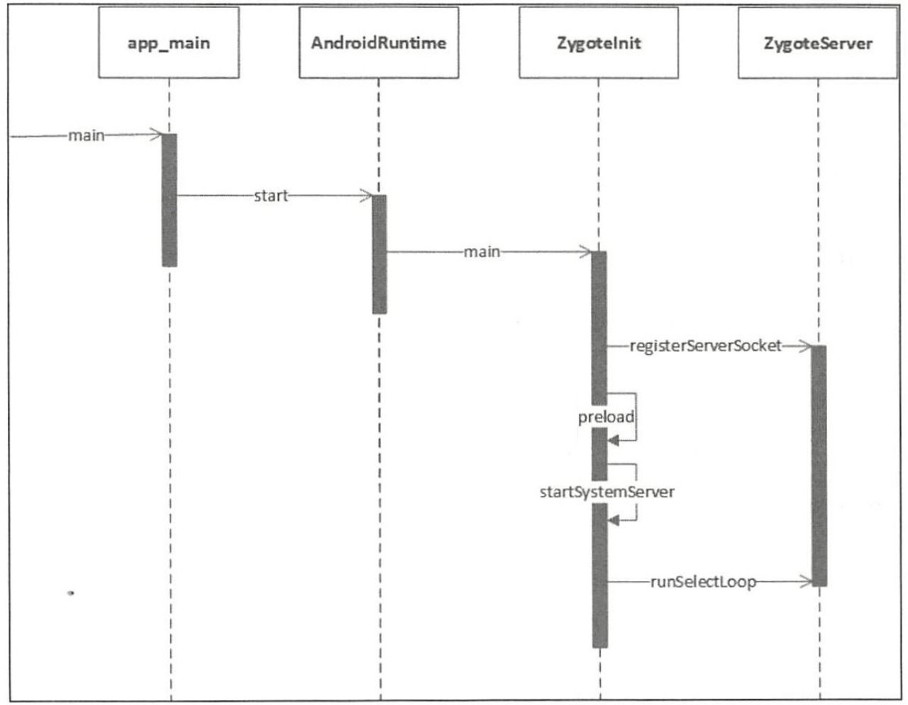

- # 一、概述
	- 在Android 系统中， DVM (Dalvik 虚拟机）和 ART、应用程序进程、运行系统的关键服务的SystemServer 进程都是由 Zygote 进程来创建的，我们也将它称为孵化器。它通过fock 自身(复制进程）的形式来创建应用程序进程和 SystemServer 进程，由于 `Zygote 进程在启动时会创建 DVM 或者 ART` ，因此通过 fock 而创建的应用程序进程和 System Server 进程可内部获取 DVM 或者 ART 例副本
- # 二、Zygote启动脚本
	- 从Android 5.0 开始， Android 开始支持64 位程序， Zygote 也就有了 32 位和 64 位的区别，所以在这里用 ro.zygote 属性来控制使用不同的 Zygote 启动脚本，从而也就启动了不同版本的 Zygote 进程， ro zygote 属性的取值有以下 种：
		- init.zygote32.rc：支持纯 32 位程序，
		- init.zygote32_64.rc：表示既支持 32 位程序也支持 64 位程序，
		- init.zygote64.rc
		- init.zygote64_32.rc
- # 三、启动过程时序图
	- init 启动 Zygote 时主要是调用叩 main.cpp main 的函数中的AppRuntime start 方陆来启动 Zygote 进程的，我们就先从 app_ main .cpp main 数开始分析，Zygote 程启动过程的时序图
	- {:height 587, :width 746}
- # 四、职责
	- 创建 AppRuntime 并调用其 start 方挂，启动 Zygote 进程。
	- 创建 Java 虚拟机并为 Java 虚拟机注册 JNI 方法
	- 通过JNI调用 Zygotelnit的main 函数进入 Zygote的Java 框架层。
	- 通过 registerZygoteSocket 方怯创建服务器端 Socket ，并通过 runSelectLoop 方怯等待AMS 的请求来创建新的应用程序进程。
	- 启动 SystemServer 进程。