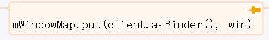

- ## 入口函数ActivityThread.handleResumeActivity
- # 一、activity.makeVisible
	- ## 1、activity.makeVisible
	  collapsed:: true
		- 会判断如果window还没添加，
		- 1、[[#red]]==**拿到windowManager（父类 viewManager）添加mDecor**==
			- 继承关系
				- 
			- ```java
			      void makeVisible() {
			          if (!mWindowAdded) {
			              ViewManager wm = getWindowManager();
			              wm.addView(mDecor, getWindow().getAttributes());
			              mWindowAdded = true;
			          }
			          mDecor.setVisibility(View.VISIBLE);
			      }
			  ```
		- > windowManager真正管理的是DecorView
	- ## 2、调用到WindowManagerImpl.addView
	- ## 3、WindowManagerGlobal.addView
		- 创建ViewRootImpl： root = new ViewRootImpl
			- > 一个窗口只对应一个ViewRootImpl
		- 列表管理view和参数
			- 
			- mViews.add(view)
			- mRoots.add(root)
			- mParams.add(wparams)
		- [[#red]]==**root.setView；真正添加view**==
	- ## 4、root.setView
		- mWindowSession.addToDisplay[[#red]]==**(和WMS沟通)**== Session在app的代理，实际上调用了Session的addToDisplay
		- Session.addToDisplay
		- WMS.addWindow
	- ## 5、WMS.addWindow
		- getDisplayContentOrCreate 获取Display 屏幕id
		- WindowState win = new WindowState 与要设置的window对应起来
		- win.attach
			- 
	- ## 6、win.attach
		- mSession.windowAddedLocked
		- new SurfaceSession
		- new SurfaceComposerClient
		- IGraphicBufferProducer
- # 二、WindowState implements WindowManagerPolicy.WindowState
  collapsed:: true
	- 
- # 三、Session extends IWindowSession.Stub
-
- [[addView到WMS流程-面试]]