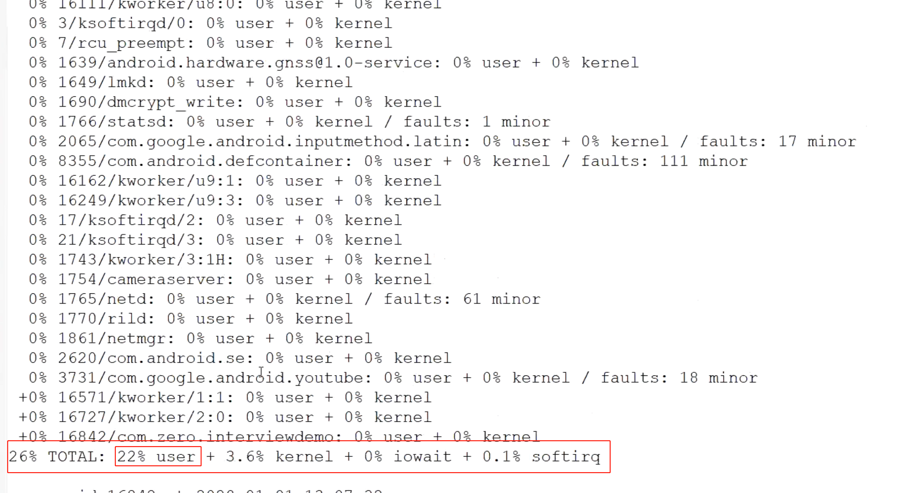

## 1、通过logcat日志或者traces文件确认anr发生时间点
	- ## 文件所在目录data/anr/traces.txt
- ## 2、通过traces文件判断CPU使用率，看是不是CPU忙不过来
	- 
	- 
- ## 3、可以继续向下看下内存使用情况
  collapsed:: true
	- //已分配堆内存大小40MB，其中29M已用，总分配207772个对象
	  Heap: 27% free, 29MB/40MB; 307772 objects
- >通过cpu使用和内存使用情况，排除文件阻塞和cpu资源耗尽
- ## 4、Traces文件可以搜索下关键字held by看是不是死锁导致的ANR
- > 查看是不是死锁问题
- ## 5、如果是开发阶段可以借助logcat搜索ANR对应类型的关键字
	- 
- ## 4、也可查看线程状态
	- 主线程状态
	- 其他线程状态
	- ```java
	     THREAD_UNDEFINED = -1   未定义的
	     THREAD_ZOMBIE = 0, /* TERMINATED */ 监视线程
	     THREAD_RUNNING = 1, /* RUNNABLE or running now */ 运行线程
	     THREAD_TIMED_WAIT = 2,/* TIMED_WAITING Object.wait()*/ 阻塞状态 
	     THREAD_MONITOR = 3, /* BLOCKED on a monitor */ 监视器 监视同步块
	     THREAD_WAIT = 4, /* WAITING in Object.wait() */ 调用wait的
	     THREAD_INITIALIZING= 5, /* allocated, not yet running */已经初始化了 但是还没运行
	     THREAD_STARTING = 6, /* started, not yet on thread list */已经start 但是没运行的
	     THREAD_NATIVE = 7, /* off in a JNI native method */ Native 线程
	     THREAD_VMWAIT = 8, /* waiting on a VM resource */ vm的 wait状态
	     THREAD_SUSPENDED = 9, /* suspended, usually by GC or debugger*/  gc和 debug的
	  ```
- {:height 262, :width 381}