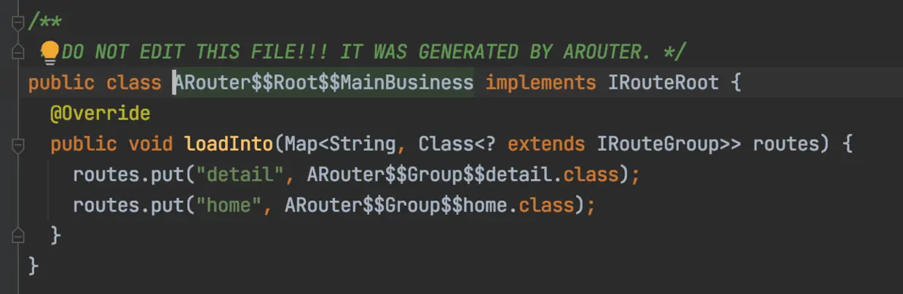
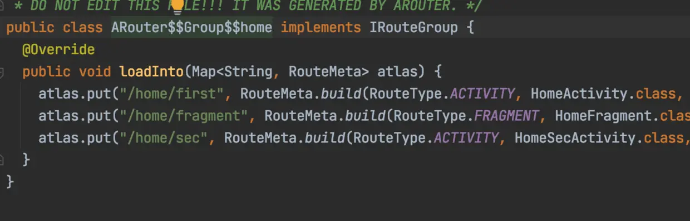
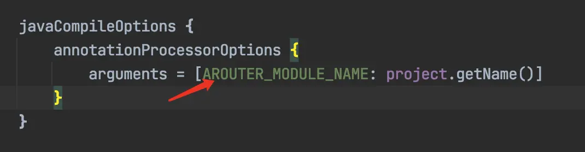
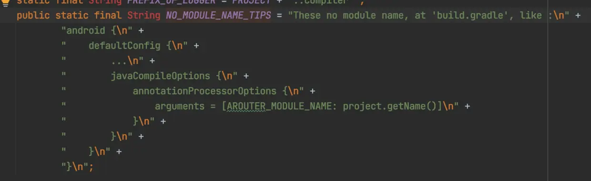

- ARouter是以路由的方式实现组件间（组件化项目）通讯的的框架。
- 路由的本质，是映射和寻址，收集所有的注册类，生成字符串和注册类的映射关系，这样就可以通过字符串找到对应的类.
- 解决的问题，没有依赖关系的两个模块，不能直接交互，路由提供了仓库，可以通过字符串找到注入仓库的类，解决类模块间交互的问题（组件间通讯）
- 如何分组和构建路由表的呢？
- ## 一、从使用说起
  collapsed:: true
	- 1、我们按照文档使用ARouter 的时候注意到， 使用@Route注解的模块，需要在modeule 的build.gradle里添加：
	  collapsed:: true
		- ```
		  defaultConfig {
		     javaCompileOptions {
		         annotationProcessorOptions {
		             arguments = [AROUTER_MODULE_NAME: project.getName()]
		         }
		     }
		  }
		  ```
		- 没有这段代码会在build项目时爆错：
		  These no module name, at ‘build.gradle’, like : …
	- 2、必须在每个使用@Route 注解的模块里都引入ARouter的注解处理器，否则这个模块里注解不会被处理
	  collapsed:: true
		- ```
		  annotationProcessor 'com.alibaba:arouter-compiler:1.5.2'
		  ```
	- 3、@Route 注解的path 至少需要有两级
	  collapsed:: true
		- ```
		  @Route(path = "/test/activity")
		  public class YourActivity extend Activity {
		      ...
		  }
		  ```
		- 否则toast提示：“There’s no route matched! Path = [/xxx/xxx] Group = [xxxx]”
		- 编译生成的类：
		  collapsed:: true
			- 
		- root
		  collapsed:: true
			- 
		- group
		  collapsed:: true
			- 
		- ARouter$Root$$xxx(modulename) 把所有的组(ARouter$Group$xxx) put到Map集合里（routers）
		  
		  * ARouter$Group$$xxx(groupname) 把一个分组下的所有路径(RouteMeta)存入map
		  
		  * ARouter$Providers$$xxx(modulename) 把注册的接口存入map
	-
	-
- ## 二.ARouter 注解处理器:RouteProcessor
  collapsed:: true
	- 有注解就有注解处理器，ARouter也是基于APT+ Javapoat，构建路由表的逻辑就在RouteProcessor，也是在RouteProcessor里生成了上面的那些类
	- APT 和 javapoat 有同学分享过，这也是APT 和 javapoat应用很好的一个例子
	- 1、BaseProcessor
	  collapsed:: true
		- RouteProcessor 继承了 BaseProcessor
		  collapsed:: true
			- ```
			  public abstract class BaseProcessor extends AbstractProcessor {
			       ...
			       // 模块名
			       String moduleName = null;
			       //是否需要生成router 文档
			       boolean generateDoc;
			  
			       @Override
			       public synchronized void init(ProcessingEnvironment processingEnv) {
			           super.init(processingEnv);
			           //初始化工具类
			           mFiler = processingEnv.getFiler();
			           types = processingEnv.getTypeUtils();
			           elementUtils = processingEnv.getElementUtils();
			           typeUtils = new TypeUtils(types, elementUtils);
			           logger = new Logger(processingEnv.getMessager());
			  
			           // Attempt to get user configuration [moduleName]
			           Map<String, String> options = processingEnv.getOptions();
			           if (MapUtils.isNotEmpty(options)) {
			  
			               //从options里获取 moduleName
			               moduleName = options.get(KEY_MODULE_NAME);
			               generateDoc = VALUE_ENABLE.equals(options.get(KEY_GENERATE_DOC_NAME));
			           }
			  
			           if (StringUtils.isNotEmpty(moduleName)) {
			               moduleName = moduleName.replaceAll("[^0-9a-zA-Z_]+", "");
			  
			           } else {
			               //moduleName为空抛出异常，停止编译
			               logger.error(NO_MODULE_NAME_TIPS);
			              。。。
			           }
			       }
			  
			       ...
			  
			       @Override
			       public Set<String> getSupportedOptions() {
			           return new HashSet<String>() {{
			               this.add(KEY_MODULE_NAME);
			               this.add(KEY_GENERATE_DOC_NAME);
			           }};
			       }
			  }
			  ```
		- 主要初始化工具类，从gradle 配置里获取 moduleName
		- ### getSupportedOptions()
		  collapsed:: true
			- KEY_MODULE_NAME的值：
			- // Options of processor
			  public static final String KEY_MODULE_NAME = "AROUTER_MODULE_NAME";
			  public static final String KEY_GENERATE_DOC_NAME = "AROUTER_GENERATE_DOC";
			  就是我们在build.gradle里配置的 AROUTER_MODULE_NAME
			- 
		- ### init（）
		  collapsed:: true
			- 从 options 里获取 moduleName，如果moduleName为空抛出异常； 异常信息就是这段字符串：
			- 
			- 这就是为什么如果不在build.gradle里配置AROUTER_MODULE_NAME，会异常的原因， moduleName有什么用？
		-
	- 2、RouteProcessor
		- 1
		  collapsed:: true
			- ```
			  public class RouteProcessor extends BaseProcessor {
			      private Map<String, Set<RouteMeta>> groupMap = new HashMap<>(); // ModuleName and routeMeta.
			      private Map<String, String> rootMap = new TreeMap<>();  // Map of root metas, used for generate class file in order.
			  
			      private TypeMirror iProvider = null;
			  
			      @Override
			      public synchronized void init(ProcessingEnvironment processingEnv) {
			          super.init(processingEnv);
			          //
			          iProvider = elementUtils.getTypeElement(Consts.IPROVIDER).asType();
			      }
			  
			      @Override
			      public boolean process(Set<? extends TypeElement> annotations, RoundEnvironment roundEnv) {
			          if (CollectionUtils.isNotEmpty(annotations)) {
			              Set<? extends Element> routeElements = roundEnv.getElementsAnnotatedWith(Route.class);
			                  try {
			                      this.parseRoutes(routeElements);
			                  } catch (Exception e) {
			                  }
			                  return true;
			              }
			  
			              return false;
			      }
			  
			  }
			  ```
		- 创建两个map，分别用来存放当前模块下所有的分组（rootMap），和每个分组下的路径（groupMap）
		- private Map<String, Set<RouteMeta>> groupMap = new HashMap<>();
		  private Map<String, String> rootMap = new TreeMap<>();
		- process（）方法调用了parseRoutes（）方法，处理注解的逻辑在这个方里
		- 先从类名获取activity/fragment/service 的类型，用于后面的类型判断
		  collapsed:: true
			- ```
			  private void parseRoutes(Set<? extends Element> routeElements) throws IOException {
			      if (CollectionUtils.isNotEmpty(routeElements)) {
			          // prepare the type an so on.
			  
			          logger.info(">>> Found routes, size is " + routeElements.size() + " <<<");
			  
			          rootMap.clear();
			  
			           //ACTIVITY = "android.app.Activity";
			           //FRAGMENT = "android.app.Fragment";
			           //SERVICE = "android.app.Service";
			         
			          TypeMirror type_Activity = elementUtils.getTypeElement(ACTIVITY).asType();
			          TypeMirror type_Service = elementUtils.getTypeElement(SERVICE).asType();
			          TypeMirror fragmentTm = elementUtils.getTypeElement(FRAGMENT).asType();
			          TypeMirror fragmentTmV4 = elementUtils.getTypeElement(Consts.FRAGMENT_V4).asType();
			  
			          // IRouteRoot、IRouteGroup 接口
			          TypeElement type_IRouteGroup = elementUtils.getTypeElement(IROUTE_GROUP);
			          TypeElement type_IProviderGroup = elementUtils.getTypeElement(IPROVIDER_GROUP);
			          ClassName routeMetaCn = ClassName.get(RouteMeta.class);
			          ClassName routeTypeCn = ClassName.get(RouteType.class);
			  ```
		- 创建 RouteMeta 对象，RouteMeta主要存放的是路径信息，包含了Rout注解的值（path，name，group…），安卓activity/fragment/service类名，Element（只要用来获取注解类的className），以及跳转参数信息。
		  collapsed:: true
			- ```
			  for (Element element : routeElements) {
			          TypeMirror tm = element.asType();
			          Route route = element.getAnnotation(Route.class);
			          RouteMeta routeMeta;
			  
			          //6。注解的是 Activity or Fragment
			          if (types.isSubtype(tm, type_Activity) || types.isSubtype(tm, fragmentTm) || types.isSubtype(tm, fragmentTmV4)) {
			              // Get all fields annotation by @Autowired
			              Map<String, Integer> paramsType = new HashMap<>();
			              Map<String, Autowired> injectConfig = new HashMap<>();
			              // 7。收集 @Autowired 注解的参数
			              injectParamCollector(element, paramsType, injectConfig);
			  
			              if (types.isSubtype(tm, type_Activity)) {
			                  // Activity
			                  logger.info(">>> Found activity route: " + tm.toString() + " <<<");
			                  routeMeta = new RouteMeta(route, element, RouteType.ACTIVITY, paramsType);
			              } else {
			                  // Fragment
			                  logger.info(">>> Found fragment route: " + tm.toString() + " <<<");
			                  routeMeta = new RouteMeta(route, element, RouteType.parse(FRAGMENT), paramsType);
			              }
			  
			              routeMeta.setInjectConfig(injectConfig);
			          } else if (types.isSubtype(tm, iProvider)) {
			              // IProvider（接口）
			              logger.info(">>> Found provider route: " + tm.toString() + " <<<");
			              routeMeta = new RouteMeta(route, element, RouteType.PROVIDER, null);
			          } else if (types.isSubtype(tm, type_Service)) {
			              // Service
			              logger.info(">>> Found service route: " + tm.toString() + " <<<");
			              routeMeta = new RouteMeta(route, element, RouteType.parse(SERVICE), null);
			          } else {
			              throw new RuntimeException("The @Route is marked on unsupported class, look at [" + tm.toString() + "].");
			          }
			          // 7。routeMeta（路径信息）存入groupMap
			          categories(routeMeta);
			      }
			  ```
		- 1.先验证路径path是否合规；合规就把RouteMeta按groupName分组存入 groupMap
		  collapsed:: true
			- ```
			  private void categories(RouteMeta routeMete) {
			      //验证routeMete
			      if (routeVerify(routeMete)) {
			          logger.info(">>> Start categories, group = " + routeMete.getGroup() + ", path = " + routeMete.getPath() + " <<<");
			          Set<RouteMeta> routeMetas = groupMap.get(routeMete.getGroup());
			          if (CollectionUtils.isEmpty(routeMetas)) {
			              Set<RouteMeta> routeMetaSet = new TreeSet<>(new Comparator<RouteMeta>() {
			                  @Override
			                  public int compare(RouteMeta r1, RouteMeta r2) {
			                      try {
			                          return r1.getPath().compareTo(r2.getPath());
			                      } catch (NullPointerException npe) {
			                          logger.error(npe.getMessage());
			                          return 0;
			                      }
			                  }
			              });
			              routeMetaSet.add(routeMete);
			              groupMap.put(routeMete.getGroup(), routeMetaSet);
			          } else {
			              routeMetas.add(routeMete);
			          }
			      } else {
			          logger.warning(">>> Route meta verify error, group is " + routeMete.getGroup() + " <<<");
			      }
			  }     
			  ```
		- 从这个判断方法 里，知道了
		  collapsed:: true
		  path 必须“/”开头，并且第一段作为默认 group 名；
			- ```
			  private boolean routeVerify(RouteMeta meta) {
			      String path = meta.getPath();
			  
			      if (StringUtils.isEmpty(path) || !path.startsWith("/")) {   // The path must be start with '/' and not empty!
			          return false;
			      }
			  
			      if (StringUtils.isEmpty(meta.getGroup())) { // Use default group(the first word in path)
			          try {
			              String defaultGroup = path.substring(1, path.indexOf("/", 1));
			              if (StringUtils.isEmpty(defaultGroup)) {
			                  return false;
			              }
			  
			              meta.setGroup(defaultGroup);
			              return true;
			          } catch (Exception e) {
			              logger.error("Failed to extract default group! " + e.getMessage());
			              return false;
			          }
			      }
			  
			      return true;
			  }
			  ```
		- 接着生成代码的过程
		  collapsed:: true
			- ```
			  for (Map.Entry<String, Set<RouteMeta>> entry : groupMap.entrySet()) {
			              //组名
			              String groupName = entry.getKey();
			                // 构建一个生成loadInto方法的MethodSpec
			                  /** 
			                  *  @Override
			                  *  public void loadInto(Map<String, RouteMeta> providers);
			                  */
			              MethodSpec.Builder loadIntoMethodOfGroupBuilder = MethodSpec.methodBuilder(METHOD_LOAD_INTO)
			                      .addAnnotation(Override.class)
			                      .addModifiers(PUBLIC)
			                      .addParameter(groupParamSpec);
			  
			              List<RouteDoc> routeDocList = new ArrayList<>();
			              Set<RouteMeta> groupData = entry.getValue();
			              for (RouteMeta routeMeta : groupData) {
			                  // Build group method body
			                  RouteDoc routeDoc = extractDocInfo(routeMeta);
			  
			                  ClassName className = ClassName.get((TypeElement) routeMeta.getRawType());
			  
			  
			                  // 构建跳转参数的map
			                  StringBuilder mapBodyBuilder = new StringBuilder();
			                  Map<String, Integer> paramsType = routeMeta.getParamsType();
			                  Map<String, Autowired> injectConfigs = routeMeta.getInjectConfig();
			                  if (MapUtils.isNotEmpty(paramsType)) {
			                      List<RouteDoc.Param> paramList = new ArrayList<>();
			  
			                      for (Map.Entry<String, Integer> types : paramsType.entrySet()) {
			                          mapBodyBuilder.append("put(\"").append(types.getKey()).append("\", ").append(types.getValue()).append("); ");
			  
			                          RouteDoc.Param param = new RouteDoc.Param();
			                          Autowired injectConfig = injectConfigs.get(types.getKey());
			                          param.setKey(types.getKey());
			                          param.setType(TypeKind.values()[types.getValue()].name().toLowerCase());
			                          param.setDescription(injectConfig.desc());
			                          param.setRequired(injectConfig.required());
			  
			                          paramList.add(param);
			                      }
			  
			                      routeDoc.setParams(paramList);
			                  }
			                  String mapBody = mapBodyBuilder.toString();
			  
			                  //生成 map的 put 代码
			                  loadIntoMethodOfGroupBuilder.addStatement(
			                          "atlas.put($S, $T.build($T." + routeMeta.getType() + ", $T.class, $S, $S, " + (StringUtils.isEmpty(mapBody) ? null : ("new java.util.HashMap<String, Integer>(){{" + mapBodyBuilder.toString() + "}}")) + ", " + routeMeta.getPriority() + ", " + routeMeta.getExtra() + "))",
			                          routeMeta.getPath(),
			                          routeMetaCn,
			                          routeTypeCn,
			                          className,
			                          routeMeta.getPath().toLowerCase(),
			                          routeMeta.getGroup().toLowerCase());
			  
			                  routeDoc.setClassName(className.toString());
			                  routeDocList.add(routeDoc);
			              }
			  
			              // 生成ARouter$Group$文件
			              String groupFileName = NAME_OF_GROUP + groupName;
			              JavaFile.builder(PACKAGE_OF_GENERATE_FILE,
			                      TypeSpec.classBuilder(groupFileName)
			                              .addJavadoc(WARNING_TIPS)
			                              .addSuperinterface(ClassName.get(type_IRouteGroup))
			                              .addModifiers(PUBLIC)
			                              .addMethod(loadIntoMethodOfGroupBuilder.build())
			                              .build()
			              ).build().writeTo(mFiler);
			  
			              logger.info(">>> Generated group: " + groupName + "<<<");
			              rootMap.put(groupName, groupFileName);
			              docSource.put(groupName, routeDocList);
			          }
			  ```
		- 上面这段代码生成类 ARouter$$Group$login，groupname = login；
		  collapsed:: true
			- ```
			  public class ARouter$$Group$xxx（groupname） implements IRouteGroup {
			      @Override
			      public void loadInto(Map<String, RouteMeta> atlas) {
			          atlas.put("/login/loginX", RouteMeta.build(RouteType.ACTIVITY, LoginActivity.class, "/login/loginx", "login", null, -1, -2147483648));
			          atlas.put("/login/register", RouteMeta.build(RouteType.ACTIVITY, RegisterActivity.class, "/login/register", "login", null, -1, -2147483648))；
			      }
			  }
			  ```
		- 有多少group就有多少这样的类，然后把这些类名存入rootMap
		  collapsed:: true
			- ```
			  if (MapUtils.isNotEmpty(rootMap)) {
			              // Generate root meta by group name, it must be generated before root, then I can find out the class of group.
			              for (Map.Entry<String, String> entry : rootMap.entrySet()) {
			                  loadIntoMethodOfRootBuilder.addStatement("routes.put($S, $T.class)", entry.getKey(), ClassName.get(PACKAGE_OF_GENERATE_FILE, entry.getValue()));
			              }
			          }
			  
			          // Write provider into disk
			          String providerMapFileName = NAME_OF_PROVIDER + SEPARATOR + moduleName;
			          JavaFile.builder(PACKAGE_OF_GENERATE_FILE,
			                  TypeSpec.classBuilder(providerMapFileName)
			                          .addJavadoc(WARNING_TIPS)
			                          .addSuperinterface(ClassName.get(type_IProviderGroup))
			                          .addModifiers(PUBLIC)
			                          .addMethod(loadIntoMethodOfProviderBuilder.build())
			                          .build()
			          ).build().writeTo(mFiler);
			  ```
		- 上面这段代码，我们看到了moduleName,也就是gradle里的project.getName()，这段代码生成下面这个类， moduleName =“LoginSDK”
		  collapsed:: true
			- ```
			  public class ARouter$$Providers$$LoginSDK implements IProviderGroup {
			      @Override
			      public void loadInto(Map<String, RouteMeta> providers) {
			          providers.put("com.example.loginsdk.IUserInfo", RouteMeta.build(RouteType.PROVIDER, UserInfoManager.class, "/interface/user", "interface", null, -1, -2147483648));
			      }
			  }
			  ```
		- 可以看到这个类命名：ARouter+Providers+moduleName，Module里只有一个这样的类，把这个模块里注册的接口（接口都继承IProvider）put到map集合里
		- 代码里看到，生成的这些类的包名都是PACKAGE_OF_GENERATE_FILE，PACKAGE_OF_GENERATE_FILE = “com.alibaba.android.arouter.routes”;这意味着所有模块生成的代码都在这个目录下，这有个问题：如果俩个模块下有个相同组名都叫home 那就会生成俩个ARouter
		  Grouphome文件，这会导致编译报错
		- WBRouter 这里做类优化，把moduleName拼接了进去，这样就不会报错了。
		- 接着生成root
		  collapsed:: true
			- ```
			  String rootFileName = NAME_OF_ROOT + SEPARATOR + moduleName;
			          JavaFile.builder(PACKAGE_OF_GENERATE_FILE,
			                  TypeSpec.classBuilder(rootFileName)
			                          .addJavadoc(WARNING_TIPS)
			                          .addSuperinterface(ClassName.get(elementUtils.getTypeElement(ITROUTE_ROOT)))
			                          .addModifiers(PUBLIC)
			                          .addMethod(loadIntoMethodOfRootBuilder.build())
			                          .build()
			          ).build().writeTo(mFiler);
			  ```
		- rootFileName =“ARouter$$Root$LoginSDK”，其中moduleName = LoginSDK
		- 最终生成的类是：
		  collapsed:: true
			- ```
			  public class ARouter$$Root$$LoginSDK implements IRouteRoot {
			      @Override
			      public void loadInto(Map<String, Class<? extends IRouteGroup>> routes) {
			          routes.put("interface", ARouter$$Group$$interface.class);
			          routes.put("login", ARouter$$Group$$login.class);
			      }
			  } 
			  ```
		- 这个类也只有一个，把前面生成的所有 ARouter$Group 都类存入map，到此就完所有注解的分组和映射。
		- 模块间以modleName分离，每个模块有多个组，分组能够更好的管理和查找路由信息。
		- 映射关系构建好了，类文件创建出来， 什么时候加载调用的呢？
	-
	-
- ## 三