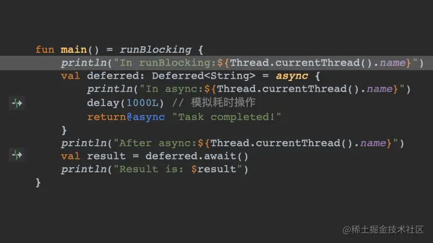

- ## 1、方法介绍
  collapsed:: true
	- ```kotlin
	  public fun <T> CoroutineScope.async(
	      context: CoroutineContext = EmptyCoroutineContext,
	      start: CoroutineStart = CoroutineStart.DEFAULT,
	      block: suspend CoroutineScope.() -> T
	  ): Deferred<T> {
	      ...
	  }
	  ```
	- 从这里我们可以看出，`block`类型是有返回值T的，而不是像`launch`返回`Unit`，同时`async`返回的是`Deferred<T>`，可以通过这个拿到协程返回值。
	- ### 钓鱼模型
		- 既然之前`launch`可以类比与射箭，那`async`用**钓鱼**来做比喻就再恰当不过了。
		- 其中`Deferred`就相当于是**鱼竿**，我们把鱼饵和鱼钩甩入水中，就相当于协程已经开始工作了，这时主线程可以继续干别的事。
		- 当需要返回结果时，再拿起鱼竿，得到钓的鱼(返回结果)。注意，拿起鱼竿这个事是阻塞后续代码执行的，假如调用`await`方法时，`async`的结果还没有，这时是需要等待运行结束的，这是非常符合逻辑的。
		- 我们最常见的可以使用`async`来同时开启多个请求，等请求结果都拿到，再接着进行后续操作。
		- 这个模型可以完美解释非阻塞和拿到返回结果，同时还有一些细节，比如下面代码：
		- ```kotlin
		  fun main() = runBlocking {
		      val deferred: Deferred<String> = async {
		          println("In async:${Thread.currentThread().name}")
		          delay(1000L) // 模拟耗时操作
		          println("In async after delay!")
		          return@async "Task completed!"
		      }
		  
		      // 不再调用 deferred.await()
		      delay(2000L)
		  }
		  
		  ```
		- 这里我们不再调用`await`方法，结果如下：
			- 
		- 会发现启动的协程依旧执行了，这就相当于我钓鱼把鱼钩丢入水中，协程已经运行了，但是我没有抬杆，这个`await`函数就相当于是抬杆，没有获取结果而已。
		-
		-
- ## 2、async执行流程图解
  collapsed:: true
	- 
- ## 3、例子
  collapsed:: true
	- ```kotlin
	  fun main() = runBlocking {
	      println("coroutine start ${Thread.currentThread().name}")
	  
	      val result = async {
	          println("inner coroutine start ${Thread.currentThread().name}")
	          //模拟耗时
	          delay(1000)
	          println("inner coroutine end ${Thread.currentThread().name}")
	          return@async "fine!"
	      }
	      println("coroutine continue")
	      println("coroutine end ${result.await()}")
	  }
	  ```
	- 根据前面所说的`runBlocking`特点，在它里面启动的协程中，再启动其他的协程，会等待子协程执行完，所以这里我们就免去了使用`Thread.sleep`的写法了。